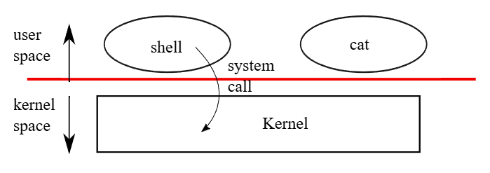

# xv6 riscv book chapter 1：Operating system interfaces

操作系统的任务，是要让多个程序能够共享同一部电脑，并提供比硬件本身更多、更加实用的功能。 操作系统负责管理并抽象化底层硬件，使得如文字处理器这类应用程序无需关心所使用的是哪一种硬盘。 操作系统能让多个程序共享硬件资源，并使它们能够同时执行（或至少看起来是同时执行）。 最后，操作系统还提供让程序之间可以互相沟通的接口，使它们能够共享数据或协同作业

操作系统通过一组接口来向用户程序提供服务，但要设计一个好的接口其实并不容易。 一方面，我们希望这个接口要简单且精确，这样比较容易实现正确； 但另一方面，我们又会想要提供许多进阶的功能给应用程序使用。 解决这个矛盾的诀窍是：设计一组依赖少量机制的接口，并让这些机制可以组合起来，提供高度的通用性

本书将使用一个具体的操作系统作为例子，来说明操作系统的各种概念。 这个操作系统叫做 xv6，它提供了 Ken Thompson 与 Dennis Ritchie 在 Unix 操作系统中所引入的基本接口，并且模仿了 Unix 的内部设计。 Unix 提供的接口通常「精准但可组合性强」，这让它意外地拥有很高的通用性。 由于这种接口设计地非常成功，以至于现代的操作系统，例如 BSD、Linux、macOS、Solaris，甚至在某种程度上连 Microsoft Windows 都拥有类 Unix 的接口。 而理解 xv6，是理解这些系统（还有许多其他系统）的一个很好的起点

如图 1 所示，xv6 采用了传统的 kernel 架构，也就是一个特殊的程序，专门提供执行中程序所需的服务。 每个执行中的程序称为一个「进程（process）」，它的内存会包含指令区、数据区，以及 stack。 指令负责实现该程序的运算逻辑； 数据则是程序操作的变量； stack 则负责组织与管理程序的函数调用。 一台电脑通常会同时拥有许多个进程，但只会有一个 kernel 



当一个进程需要调用 kernel 的服务时，它会发出一个「系统调用」，这是操作系统接口中的一种调用方式。 这个系统调用会进入 kernel，接著 kernel 会执行所请求的服务并返回。 因此一个进程的执行会在 user space 与 kernel space 之间交替进行

如后续章节将详细说明的，kernel 会使用 CPU 提供的硬件保护机制（本书使用 CPU 一词来指称执行运算的硬件元件； 其他文件，如 RISC-V 规格，会使用 processor、core 或 hart 等词来代替 CPU），来确保每个在 user space 中执行的进程只能访问自己的内存。 kernel 本身会于具备特权的硬件模式执行，以实现这些保护机制； 而用户程序则在没有这些特权的情况下执行。 当一个用户程序发出系统调用时，硬件会提升执行权限，并开始执行 kernel 中事先安排好的函数

用户程序所能看见的接口由 kernel 提供的所有系统调用组成。 xv6 kernel 提供了一部分传统 Unix kernel 所具备的服务与系统调用。 图 1.2 列出了 xv6 所提供的全部系统调用：``

<center-panel natural title="（Figure 1.2: xv6 system calls. If not otherwise stated, these calls return 0 for no error, and -1 if there’s an error）">

| **System call**                               | **Description**                                                                 |
|----------------------------------------------|---------------------------------------------------------------------------------|
| `int fork()`                                  | Create a process, return child's PID.                                           |
| `int exit(int status)`                        | Terminate the current process; status reported to wait(). No return.           |
| `int wait(int *status)`                       | Wait for a child to exit; exit status in *status; returns child PID.           |
| `int kill(int pid)`                           | Terminate process PID. Returns 0, or -1 for error.                              |
| `int getpid()`                                | Return the current process's PID.                                               |
| `int sleep(int n)`                            | Pause for n clock ticks.                                                        |
| `int exec(char *file, char *argv[])`          | Load a file and execute it with arguments; only returns if error.              |
| `char *sbrk(int n)`                           | Grow process's memory by n zero bytes. Returns start of new memory.            |
| `int open(char *file, int flags)`             | Open a file; flags indicate read/write; returns an fd (file descriptor).       |
| `int write(int fd, char *buf, int n)`         | Write n bytes from buf to file descriptor fd; returns n.                        |
| `int read(int fd, char *buf, int n)`          | Read n bytes into buf; returns number read; or 0 if end of file.               |
| `int close(int fd)`                           | Release open file fd.                                                           |
| `int dup(int fd)`                             | Return a new file descriptor referring to the same file as fd.                 |
| `int pipe(int p[])`                           | Create a pipe, put read/write file descriptors in p[0] and p[1].               |
| `int chdir(char *dir)`                        | Change the current directory.                                                   |
| `int mkdir(char *dir)`                        | Create a new directory.                                                         |
| `int mknod(char *file, int, int)`             | Create a device file.                                                           |
| `int fstat(int fd, struct stat *st)`          | Place info about an open file into *st.                                         |
| `int link(char *file1, char *file2)`          | Create another name (file2) for the file file1.                                 |
| `int unlink(char *file)`                      | Remove a file.                                                                  |

</center-panel>

本章接下来将粗略地介绍 xv6 所提供的几项服务，包含进程管理、内存、文件描述符（file descriptors）、pipes，以及文件系统，并通过代码范例与说明，来展示 Unix 的命令列接口 shell 是如何使用这些功能。 从 shell 对系统调用的使用方式，可以看出这些调用是如何被精心设计的

shell 是一个普通的程序，它负责读取用户输入的指令并执行。 另外它是一个用户程序，而不是 kernel 的一部分，这点凸显了系统调用接口的强大之处：shell 并不是什么特别的程序。 这也代表 shell 很容易被替换； 因此，现代的 Unix 系统都有各式各样的 shell 可供选择，每种 shell 都有自己独特的用户接口与脚本功能。 xv6 的 shell 是 Unix Bourne shell 精神的一个简单实现，其代码可以在 [user/sh.c:1](https://github.com/mit-pdos/xv6-riscv/blob/riscv//user/sh.c#L1) 内找到

## 1.1 Processes and memory

一个 xv6 进程由 user space 中的内存（包含指令、数据与 stack）以及属于该进程、只有 kernel 能访问的内部状态所构成。 xv6 采用时间分割（time-sharing）的方式来管理进程：它会在等待执行的进程之间，自动切换可用的 CPU。 当某个进程暂停执行时，xv6 会存储该进程的 CPU 寄存器，等下次执行该进程时再将其还原。 kernel 还会为每个进程分配一个被称为 `PID`（process identifier，进程识别码）的编号

一个进程可以通过 `fork` 系统调用来创建一个新的进程。 `fork` 会将原本调用者的内存完整复制给新创建的进程：它会将调用者的指令、数据与 stack 全部复制到新进程中。 `fork` 会在原本与新创建的进程中各自返回一次，在原本的进程中，`fork` 会返回新进程的 `PID`； 而在新创建的进程中，`fork` 则返回 0。 原本的进程与新创建的进程，通常分别被称为「父进程」与「子进程」

举例来说，请看以下这段以 C 语言撰写的代码片段：

```c
int pid = fork();
if(pid > 0){
  printf("parent: child=%d\n", pid);
  pid = wait((int *) 0);
  printf("child %d is done\n", pid);
} else if(pid == 0){
  printf("child: exiting\n");
  exit(0);
} else {
  printf("fork error\n");
}
```

`exit` 系统调用会让调用它的进程停止执行，并释放像是内存与已打开文件这类资源。 `exit` 接收一个整数作为状态引数，惯例上，0 表示成功，1 表示失败

`wait` 系统调用会返回一个已结束（或被终止）的子进程的 `PID`，并将该子进程的结束状态写入「传给 `wait` 的内存位置」； 如果目前还没有任何已结束的子进程，`wait` 就会阻塞，直到有一个子进程结束。 如果调用者没有子进程，`wait` 会立即返回 -1。 如果父进程不在意子进程的结束状态，它可以传入 0 当作 `wait` 的引数

在这个范例中，这两行输出：

```
parent: child=1234 
child: exiting
```

的顺序可能会互换（甚至交错），这取决于父进程与子进程谁先执行到 `printf`。 当子进程结束后，父进程中的 `wait` 调用会返回，接著父进程会印出 `parent: child 1234 is done`。 虽然子进程最初拥有与父进程相同的内存内容，但父子进程各自拥有独立的内存与寄存器，因此在其中一方改变变量时，不会影响到另一方。 例如，当 `wait` 的返回值被存入父进程的变量 `pid` 中时，也不会改变子进程中的 `pid` 变量，子进程中的 `pid` 值仍然是 0

`exec` 系统调用会用从文件系统中加载的程序映像（memory image），取代调用该进程原本的内存内容。 这个文件必须具有特定格式，格式中会定义文件的哪个部分是指令、哪个部分是数据、从哪个指令开始执行等等。 xv6 采用 ELF 格式，这部分会在第三章中进一步说明，通常这个文件是将源代码编译后所生成的结果

当 `exec` 成功时，它不会返回到调用它的程序； 相反地，从文件中加载的指令会从 ELF header 中指定的进入点开始执行。 `exec` 接收两个引数（argument）：一个是包含可执行档的文件名称，另一个是用作引数的字串数组

举例来说：

```c
char *argv[3];
argv[0] = "echo";
argv[1] = "hello";
argv[2] = 0;
exec("/bin/echo", argv);
printf("exec error\n");
```

这段代码会将目前的程序取代为 `/bin/echo` 这个程序的执行实例，并带入引数列表 `echo` 与 `hello`。 大多数程序会忽略引数数组的第一个元素，这个元素惯例上是程序本身的名称

xv6 的 shell 使用上述系统调用来代替用户执进程序。 这个 shell 的主体结构相当简单，可以参考 [user/sh.c:146](https://github.com/mit-pdos/xv6-riscv/blob/riscv//user/sh.c#L146) 中的 `main` 函数。 主循环会通过 `getcmd` 从用户那读取一行输入。 接著它会调用 `fork`，创建 shell 进程的复本。 父进程会调用 `wait`，而子进程则负责执行命令

例如，如果用户在 shell 中输入 `"echo hello"`，`runcmd` 就会被调用，并以 `"echo hello"` 作为引数。 `runcmd`（[user/sh.c:55](https://github.com/mit-pdos/xv6-riscv/blob/riscv//user/sh.c#L55)）会执行真正的命令。 对于 `"echo hello"`，它会调用 `exec`（见 [user/sh.c:79](https://github.com/mit-pdos/xv6-riscv/blob/riscv//user/sh.c#L79)）。 如果 `exec` 成功，子进程就会开始执行 `echo` 的指令，而不是 `runcmd`。 之后的某个时间点，`echo` 会调用 `exit`，此时父进程中的 `wait` 会返回，控制流程便会回到 `main` 函数中（见 [user/sh.c:146](https://github.com/mit-pdos/xv6-riscv/blob/riscv//user/sh.c#L146)）

你可能会想，为什么 `fork` 和 `exec` 不直接合并成一个调用； 我们稍后会看到，shell 通过分离它们来实现 I/O 的重导（redirection）功能。 为了避免「创建一个进程复本、接著马上被 `exec` 替换掉」这种浪费，kernel 会针对这类用途对 `fork` 的实现进行最佳化，例如采用虚拟内存技术中的 copy-on-write（详见第 4.6 节）

xv6 对于大部分 user space 的内存分配是隐式进行的：`fork` 会分配足够的内存来复制父进程的内存给子进程，`exec` 则会分配足够的内存以容纳可执行档的内容。 若某个进程在执行期间需要更多内存（例如 `malloc`），可以调用 `sbrk(n)` 来将其数据区延伸 `n` 个 0 位元组； `sbrk` 会返回新内存的起始位置

## 1.2 I/O and File descriptors

文件描述符（File descriptors）是一个较小的整数，用来表示一个由 kernel 管理的对象，进程可以从这个对象读取或写入数据。 进程可以通过打开文件、目录、或装置、创建 pipe，或复制现有的描述符，来获取一个文件描述符。 为了简化说明，我们会将文件描述符所指向的对象统称为「文件」； 文件描述符这个接口抽象化了文件、pipe 与装置之间的差异，使它们看起来都像是 byte stream。 我们会把输入与输出称为 I/O

::: tip  
虽然名字叫「file」，但其实它可以指向任何 I/O 来源，例如文件、终端机、pipe、装置等。 它是一个抽象层，让程序不用知道背后实体是什么，就能进行读写操作  
:::

在内部，xv6 kernel 使用文件描述符作为每个进程表格中的索引，因此每个进程都有一个从 0 开始的私有文件描述符空间。 依照惯例，进程从描述符 0（标准输入）读取，将输出写到描述符 1（标准输出），将错误消息写到描述符 2（标准错误）。 如我们后面会看到，shell 利用这些惯例来实现 I/O 重导与 pipeline。 默认情况下这三个描述符对应到主控台，因此 shell 会确保它总是打开这三个文件描述符

`read` 与 `write` 系统调用会根据文件描述符，从已打开的文件中读取或写入位元组。 调用 `read(fd, buf, n)` 会从文件描述符 `fd` 所指向的文件中最多读取 `n` 个位元组，接著将它们复制到 `buf` 中，并返回实际读取的位元组数。 每个指向文件的文件描述符都会有一个相关的偏移量（offset）。 `read` 会从目前的偏移位置读取数据，然后将偏移量往后推移「该次读取的位元组数」，下一次 `read` 会接续读取后面的数据。 当没有更多数据可读时，`read` 会返回 0，以表示文件结尾

`write(fd, buf, n)` 这个调用会将 `buf` 中的 `n` 个位元组写入文件描述符 `fd` 所指向的目标，并返回实际写入的位元组数。 只有在发生错误时，才可能写入少于 `n` 个位元组。 与 `read` 类似，`write` 会从目前的文件偏移位置开始写入数据，并在写入后将偏移量增加「该次写入的位元组数」，每次 `write` 都会从上一次结束的位置继续

以下这段代码（它构成了 `cat` 程序的 kernel 逻辑）会将数据从标准输入复制到标准输出。 如果发生错误，它会将错误消息输出到标准错误：

```c
char buf[512];
int n;

for(;;){
  n = read(0, buf, sizeof buf);
  if(n == 0)
    break;
  if(n < 0){
    fprintf(2, "read error\n");
    exit(1);
  }
  if(write(1, buf, n) != n){
    fprintf(2, "write error\n");
    exit(1);
  }
}
```

这段代码中最值得注意的是，`cat` 并不知道它是从文件、主控台，还是 pipe 中读取数据的。 同样地，`cat` 也不知道它是把数据印到主控台、写到文件，还是其他地方。 文件描述符的使用方式，加上将描述符 0 视为输入、描述符 1 视为输出的惯例，使得 `cat` 的实现可以非常简洁

`close` 系统调用会释放一个文件描述符，让它可以被日后的 `open`、`pipe` 或 `dup` 系统调用（下文会说明）重新使用。 新分配的文件描述符总是从目前进程中尚未使用的最小编号开始

文件描述符与 `fork` 的交互，使得 I/O 重导的实现变得简单。 `fork` 会连同父进程的内存一起复制其文件描述符表，因此子进程启动时会拥有与父进程完全相同的已打开文件。 系统调用 `exec` 虽然会取代调用者的内存，但会保留它的文件描述符表。 这样的行为允许 shell 通过「先 `fork` 出子进程、在子进程中重新打开指定的文件描述符、再调用 `exec` 来执行新程序」的方式来实现 I/O 重导

以下是一段简化版本的 shell 代码，模拟执行 `cat < input.txt` 这条命令的行为：

```c
char *argv[2];

argv[0] = "cat";
argv[1] = 0;
if(fork() == 0) {
  close(0);
  open("input.txt", O_RDONLY);
  exec("cat", argv);
}
```

当子进程关闭文件描述符 0 之后，`open` 一定会将新打开的 `input.txt` 指派给该描述符，因为 0 是当前可用的最小文件描述符。 接下来 `cat` 的执行中，文件描述符 0（标准输入）就会对应到 `input.txt`。 这整个过程只改变了子进程的描述符，父进程的文件描述符不会受到影响

xv6 shell 中的 I/O 重导就是依照这个方式运行的（[user/sh.c:83](https://github.com/mit-pdos/xv6-riscv/blob/riscv//user/sh.c#L83)）。 请记得，在程序执行到这个阶段时，shell 已经创建了子进程，而 `runcmd` 会接著调用 `exec` 来加载新的程序

`open` 的第二个引数是一组用位元表示的旗标，用来控制 `open` 的行为。 这些可用的旗标定义在 fcntl.h（file control）中（[kernel/fcntl.h:1-5](https://github.com/mit-pdos/xv6-riscv/blob/riscv//kernel/fcntl.h#L1-L5)），包括：`O_RDONLY`、`O_WRONLY`、`O_RDWR`、`O_CREATE` 与 `O_TRUNC`，它们分别代表以读取、写入、读写模式打开文件，若文件不存在则会创建该文件，并将文件长度截断为零

现在你应该可以理解，为什么将 `fork` 和 `exec` 设计为分开的调用是有帮助的：这两者之间的空档，让 shell 能够在不影响主 shell 的情况下，重新设置子进程的 I/O。 想像有一个虚构的 `forkexec` 系统调用，那么要在这样的架构下实现 I/O 重导会变得相当麻烦。 可能的做法会像：shell 在调用 `forkexec` 前修改自己的 I/O 设置（然后再复原）； 或者让 `forkexec` 接收 I/O 重导的引数； 或者（这是最不理想的）让每个像 `cat` 这样的程序都学会自己做 I/O 重导

虽然 `fork` 会复制文件描述符表，但每个底层文件的偏移量仍然会在父子进程之间共用。 请看以下这段代码：

```c
if(fork() == 0) {
  write(1, "hello ", 6);
  exit(0);
} else {
  wait(0);
  write(1, "world\n", 6);
}
```

在这段程序执行结束后，与文件描述符 1 相关联的文件中，将会包含 `hello world` 这段数据。 父进程的 `write`（由于有 `wait` 的关系，会在子进程执行完毕后才执行）会从子进程 `write` 所留下的位置继续写入。 这种行为有助于让 shell 指令序列生成连续的输出，例如 `(echo hello; echo world) >output.txt`

`dup` 系统调用会复制一个已存在的文件描述符，并返回一个新的描述符，这个新的描述符会指向相同的底层 I/O 对象。 这两个文件描述符会共用一个偏移量，就像通过 `fork` 复制出的描述符一样。 以下是另一种将 `hello world` 写入到文件的方法：

```c
fd = dup(1);
write(1, "hello ", 6);
write(fd, "world\n", 6);
```

如果两个文件描述符是通过一连串的 `fork` 和 `dup` 调用，从同一个原始描述符衍生而来的，那它们就会共用偏移量。 否则，即使它们是对同一个文件使用 `open` 所得到的描述符，也不会共享偏移量。 `dup` 允许 shell 实现像这样的指令：`ls existing-file non-existing-file > tmp1 2>&1`。 其中的 `2>&1` 是告诉 shell，将描述符 2（标准错误）设为描述符 1（标准输出）的副本。 这样，现有文件的档名与不存在文件的错误消息，会同时写入到 `tmp1` 这个文件中。 虽然 xv6 的 shell 不支持错误输出的 I/O 重导，但你现在已经知道如何实现它了

文件描述符是一个强大的抽象，因为它隐藏了它所连接对象的细节：一个进程在写入文件描述符 1 时，实际上可能是在写入一个文件、一个像主控台这样的装置，或是一个 pipe

## 1.3 Pipes

pipe 是一块由 kernel 管理的小型缓冲区，对进程而言，它表现为一对文件描述符：一个用于读取、一个用于写入。 将数据写入 pipe 的一端，会使这些数据可以从 pipe 的另一端被读取。 pipe 提供了一种让进程之间可以互相沟通的方式

以下这段范例代码执行了 `wc` 这个程序，并将其标准输入接到一个 pipe 的读取端：

```c
int p[2];
char *argv[2];

argv[0] = "wc";
argv[1] = 0;

pipe(p);
if(fork() == 0) {
  close(0);
  dup(p[0]);
  close(p[0]);
  close(p[1]);
  exec("/bin/wc", argv);
} else {
  close(p[0]);
  write(p[1], "hello world\n", 12);
  close(p[1]);
}
```

上例程序调用了 `pipe`，这会创建一条新的 pipe，并将读取与写入的文件描述符存放在数组 `p` 中。 在 `fork` 之后，父进程与子进程都拥有指向该 pipe 的描述符。 子进程会调用 `close` 与 `dup`，让描述符 0 指向 pipe 的读取端，然后关闭 `p` 中的描述符，接著调用 `exec` 来执行 `wc`。 当 `wc` 从标准输入读取时，它实际上是从这条 pipe 读数据。 父进程会关闭 pipe 的读取端、写入数据，然后再关闭写入端

如果没有数据可读，则对 pipe 进行 `read` 时会等待「数据被写入」或「所有指向写入端的描述符都已关闭」这两种情况发生； 在后者情况下，`read` 会返回 0，就像读到文件结尾一样。 `read` 会阻塞直到确定不会有新数据出现，这正是为什么子进程在执行 `wc` 之前一定要关闭 pipe 写入端的原因之一：如果 `wc` 有一个描述符仍然指向 pipe 的写入端，那它就永远看不到文件结尾（EOF）

xv6 的 shell 会用类似上述代码的方式来实现像 `grep fork sh.c | wc -l` 这类的 pipeline 指令。 子进程会创建一条 pipe，用来连接 pipeline 左端与右端。 接著，它会为 pipeline 的左端调用 `fork` 与 `runcmd`，接著为右端也调用 `fork` 与 `runcmd`，并等待两者完成。 pipeline 的右端本身可能也包含 pipeline（例如 `a | b | c`），这会额外再 `fork` 出两个子进程（分别给 `b` 和 `c`）。 因此，shell 最终可能创建出一棵进程树。 这棵树的叶节点是实际执行的命令，而内部节点则是负责等待左右子进程完成的过渡进程

pipe 在表面上看起来与暂存文件并无太大差别，这段 pipeline 程序

```sh
echo hello world | wc
```

也可以改用暂存档来实现，不用 pipe：

```sh
echo hello world >/tmp/xyz; wc </tmp/xyz
```

但在这种情况下，pipe 相较于暂存档至少有三项优势：

- 第一，pipe 会自动清除自身； 如果使用文件重导，执行完后 shell 必须另外小心地移除 `/tmp/xyz`
- 第二，pipe 能传递任意长度的数据流，而文件重导方式则需要硬盘上有足够空间来存储全部数据
- 第三，pipe 允许 pipeline 中的各阶段并行执行，而使用文件的做法则要求第一个程序必须先结束，第二个才能开始

## 1.4 File system

xv6 的文件系统提供了「数据文件（data files）」与「目录（directories）」，前者的内容是未经诠释的位元组数组，而后者的内容是指向数据文件与其他目录的具名引用（named reference）。 目录之间会形成一棵树状结构，其从一个特别的目录开始，称为 root（根目录）。 像 `/a/b/c` 这样的路径，表示在根目录 `/` 底下的 `a` 目录中的 `b` 目录中的 `c` 文件或目录。 如果路径不是以 `/` 开头，则会根据调用该程序的进程「当下的目前目录（current directory）」来解析； 这个目前目录可以通过 `chdir` 系统调用来变更

以下两段代码会打开同一个文件（假设中间所有目录皆已存在）：

```c
chdir("/a");
chdir("b");
open("c", O_RDONLY);

open("/a/b/c", O_RDONLY);
```

第一段程序会将目前目录改为 `/a/b`； 第二段则完全不会去变动目前目录的位置

xv6 提供了一些系统调用来创建新的文件与目录：

- `mkdir` 用来创建新的目录
- 在调用 `open` 时加上 `O_CREATE` 标志，则会创建新的数据文件
- `mknod` 则用来创建新的装置文件

下面这个范例示范了三者的使用方式：

```c
mkdir("/dir");
fd = open("/dir/file", O_CREATE|O_WRONLY);
close(fd);
mknod("/console", 1, 1);
```

`mknod` 会创建一个特殊文件，该文件代表一个装置。 与装置文件相关联的是主装置号与次装置号（即 `mknod` 的两个引数），其能用来唯一识别一个 kernel 中的装置。 之后进程打开该装置文件时，kernel 会将 `read` 和 `write` 系统调用转向装置驱动程序的实现，而不是交由文件系统处理

一个文件的名称与该文件本身是分开的； 同一个底层文件（称为 inode）可以对应到多个名称，这些名称被称为「链接（link）」。 每个链接都是一个目录项目，该项目包含一个文件名称以及对一个 inode 的引用。 inode 存放的是关于该文件的中继数据（metadata），包括文件类型（文件、目录或装置）、文件长度、文件在硬盘上的内容位置，以及该文件被多少个链接所引用

`fstat` 系统调用会从文件描述符所对应的 inode 中获取信息。 它会填入一个 `struct stat` 结构，该结构在 `stat.h`（[kernel/stat.h](https://github.com/mit-pdos/xv6-riscv/blob/riscv//kernel/stat.h)）中的定义如下：

```c
#define T_DIR     1   // Directory
#define T_FILE    2   // File
#define T_DEVICE  3   // Device

struct stat {
  int dev;     // File system's disk device
  uint ino;    // Inode number
  short type;  // Type of file
  short nlink; // Number of links to file
  uint64 size; // Size of file in bytes
};
```

`link` 系统调用可以创建另一个档名，使其指向与现有文件相同的 inode。 以下这段代码会创建一个同时名为 `a` 与 `b` 的文件：

```c
open("a", O_CREATE|O_WRONLY);
link("a", "b");
```

此时读写 `a` 就等同于读写 `b`。 每个 inode 都有唯一的 inode 编号。 在执行完上面这段代码后，我们可以通过 `fstat` 得知 `a` 和 `b` 是否指向同一个内容，若是，则它们会返回相同的 inode 编号（`ino`），且其 `nlink` 会是 2

`unlink` 系统调用会从文件系统中移除一个档名。 只有当文件的链接数为零，且没有任何文件描述符指向它时，inode 与其硬盘上的内容才会被释放。 因此若在前段代码中加入：

```c
unlink("a");
```

则该文件的 inode 与内容仍可通过 `b` 访问。 此外：

```c
fd = open("/tmp/xyz", O_CREATE|O_RDWR);
unlink("/tmp/xyz");
```

是一种惯用的方式，用来创建一个没有名称的暂时 inode，当程序关闭 `fd` 或终止时，该 inode 就会被自动清除

Unix 提供许多可从 shell 调用的文件操作工具，这些工具是用户层级的程序，例如 `mkdir`、`ln` 与 `rm`。 这样的设计让任何人都能通过新增用户层级的程序来扩充命令列接口。 现在回头看，这个设计似乎理所当然，但当时的其他系统常常选择把这些命令内建在 shell 里，甚至将 shell 内建在 kernel 之中

有一个例外是 `cd`，它是内建在 shell 里的。 由于 `cd` 必须改变 shell 本身的目前工作目录，如果 `cd` 是以一般命令执行的，则 shell 会需要创建一个子进程，子进程执行 `cd`，而 `cd` 只会改变子进程的工作目录。 父进程（也就是 shell）的目前目录将不会受到影响

## 1.5 Real world

Unix 将「标准」文件描述子、pipe，以及可用于操作这些机制的 shell 语法结合了起来，这在撰写通用且可重复使用的程序上是一项重大进展。 这个想法激发了「软件工具（software tools）」的文化，而这正是 Unix 强大与受欢迎的主因之一，而 shell 也成为了最早的「脚本语言（scripting language）」。 Unix 的系统调用接口直到今天也仍持续存在于 BSD、Linux 和 macOS 等系统中

Unix 的系统调用接口已通过 Portable Operating System Interface 标准（POSIX）进行标准化。 然而 xv6 并「不」符合 `POSIX` 规范：它缺少许多系统调用（包含像 `lseek` 这种基本的也没有），而且它提供的许多系统调用与标准不一致

我们设计 xv6 的主要目标是简单与清晰，同时提供一个简洁的 UNIX-like 系统调用接口。 有些人对 xv6 进行扩充，加入更多的系统调用与简易的 C 函数库，使其能执行一些基本的 Unix 程序。 然而，现代的 kernel 系统提供比 xv6 多得多的系统调用与 kernel 服务，例如支持网络、视窗系统、用户层级的线程、多种装置的驱动程序等等。 现代 kernel 持续快速演进，并且提供了许多超出 `POSIX` 规范的功能

Unix 将多种不同类型的资源（文件、目录、装置）通过一组共通的文件名称与文件描述符的接口进行统一的访问。 这个概念其实可以扩展到更多类型的资源； 一个很好的例子是 Plan 9，它将「资源皆为文件（resources are files）」的理念应用到网络、图形等更多领域。 不过，大多数基于 Unix 的操作系统并没有走这条路

文件系统与文件描述符一直是非常强大的抽象方式。 然而，操作系统的接口也有其他模型。 Unix 的前身 Multics，将文件存储抽象成类似内存的形式，这生成出截然不同风格的接口。 Multics 设计上的复杂性直接影响了 Unix 的设计者，使他们立志要打造一个更简洁的系统

xv6 并没有提供用户的概念，也没有针对用户间的保护机制； 用 Unix 的术语来说，所有 xv6 的进程都是以 root 身份执行的

本书将探讨 xv6 如何实现其类 Unix 的接口，但其中的概念与想法并不限于 Unix。 任何操作系统都必须将多个进程多任务（multiplex）到底层硬件上、将进程彼此隔离，并提供受控的进程间通信机制。 在学习完 xv6 后，你应该能够理解其他更复杂的操作系统，并在其中辨识出 xv6 所体现的 kernel 概念

## 1.6 Exercises

1. 撰写一个程序，使用 UNIX 系统调用以通过一对 pipe（每个方向一个）在两个进程之间来返回递一个位元组（byte），实现类似「乒乓（ping-pong）」的效果。 以每秒交换次数（exchanges per second）为单位来量测此程序的效能
