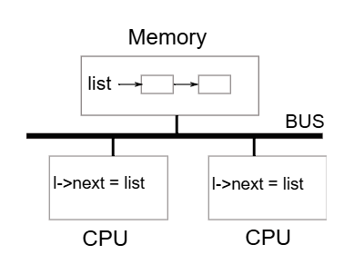
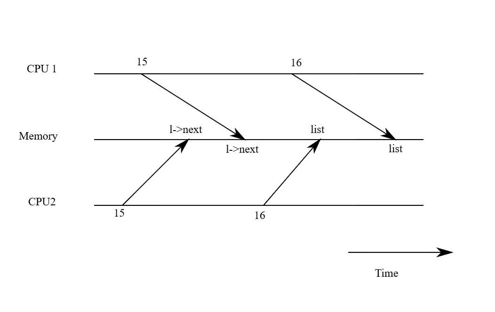

# xv6 riscv book chapter 6：Locking

包括 xv6 的大多数 kernel，在执行时都会交错进行多个活动。 造成交错的其中一个原因是多核的硬件：例如 xv6 的 RISC-V 支持多个独立执行的 CPU。 这些 CPU 会共用实体 RAM，而 xv6 会善用这样的特性来维护那些所有 CPU 都会读写的数据结构。 这种共用会生成一个问题，就是当某个 CPU 正在读某个数据结构的同时，另一个 CPU 可能正好在修改它，甚至可能有多个 CPU 同时在修改同一笔数据

若没有谨慎设计，这种平行访问很可能导致错误的结果，甚至破坏数据结构。 即便在单核系统中，kernel 也可能在多个线程之间切换，使得它们的执行交错进行。 最后，若某个装置的 interrupt handler 与可被中断的代码会修改同一份数据，而中断刚好在不恰当的时机发生，则也可能会破坏数据。 并行（concurrency）这个词就是指这种多条指令流因为多核平行处理、线程切换，或中断而生成交错的情况

kernel 中充满了会被并行访问的数据。 举例来说，两个 CPU 可能会同时调用 `kalloc`，导致它们同时从 free list 的开头取出项目。 kernel 的设计者倾向允许大量的并行，因为这样可以通过平行运行提升效能，也能让系统的反应更快。 但也因此，设计者必须在这样的并行条件下，确保系统的正确性。 要写出正确的代码有很多方法，也有一些较简单的方法。 在并行情况下确保正确性的策略，以及支持这些策略的抽象机制，统称为并行控制（concurrency control）技术

xv6 依据不同情况使用多种并行控制技术，而实际上还有更多其他可能的做法。 本章会聚焦在一种被广泛使用的技术：锁（lock）。 lock 提供互斥（mutual exclusion），确保每次只有一个 CPU 能持有这个锁。 如果程序设计者为每个共享数据加上一把对应的锁，并且在使用这份数据时总是持有这把锁，那么每次就只有一个 CPU 能使用这笔数据。 我们称这种情况为「lock 保护了这笔数据」。 尽管 lock 是一种易于理解的并行控制机制，但它的缺点是可能会限制效能，因为它会让原本可以并行的操作变成序列化的执行

本章接下来将说明 xv6 为何需要锁、xv6 是如何实现锁的，以及它是如何使用这些锁的

## 6.1 Races

这边用一个例子来说明为何我们需要锁：假设有两个 process，它们各自都有已结束（exited）的子进程，且这两个 parent 在不同的 CPU 上调用了 `wait`。 由于 `wait` 会释放子进程的内存，因此在每个 CPU 上，kernel 都会调用 `kfree` 来释放这些子进程的内存 page

kernel 的内存分配器维护一个 linked list：`kalloc()` 会从 free list 中弹出一个 page，`kfree()` 则会把一个 page 推回 free list。 为了最佳效能，我们或许会希望这两个 parent process 的 `kfree` 能同时并行执行，互不等待，但以 xv6 的 `kfree` 实现来说，这样做是不正确的

图 6.1 更详细地说明了这个情境：free page 的 linked list 位于两个 CPU 共享的内存中，而它们使用 load 与 store 指令来操作这个 list（实际上处理器内会有 cache，但概念上多处理器系统的行为就像是共享单一内存一样）



如果没有并行的请求，则 list 的 push 实现可能如下：

```c
struct element {
  int data;
  struct element *next;
};

struct element *list = 0;

void
push(int data)
{
  struct element *l;

  l = malloc(sizeof *l);
  l->data = data;
  l->next = list;
  list = l;
}
```

这段实现在单独执行时是正确的，然而当多个实例同时执行时，这段程序就不正确了。 如果两个 CPU 同时执行 `push`，那么它们都可能如图 6.1 所示地执行 `l->next = list`，这会导致在它们都还没来得及执行 `list = l` 之前，就出现如图 6.2 所示的错误结果：两个 list 节点的 `next` 都指向原本的 list，而当这两次 `list = l` 被执行时，第二次的赋值会覆盖第一次的结果，导致第一次的节点遗失



在 `list = l` 发生的数据遗失就是一个竞争（race）的例子。 race 是指某个内存位置被多个线程或 CPU 同时访问，而且其至少有一个是写入操作。 race 通常代表有 bug，要么是更新被遗失（如果是多次写入），要么是读到尚未完整更新的数据结构。 race 的结果会受到编译器生成的机器码、两个 CPU 执行的时序，以及内存系统安排这些操作顺序的方式影响，因此 race 导致的错误常常很难重现与除错。 举例来说，在 debug `push` 时加上 print statement 可能就改变了执行时序，使 race 的情况消失

避免 race 最常见的方法就是使用 lock。 lock 可以保证互斥（mutual exclusion），也就是在任一时间点，只有一个 CPU 能执行 `push` 中敏感的代码部分，这样就能完全避免发生上述错误情况。 正确加上 lock 的版本只需要新增几行：

```c
struct element *list = 0;
struct lock listlock;  // add this line

void
push(int data)
{
  struct element *l;
  l = malloc(sizeof *l);
  l->data = data;

  acquire(&listlock);  // add this line
  l->next = list;
  list = l;
  release(&listlock);  // add this line
}
```

在 `acquire` 与 `release` 之间的这段代码称为临界区（critical section）

我们通常说某个 lock 保护了某笔数据，这种时候实际上是指这个 lock 保护了一组描述这笔数据不变式（invariants），不变式是数据结构在不同操作之间需要维持的「性质」。 通常，一个操作是否正确，会仰赖于操作开始时那些不变式是否成立。 这个操作可能会在执行过程中暂时破坏这些不变式，但它必须在结束前再次恢复它们。 举例来说，在 linked list 的例子中，不变式包括 `list` 应该指向串列的第一个节点，且每个节点的 `next` 栏位应该指向下一个节点

在 `push` 的实现中，这个不变式会被暂时打破：在 `l->next = list` 处，`l` 就已经指向了下一个节点，但此时 `list` 还没指向 `l`（直到 `list = l` 才重新创建起来）。 前面我们讨论的 race 发生的原因就是有另一个 CPU 在这些不变式暂时无效时执行了依赖于它们的操作。 正确使用 lock 可以确保任何时刻只有一个 CPU 可以在临界区内操作数据结构，从而避免在不变式尚未成立的情况下执行错误的操作

你可以把 lock 想成是「序列化（serializing）」多个并行的临界区，使它们一次只会有一个执行，从而保护那些不变式（前提是这些临界区在单独执行时本身就是正确的）。 你也可以这样理解：由同一个 lock 保护的临界区彼此之间具有「原子性」，也就是它们彼此之间只会看到其他临界区完整执行后的结果，而永远不会看到执行到一半的中间状态

虽然 lock 对于确保正确性很有帮助，但它本质上会限制效能。 举例来说，若两个 process 同时调用 `kfree`，lock 会将这两段临界区序列化地执行，但这样就无法通过使用不同 CPU 来得到效能上的好处了。 我们会说多个 process 在同时需要同一把 lock 时生成了冲突（conflict），或者说这把 lock 发生了竞争（contention）

kernel 设计中一大挑战就是如何在追求平行化的同时避免 lock contention。 xv6 在这方面的设计比较少，但较进阶的 kernel 则会特别针对数据结构与演算法设计来避免 contention。 以 list 为例，有些 kernel 会为每个 CPU 维护一个独立的 free list，只有在当前 CPU 的 list 是空的情况下，才会去「偷取」别的 CPU 的内存。 其他应用场景则可能需要更复杂的设计

lock 的放置位置对效能也很重要。 举例来说，虽然把 `push` 中的 `acquire` 移到更早的位置（例如放在 `l = malloc(sizeof *l)` 前）也是正确的作法，但这么做可能会降低效能，因为这样 `malloc` 的调用也会被序列化。 下面的「Using locks」小节会提供一些指引，说明该如何选择 `acquire` 和 `release` 的插入位置

## 6.2 Code: Locks

xv6 有两种类型的 lock：spinlock 和 sleep-lock。 我们先从 spinlock 开始介绍，xv6 用一个 `struct spinlock` 来表示一个 spinlock（[kernel/spinlock.h:2](https://github.com/mit-pdos/xv6-riscv/blob/riscv//kernel/spinlock.h#L2)）。 这个结构中最重要的栏位是 `locked`，当这个栏位为 0 表示 lock 是可用的，非零则表示 lock 已被持有。 从逻辑上来说，获取一把 lock 的实现可能长这样：

```c
void
acquire(struct spinlock *lk) // does not work!
{
  for(;;) {
    if(lk->locked == 0) {
      lk->locked = 1;
      break;
    }
  }
}
```

不幸的是，这段实现在多核系统中无法保证互斥（mutual exclusion）。 可能会有两个 CPU 同时执行到 `if(lk->locked == 0)` 这一行，且都发现 `lk->locked` 为 0，然后都执行 `assign` 将它设为 1，结果就是两个不同的 CPU 都以为自己获取了这把 lock，这违反了互斥的基本原则。 因此我们需要一种能让 lock 的判断和 lock 的索取这两行变成一个原子（不可分割）操作的方法

由于 lock 的使用非常普遍，多核处理器通常会提供某些指令，来实现判断与索取 lock 的原子版本。 RISC-V 提供了 `amoswap r, a` 这条指令，其会读取内存地址 `a` 的内容，然后将寄存器 `r` 的值写入该地址，并把原先内存中的值存回 `r`。 换句话说，它会原子性地交换寄存器和内存地址的内容。这个过程是不可中断的，硬件会确保在这个读写过程中没有其他 CPU 介入访问这块内存

xv6 的 `acquire`（[kernel/spinlock.c:22](https://github.com/mit-pdos/xv6-riscv/blob/riscv//kernel/spinlock.c#L22)）函数使用了一个可移植的 C 函数 `__sync_lock_test_and_set`，它的底层实现会转换成 `amoswap` 指令； 这个函数会返回 `lk->locked` 这个栏位的旧值（也就是 swap 前的值）。 `acquire` 会将这个 swap 操作包在一个循环里，不断重试（自旋），直到成功获取 lock 为止

每次循环都会尝试将 1 写入 `lk->locked`，并检查它原本的值； 如果原本的值是 0，代表我们成功获取了 lock，且这次的 swap 会将 `lk->locked` 设为 1。 如果原本的值是 1，代表有其他 CPU 已经持有这把 lock，而这次我们虽然也执行了 swap，把 1 写了进去，但其并没有改变原来的值（都是 1）

为了除错用途，当成功获取 lock 后，`acquire` 会纪录是哪个 CPU 获取了这把 lock（`lk->cpu`）。 `lk->cpu` 这个栏位也会被该 lock（`lk`）保护，因此只能在持有该 lock 的情况下修改它

`release`（[kernel/spinlock.c:47](https://github.com/mit-pdos/xv6-riscv/blob/riscv//kernel/spinlock.c#L47)）函数与 `acquire` 相反：它会先清空 `lk->cpu` 栏位，然后释放 lock。 从概念上来看，释放 lock 只需要将 `lk->locked` 设为 0 就可以了。 但是 C 语言标准允许编译器用多个 store 指令来实现单个 assignment，所以赋值操作在多线程的环境下可能不会是 atomic 的。 为了避免这个问题，`release` 使用了 C 标准库中的 `__sync_lock_release` 函数，这个函数会做原子性的赋值以将 `lk->locked` 设为 0，它的底层也会转换成 RISC-V 的 `amoswap` 指令

## 6.3 Code: Using locks

xv6 在许多地方使用了 lock 来避免 race condition。 就如前面提到的，`kalloc`（[kernel/kalloc.c:69](https://github.com/mit-pdos/xv6-riscv/blob/riscv//kernel/kalloc.c#L69)）和 `kfree`（[kernel/kalloc.c:47](https://github.com/mit-pdos/xv6-riscv/blob/riscv//kernel/kalloc.c#L47)）是很好的例子。你可以尝试做第 1 和第 2 题练习，看看当这些函数省略 lock 时会发生什么事。 你可能会发现实际上我们很难触发明显的错误行为，这也显示要可靠地测试某段代码是否真的没有 lock 的问题或 race condition 是很困难的。 xv6 本身也可能仍有尚未被发现的 race 问题

使用 lock 最困难的地方之一是决定要使用多少把 lock，以及每把 lock 应该保护哪些数据与不变式，这有一些基本原则可以遵循。 第一，当某个变量可能在一个 CPU 上被写入，同时又可能在另一个 CPU 上被读取或写入，就应该使用 lock 来防止这两个操作重栈。 第二，记住 lock 的目的是保护不变式：如果某个不变式涵盖了多个内存位置，那么通常这些位置都应该由同一把 lock 保护，才能确保这个不变式不会被破坏

上述规则说明了何时需要加锁，但并未说明什么情况下不需要加锁。 如前面所述，为了效能考量，我们不应该过度地加锁，因为锁会减少平行性。 如果不需要平行性，那可以只用单一线程，这样就不用担心加锁的问题。 一个简单的 kernel 在多核系统上也可以这么做：只要在进入 kernel 时获取一把全域的 lock，离开时再释放（但像是 `pipe` 的读取或 `wait` 之类会阻塞的系统调用会变得比较麻烦）

很多单核操作系统就是用这种方式转移到多核环境的，这种做法有时被称为「big kernel lock」。 但这会牺牲平行性：任何时候只有一个 CPU 能执行 kernel。 如果 kernel 需要进行大量地运算，改用更多、且范围较小的 lock 会更有效率，这样 kernel 才能同时在多个 CPU 上执行

以 coarse-grained（粗粒度）lock 为例，xv6 实现在 kalloc.c 中的内存分配器内，整个 free list 是由一把 lock 所保护的。 如果有多个 process 在不同的 CPU 上同时试图分配内存 page，它们就得轮流等待，在 `acquire` 中自旋。 自旋会浪费 CPU 时间，因为这不算是实质工作。 如果这把 lock 的竞争浪费了大量的 CPU 时间，也许可以通过修改分配器的设计，改为使用多个 free list，每个都有自己的 lock，如此就能真正做到平行地进行内存分配

再看一个 fine-grained（细粒度）lock 的例子：xv6 为每个文件设置了一把独立的 lock，因此当不同的 process 操作不同的文件时，通常不需等待彼此的 lock，可以同时进行。 这个文件锁的设计其实还可以做得更细，例如若要允许多个 process 同时写入同一个文件的不同区块，就可以再细分锁的范围。 最终，锁的粒度应根据实际效能测试以及系统设计的复杂度来决定

后续章节在介绍 xv6 的各部分时，会提到 xv6 是如何使用 lock 来处理并行问题的。 作为预告，表 6.3 列出了 xv6 中所有使用的 lock

<center-panel natural title="（Figure 6.3: Locks in xv6）">

| **Lock**            | **Description**                                                  |
|---------------------|------------------------------------------------------------------|
| `bcache.lock`       | Protects allocation of block buffer cache entries               |
| `cons.lock`         | Serializes access to console hardware, avoids intermixed output |
| `ftable.lock`       | Serializes allocation of a struct file in file table            |
| `itable.lock`       | Protects allocation of in-memory inode entries                  |
| `vdisk_lock`        | Serializes access to disk hardware and queue of DMA descriptors |
| `kmem.lock`         | Serializes allocation of memory                                 |
| `log.lock`          | Serializes operations on the transaction log                    |
| `pipe`'s `pi->lock` | Serializes operations on each pipe                              |
| `pid_lock`          | Serializes increments of `next_pid`                             |
| `proc`'s `p->lock`  | Serializes changes to process's state                           |
| `wait_lock`         | Helps wait avoid lost wakeups                                   |
| `tickslock`         | Serializes operations on the ticks counter                      |
| `inode`'s `ip->lock`| Serializes operations on each inode and its content             |
| `buf`'s `b->lock`   | Serializes operations on each block buffer                      |

</center-panel>

## 6.4 Deadlock and lock ordering

如果 kernel 中某段程序路径必须同时持有多把 lock，那么所有程序路径都必须以相同的顺序获取这些 lock，这一点非常重要，否则会有发生死结（deadlock）的风险。 假设 xv6 中有两段程序路径都需要获取 lock A 和 lock B，其中第一段会依序获取 A 再获取 B，而第二段则是先获取 B 再获取 A

假设 thread T1 执行第一段路径并已获取 lock A，thread T2 执行第二段路径并已获取 lock B。 接下来 T1 尝试获取 lock B，而 T2 尝试获取 lock A。 此时这两次 `acquire` 都会无限期阻塞，因为它们彼此持有对方需要的 lock，且只有等到 `acquire` 成功后才会释放原本的 lock

为了避免这种死结情况，所有程序路径都必须依照相同的顺序获取 lock。 这也意味著每一把 lock 的获取顺序事实上是每个函数行为规格的一部分：调用者必须以符合整体约定的方式来使用这些函数，确保 lock 的获取顺序一致

由于 `sleep` 的实现方式（详见第七章），xv6 中有许多长度为 2 的 lock-order chain，这涉及到每个 process 的 lock（也就是每个 `struct proc` 中的那把 lock）。 举例来说，`consoleintr`（[kernel/console.c:136](https://github.com/mit-pdos/xv6-riscv/blob/riscv//kernel/console.c#L136)）是处理键盘输入中断的函数。 当接收到换行字元时，所有正在等待 console 输入的 process 都应该被唤醒。 为了达成这点，`consoleintr` 会在持有 `cons.lock` 的情况下调用 `wakeup`，而 `wakeup` 在唤醒某个 process 时会获取该 process 的 lock

因此，xv6 为了避免死结，规定全域的 lock 顺序中必须先获取 `cons.lock`，然后才可以获取任何的 process lock。 而在文件系统中，xv6 则有最长的 lock chain。 例如在创建文件时，需要同时持有该目录的 lock、新文件 inode 的 lock、一个 disk block buffer 的 lock、硬盘驱动程序的 `vdisk_lock`，以及调用者的 `p->lock`。 为了避免死结，文件系统代码必须依照前述顺序来依次获取这些 lock

要遵守全域的、避免死结的 lock 获取顺序，其实比想像中困难。 某些时候，这样的 lock 顺序会与程序逻辑的结构冲突。 例如，某个模组 M1 调用另一个模组 M2，但 lock 的顺序却要求先获取 M2 的 lock，才能获取 M1 的 lock。 也有时候，在事前根本不知道下一把要获取的 lock 是哪一个，因为可能必须先持有某把 lock 才能知道下一个要锁的是谁

这种情况会出现在文件系统中，像是在依序解析路径名称的每一层时会发生，也会出现在 `wait` 与 `exit` 搜索 process table 中的子进程时。 最后，避免死结的需求也常常限制了 lock 粒度的细致程度，因为使用越多的 lock，死结发生的机会也越高。 事实上，如何避免死结，常常是 kernel 实现时的一个主要考量因素

## 6.5 Re-entrant locks

乍看之下，某些死结与 lock 顺序的难题似乎可以通过使用 re-entrant locks（又称为 recursive locks）来避免。 这种 lock 的设计概念是：如果某个 process 已经持有了一把 lock，并且它再次尝试去获取同一把 lock，那么 kernel 可以直接允许这件事发生（因为这个 process 已经拥有该 lock），而不是像 xv6 那样直接触发 panic

然而事实上，re-entrant lock 反而让并行性的分析变得更困难：它破坏了一个重要的直觉，也就是「持有 lock 的区段之间具有原子性（critical section 彼此互斥）」。 来看看以下这些函数：`f`、`g`，以及一个假设性的函数 `h`：

```c
struct spinlock lock;
int data = 0; // protected by lock

f() {
  acquire(&lock);
  if(data == 0){
    call_once();
    h();
    data = 1;
  }
  release(&lock);
}

g() {
  acquire(&lock);
  if(data == 0){
    call_once();
    data = 1;
  }
  release(&lock);
}

h() {
  ...
}
```

观察这段代码，我们会直觉地认为 `call_once` 只会被调用一次：要么是在 `f` 中被调用，要么是在 `g` 中，但不会两者都调用。 但如果允许使用 re-entrant lock，而且 `h` 恰好又调用了 `g`，则 `call_once` 将会被调用两次

如果不允许使用 re-entrant lock，那么当 `h` 调用 `g` 会造成死结，这虽然也不好，但如果重复调用 `call_once` 是一个严重错误的话，那么死结反而是比较可以接受的情况。 因为 kernel 开发者会观察到这个死结（kernel 会 panic），然后可以修正这段代码来避免它； 而若是 `call_once` 被调用了两次，可能会默默地造成一个很难跟踪的错误

基于这个原因，xv6 采用的是较容易理解的 non-re-entrant（不可重入）lock。 当然，只要程序设计者谨记加锁的规则，这两种方式都可以良好运行。 如果 xv6 要改成支持 re-entrant lock，就必须修改 `acquire`，让它能够辨识目前的 lock 是否已经被调用该函数的 thread 持有。 此外还需要在 `struct spinlock` 中加入一个用来记录巢状锁定次数的栏位，其设计方式会类似接下来会介绍的 `push_off`

## 6.6 Locks and interrupt handlers

有些 xv6 的 spinlock 用来保护同时被 thread 与 interrupt handler 访问的数据。 举例来说，`clockintr` 这个 timer interrupt handler 可能会于 kernel thread 正在 `sys_sleep`（[kernel/sysproc.c:61](https://github.com/mit-pdos/xv6-riscv/blob/riscv//kernel/sysproc.c#L61)）中读取 `ticks`（[kernel/trap.c:164](https://github.com/mit-pdos/xv6-riscv/blob/riscv//kernel/trap.c#L164)）时，尝试把 `ticks` 加一。 为了序列化这两种访问，xv6 使用 `tickslock` 这把 lock 来保护 `ticks`

spinlock 与中断的交互作用会带来潜在的危险。 假设现在 `sys_sleep` 已经持有了 `tickslock`，而此时该 CPU 被 timer interrupt 打断，进入 `clockintr`。 `clockintr` 接著会尝试获取 `tickslock`，发现它已被持有，于是就会等待释放。 但问题在于：这把 lock 只能由 `sys_sleep` 释放，而 `sys_sleep` 又无法继续执行，因为中断尚未结束。 因此整个 CPU 会陷入死结，所有需要这把 lock 的代码也会跟著卡住

::: tip  
这段描述的是一种「自我死结」情境，也称为 interrupt-induced deadlock：thread 拿著 lock 时被中断，而 interrupt handler 又需要那把 lock，但 thread 又得等中断结束才会继续执行。 两者互相依赖，导致整个 CPU 无限等待。 这个问题特别会发生在 spinlock 无法 sleep 的情况下  
:::

为了避免上述情况，如果某把 spinlock 是会被中断处理函数使用的，那么任何 CPU 在持有这把 lock 的期间，都绝对不能允许中断。 xv6 采取更保守的做法：当 CPU 获取任何 lock 时，xv6 都会先关闭该 CPU 的中断。 其他 CPU 上的中断仍然可以发生，所以在其他 CPU 上，interrupt handler 仍可能会去 `acquire` 某把 spinlock，只是不能在持有该 lock 的同一 CPU 上这样做

xv6 会在 CPU 不再持有任何 spinlock 时重新打开中断。 为了支持巢状的 critical section，它必须做一些状态纪录。 `acquire` 会调用 `push_off`（[kernel/spinlock.c:89](https://github.com/mit-pdos/xv6-riscv/blob/riscv//kernel/spinlock.c#L89)），`release` 则会调用 `pop_off`（[kernel/spinlock.c:100](https://github.com/mit-pdos/xv6-riscv/blob/riscv//kernel/spinlock.c#L100)），这两个函数用来跟踪目前 CPU 上的 lock 巢状层数。 当这个巢状层数变成 0 时，`pop_off` 会还原当初进入最外层 critical section 时的中断状态。 `intr_off` 与 `intr_on` 则分别对应执行 RISC-V 关闭与打开中断的指令

非常重要的一点是，`acquire` 必须在设置 `lk->locked`（[kernel/spinlock.c:28](https://github.com/mit-pdos/xv6-riscv/blob/riscv//kernel/spinlock.c#L28)）之前就先调用 `push_off`。 如果顺序颠倒，就会出现一个短暂的时间区间，在那期间 lock 已经被持有，但中断仍然是打开的，此时若刚好发生中断，就会导致整个系统死结。 同样地，也必须在释放 lock 之后才调用 `pop_off`（[kernel/spinlock.c:66](https://github.com/mit-pdos/xv6-riscv/blob/riscv//kernel/spinlock.c#L66)）

## 6.7 Instruction and memory ordering

直觉上我们会认为程序会按照源代码中语句出现的顺序执行。 对於单线程的代码而言，这种心智模型是合理的，但在多个线程通过共享内存进行交互时，这个模型就是错误的了<sup>[[1]](#1), [[2]](#2)</sup>。 原因之一是：编译器生成的 load 与 store 的指令顺序，可能与源代码中所暗示的顺序不同，甚至可能完全省略某些指令（例如把数据暂存在寄存器中，根本不写回内存）。 另一个原因是 CPU 为了提升效能，可能会重新安排指令的执行顺序。 举例来说，若指令序列中的 A 与 B 彼此没有依赖性，那么 CPU 可能会先执行 B，这可能是因为 B 的输入比较早准备好，或是为了与 A 的执行重栈来增加平行性

来看看以下 `push` 的实现，它展示了可能出错的情境。 如果编译器或 CPU 把第 4 行的 store 操作移到第 6 行的 `release` 之后，那会造成灾难性的后果：

```c
l = malloc(sizeof *l);
l->data = data;
acquire(&listlock);
l->next = list;   // line 4
list = l;
release(&listlock);  // line 6
```

如果真的发生这样的重新排序，那就会出现一个短暂的时间区间，期间其他 CPU 可能获取这把 lock，并看到已更新的 list，但此时的 `list->next` 还未被初始化

好消息是，编译器与 CPU 都会遵循一套称为 memory model（内存模型）的规则，来帮助并进程序设计者。 此外它们也提供一些原语（primitives），让程序设计者能控制重新排序的行为

::: tip  
尽管存在重新排序的风险，但操作系统或语言层提供了内存模型（如 C/C++11 memory model、RISC-V memory model）来让这些行为可预测。 更进一步的工具像是：

- memory barriers / fences：指令级别的排序限制
- atomic operations：具有特定顺序语意的同步原语

这些工具能帮助开发者明确告诉 CPU/编译器「不要进行重新排序」  
:::

为了告诉硬件与编译器「不要进行重新排序」，xv6 在 `acquire`（[kernel/spinlock.c:22](https://github.com/mit-pdos/xv6-riscv/blob/riscv//kernel/spinlock.c#L22)）与 release（[kernel/spinlock.c:47](https://github.com/mit-pdos/xv6-riscv/blob/riscv//kernel/spinlock.c#L47)）中都使用了 `__sync_synchronize()` 函数。 这个函数是一种 memory barrier（内存屏障），它会要求编译器与 CPU 不要让 loads 或 stores 穿越这道屏障而重新排序。 xv6 的 `acquire` 与 `release` 函数中的这些屏障，几乎在所有重要的情况下都能强制确保正确的执行顺序，因为 xv6 会用 lock 包住对共享数据的访问。 不过在第九章中还会讨论一些例外情况

## 6.8 Sleep locks

有时候 xv6 需要长时间持有一把锁。 例如文件系统（见第八章）在从硬盘读写文件内容时会将文件上锁，而这些硬盘操作可能会花上数十毫秒。 若在这段期间持有一把 spinlock，会造成浪费，因为如果其他 process 想获取这把 lock，就会在这段时间中不断自旋、浪费 CPU 资源。 另一个使用 spinlock 的缺点是，process 在持有 spinlock 时无法让出 CPU

但我们希望 process 在等待硬盘时能让出 CPU，好让其他 process 可以使用，然而在持有 spinlock 时让出 CPU 是不合法的，因为这可能导致 deadlock：如果此时另一条线程也想获取这把 spinlock，而 `acquire` 并不会让出 CPU，那么这条线程就会自旋，可能阻止原本持有 lock 的线程再次执行、从而无法释放 lock

在持有 lock 的状态下让出 CPU，也会违反 spinlock 所要求的「必须关闭中断」的条件。 因此，我们希望有一种 lock，在等待获得时可以让出 CPU，并且在持有 lock 的期间也能让出 CPU（甚至允许中断发生）

xv6 提供了 sleep-lock 来满足这个需求。 `acquiresleep`（[kernel/sleeplock.c:22](https://github.com/mit-pdos/xv6-riscv/blob/riscv//kernel/sleeplock.c#L22)）在等待期间会让出 CPU，具体机制会在第七章详细说明。 简单来说，sleep-lock 内部有一个 `locked` 栏位，由一把 spinlock 保护，`acquiresleep` 中会调用 `sleep`，并在这个调用中以原子地方式同时让出 CPU 并释放 spinlock。 这样的设计让其他线程可以在 `acquiresleep` 等待期间继续执行

由于 sleep-lock 不会关闭中断，因此不能在 interrupt handler 中使用。 又因为 `acquiresleep` 可能会让出 CPU，所以 sleep-lock 也不能被用在 spinlock 的 critical section 内（不过反过来，spinlock 可以在 sleep-lock 的 critical section 里使用）

总的来说，spinlock 适合用在短暂的 critical section，因为等待它会浪费 CPU； 而 sleep-lock 则适合用在耗时较长的操作上

## 6.9 Real world

即使经过了多年针对并行原语与平行运算的研究，使用 lock 进进程序设计仍然是一项困难的挑战。 将 lock 隐藏在像是 synchronized queue 这种高阶结构中通常是比较好的做法，不过 xv6 并没有这样做。 如果你必须直接使用 lock 来写程序，建议搭配能侦测 race condition 的工具，因为人们很容易漏掉某些需要 lock 保护的不变性条件

大多数操作系统都支持 POSIX threads（Pthreads），这允许一个用户进程能同时在多个 CPU 上执行数个线程。 Pthreads 提供了用户层级的 lock、barrier 等功能。 Pthreads 也允许程序设计者指定某些 lock 是否要支持 re-entrant

在用户层级实现 Pthreads 需要操作系统的支持。 例如，如果一个 pthread 在某个系统调用中被 block，则同一个 process 中的其他 pthread 应该仍能在那颗 CPU 上继续执行。 又例如，如果某个 pthread 改变了整个 process 的地址空间（像是对内存进行 map 或 unmap），kernel 必须让所有在其他 CPU 上执行该 process 的线程也能更新它们的 page table hardware，以反映这个地址空间的改变

虽然可以在不使用 atomic instruction 的情况下实现 lock<sup>[[3]](#3)</sup>，但这样的做法成本很高，因此大多数操作系统会选择使用 atomic instruction 来实现 lock

当多个 CPU 同时尝试 acquire 同一把 lock 时，这个 lock 的开销就会变得很高。 如果某个 CPU 把 lock 保存在它的本地缓存中，而另一个 CPU 想要获取这把 lock，那么用来更新这段缓存的 atomic instruction 必须先将这条 cache line 从原本的 CPU 移动到目标 CPU，并可能需要让其他 CPU 中的缓存副本失效。 从其他 CPU 的缓存中取出 cache line 的成本，可能会比从本地缓存中获取的成本还高出数十倍

为了避免 lock 带来的高开销，许多操作系统会使用 lock-free 的数据结构与演算法<sup>[[4]](#4), [[5]](#5)</sup>。 例如，可以设计一个 linked list，在查询的时候完全不需要用 lock，而插入时也只需一个 atomic 指令。 不过 lock-free 程序设计比使用 lock 更加复杂，例如必须考虑指令与内存的重排序。 考虑到用 lock 写程序已经够困难了，因此 xv6 选择不加入 lock-free 机制，以减少复杂性

## 6.10 Exercises

1. 注解掉 `kalloc` 中对 `acquire` 与 `release` 的调用（[kernel/kalloc.c:69](https://github.com/mit-pdos/xv6-riscv/blob/riscv//kernel/kalloc.c#L69)）。 这应该会对调用 `kalloc` 的 kernel 代码造成问题。 你预期会看到什么症状？ 当你执行 xv6 时是否真的看到了这些症状？ 执行 `usertests` 时又会如何？ 如果你没有看到任何问题，那是为什么？ 试著在 `kalloc` 的 critical section 中加入一些 dummy 的循环，看看能不能让问题更明显
2. 假设你恢复 `kalloc` 的 locking，改为注解掉 `kfree` 的 locking，那会发生什么问题？ 相比之下，`kfree` 缺少 lock 是不是没 `kalloc` 那么严重？
3. 如果两个 CPU 同时调用 `kalloc`，其中一个必须等待另一个，这对效能是有害的。 请修改 kalloc.c 增加并行性，使得不同 CPU 上的 `kalloc` 调用可以同时进行，而不必互相等待
4. 使用 POSIX threads 撰写一个平进程序（大多数操作系统都有支持）。 例如你可以实现一个平行的 hash table，并测量当 CPU 数增加时，put/get 的数量是否能跟著扩张
5. 在 xv6 上实现一个简化版的 Pthreads。 也就是实现一个用户层级的 thread library，使得一个用户进程可以有不只一个 thread，并安排这些 thread 可以在不同 CPU 上平行执行。 请设计一套正确处理 blocking system call 与共享地址空间改动的方案

## Bibliography

- <a id="1">[1]</a>：The RISC-V instruction set manual Volume I: unprivileged specification ISA. https://drive.google.com/file/d/17GeetSnT5wW3xNuAHI95-SI1gPGd5sJ_/view?usp=drive_link, 2024.
- <a id="2">[2]</a>：Hans-J Boehm. Threads cannot be implemented as a library. ACM PLDI Conference, 2005.
- <a id="3">[3]</a>：L Lamport. A new solution of dijkstra’s concurrent programming problem. Communications of the ACM, 1974.
- <a id="4">[4]</a>：Maurice Herlihy and Nir Shavit. The Art of Multiprocessor Programming, Revised Reprint. 2012.
- <a id="5">[5]</a>：Paul E. Mckenney, Silas Boyd-wickizer, and Jonathan Walpole. RCU usage in the linux kernel: One decade later, 2013.
