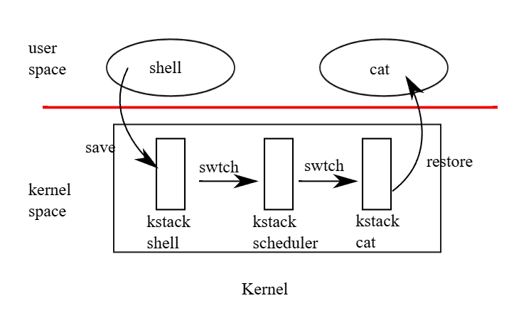

# xv6 riscv book chapter 7：Scheduling

任何操作系统在执行时，通常会有比电脑实际拥有的 CPU 数量还多的 process，因此必须有一套计划来让这些 process 能够轮流使用 CPU。 理想上，这种共享机制对用户的 process 来说应该要是透明的。 常见的做法是通过「multiplexing」的方式，把多个 process 映射（multiplex）到实际的硬件 CPU 上，让每个 process 生成拥有自己虚拟 CPU 的错觉。 本章会说明 xv6 是如何实现这样的 multiplexing 的

## 7.1 Multiplexing

xv6 的 multiplexing 机制会在两种情况下让某个 CPU 从一个 process 切换到另一个。 第一种是当 process 调用会阻塞（也就是需要等待某些事件才能继续）的系统调用时，例如 `read`、`wait` 或 `sleep`，此时会通过 xv6 的 `sleep` 与 `wakeup` 机制来切换； 第二种是为了应对那些长时间运算而不会阻塞的 process，xv6 会定期强制让 CPU 切换到其他 process。 前者称为「自愿切换（voluntary switches）」，后者则称为「非自愿切换（involuntary switches）」。 通过这些切换，xv6 创造出每个 process 各自拥有一颗 CPU 的错觉

要实现 multiplexing 有几个挑战：

- 第一，该如何从一个 process 切换到另一个？
  - 基本的作法是存储与还原 CPU 的寄存器，不过因为这种行为无法用 C 来表达，所以会比较麻烦
- 第二，该如何让「强制切换」对 user process 来说是透明的？
  - xv6 采用了一个标准技巧，由硬件 timer 所触发的中断来驱动 context switch
- 第三，由于所有 CPU 都会在同一组 process 间切换，因此必须设计一套锁定策略以避免 race condition
- 第四，当一个 process 结束时，它的内存与其他资源必须被释放，但 process 自己无法完成这些释放动作
  - 例如 process 无法在其还在使用 kernel stack 的情况下释放那块 stack，需要其他 thread 帮它收尾
- 第五，对于多核机器，每颗 CPU 都必须记住自己目前正在执行哪个 process，这样系统调用才能正确地作用在那个 process 的 kernel 状态上
- 最后，`sleep` 和 `wakeup` 机制允许 process 放弃 CPU，并等待其他 process 或中断将它唤醒，而这里需要特别小心，避免 race condition 导致唤醒通知被遗失

## 7.2 Code: Context switching

图 7.1 说明了从一个 user process 切换到另一个时所经历的步骤：首先是从 user space 发出 trap（可能是 system call 或 interrupt），转入旧 process 的 kernel thread； 接著切换到目前 CPU 的 scheduler thread； 然后切换到新 process 的 kernel thread； 最后从 trap return 回到新的 user-level process

xv6 为 scheduler 使用了独立的 thread（各自拥有寄存器与 stack 的保存空间），因为让 scheduler 在任意 process 的 kernel stack 上执行并不安全：其他 CPU 可能会在这段期间唤醒该 process 并开始执行，若两个 CPU 共用同一个 stack，会造成灾难性的后果。 为了处理多颗 CPU 同时执行、并有 process 要放弃 CPU 的情况，xv6 为每个 CPU 分配了独立的 scheduler thread。 在这一节中，我们将会详细探讨 kernel thread 与 scheduler thread 之间切换的具体实现方式



从一个 thread 切换到另一个 thread 的过程，需要将旧 thread 的 CPU 寄存器存储下来，并还原新 thread 先前存储的那些寄存器。 由于 stack pointer 和 program counter 都会被存储与还原，这也表示 CPU 将会切换至新的 stack，并且执行新的代码

`swtch` 函数负责存储与还原寄存器，实现 kernel thread 间的切换。 `swtch` 并不直接知道所谓的「thread」是什么，它只负责存储与还原一组 RISC-V 的寄存器，这组寄存器的集合被称作「context」。 当某个 process 要放弃 CPU 时，它的 kernel thread 会调用 `swtch`，把自己的 context 存储起来，并还原 scheduler 的 context

每个 context 都存在 `struct context`（[kernel/proc.h:2](https://github.com/mit-pdos/xv6-riscv/blob/riscv//kernel/proc.h#L2)）里，这个结构会被放在某个 process 的 `struct proc` 或某个 CPU 的 `struct cpu` 中。 `swtch` 会接收 `struct context *old` 和 `struct context *new` 这两个引数，并将目前的寄存器存储到 `old`，从 `new` 中加载先前存储的寄存器，然后 return

现在让我们来跟踪一个 process 如何通过 `swtch` 切换进入 `scheduler` 的。 在第四章中我们看到，中断的结束阶段中有一种情况是 `usertrap` 调用 `yield`。 而 `yield` 接著会调用 `sched`，`sched` 再调用 `swtch`，把目前的 context 存到 `p->context` 中，并切换到先前存储在 `cpu->context` 的 scheduler context（[kernel/proc.c:506](https://github.com/mit-pdos/xv6-riscv/blob/riscv//kernel/proc.c#L506)）

`swtch`（[kernel/swtch.S:3](https://github.com/mit-pdos/xv6-riscv/blob/riscv//kernel/swtch.S#L3)）只会存储 callee-saved 寄存器，而 caller-saved 寄存器则会由 C 编译器在调用端负责存储到 `stack` 上。 `swtch` 知道每个寄存器对应到 `struct context` 中的哪个成员，以及该成员的偏移量。 它不会存储 program counter，而是存储 `ra` 寄存器，这个寄存器中存放的是调用 `swtch` 那一行指令的 return address

接著，`swtch` 从新的 context 还原寄存器，这些值是先前某次 `swtch` 存储的。 当 `swtch` 调用 `ret` 返回时，它会回到还原后的 `ra` 所指向的那行指令，也就是新 thread 先前调用 `swtch` 的那个位置。 同时，因为 `sp` 已被还原为新 thread 的 stack pointer，因此执行也会从新 thread 的 stack 上继续

在我们这个例子中，`sched` 会调用 `swtch`，并切换到 `cpu->context`，也就是这颗 CPU 专属的 scheduler context。 这份 context 是在先前某个时刻，由 scheduler 调用 `swtch` 并切换到现在这个 process 时所存储的（[kernel/proc.c:466](https://github.com/mit-pdos/xv6-riscv/blob/riscv//kernel/proc.c#L466)）。 所以当我们目前跟踪的这次 `swtch` return 时，它实际上不是回到 `sched`，而是回到 scheduler，而且此时 stack pointer 已经是这颗 CPU 的 scheduler stack 了

::: tip  
根据 [RISC-V Calling Conventions](https://github.com/riscv-non-isa/riscv-elf-psabi-doc/blob/master/riscv-cc.adoc)，寄存器口语上会分成两类：

- caller-saved registers：调用者在调用 function 前要自己备份，包含 `a0–a7`, `t0–t6`, `ra` 等
- callee-saved registers：被调用者（像 `swtch`）必须保存与还原，包含 `s0–s11`, `sp` 等

这可以在点进去一开始的表格中的「Preserved across calls?」栏位看到，为「Yes」的就是文中说的 callee-saved register。 而 `ra` 虽然不是 callee-saved register，但 `swtch` 为了做 context switch 所以有存

而 `swtch` 做的事基本上就是：

1. 把被换出的 process 的 context 存到 `struct context *old`
2. 把换进来要执行的 process 的 context 用 `struct context *new` 的内容复原
3. 利用 `ret` 回到 `new->ra` 处执行

而对于文中的例子，由于它是由 `sched` 去调用 `swtch`，所以 `new` 填的会是 `&mycpu()->context`，也就是一个 pre-CPU 的 scheduler context  
:::

## 7.3 Code: Scheduling

上一节我们探讨了 `swtch` 的底层细节； 现在我们把来观察 process 的 kernel thread 是如何通过 scheduler 切换到另一个 process 的。 scheduler 是每颗 CPU 上的一个特殊的 thread，这个 thread 执行的是 `scheduler` 函数。 这个函数会负责选出下一个要执行的 process。 当某个 process 想放弃 CPU 时，它必须先获取自己的 process lock `p->lock`，释放它持有的其他 lock，更新自己的状态（`p->state`），然后调用 `sched`。 你可以在 `yield`（[kernel/proc.c:512](https://github.com/mit-pdos/xv6-riscv/blob/riscv//kernel/proc.c#L512)）、`sleep` 和 `exit` 中看到这个流程

接著 `sched` 会再次确认这些条件是否已被满足（[kernel/proc.c:496-501](https://github.com/mit-pdos/xv6-riscv/blob/riscv//kernel/proc.c#L496-L501)），并检查一个隐含的条件：既然有持有锁，则必须确保中断已被关闭。 最后，`sched` 调用 `swtch`，将当前的 context 存入 `p->context`，并切换到 `cpu->context` 中的 scheduler context。 `swtch` 返回时会回到 scheduler 的 stack，就好像当初 scheduler 调用的 `swtch` 返回了一样（[kernel/proc.c:466](https://github.com/mit-pdos/xv6-riscv/blob/riscv//kernel/proc.c#L466)）。 然后 scheduler 继续它的 for 循环，找下一个 process 来执行，再切换过去，如此反复循环

::: tip  
- `scheduler()` 是每颗 CPU 的主控 loop，会寻找 runnable process，并执行它
- 被执行的 process 如果想释放 CPU（例如主动调用 `yield`、被 `sleep` 阻塞、或是 `exit`），就会开始切换流程
- 这时 `sched()` 函数会做两件事：确认合法状态、调用 `swtch` 并切回 scheduler

此处 `swtch` 不是随便 return 的，而是会直接回到当初 `scheduler()` 调用 `swtch()` 的那一点，这依赖于之前 `scheduler()` 有正确地保存自己的 context  
:::

我们刚刚看到 xv6 在调用 `swtch` 的整个过程中会持续持有 `p->lock`：调用 `swtch` 的代码必须事先持有这把 lock，并且这把 lock 的控制权会一并传给被切换过去的代码。 这样的安排并不常见：更常见的做法是持有锁的一方同时负责释放它。 但 xv6 不能这样做，因为 `p->lock` 保护了 `p->state` 与 `p->context` 栏位的状态不变性，而这些不变性在执行 `swtch` 的时候会被暂时破坏掉

例如，如果在执行 `swtch` 期间没有持有 `p->lock`，那么另一颗 CPU 可能会在 `yield` 将 process 状态设为 `RUNNABLE` 之后、但 `swtch` 还没释出 stack 之前，就抢先执行这个 process，导致两个 CPU 同时在用同一个 stack，造成灾难

因此，一旦 `yield` 开始修改 process 的状态，使它变成 `RUNNABLE`，那就必须持续持有 `p->lock`，直到系统恢复状态一致为止：最早能释放 lock 的时间点是在 scheduler（它使用自己的 stack 执行）清除 `c->proc` 之后。 反过来说，当 scheduler 开始把某个 `RUNNABLE` process 转换成 `RUNNING` 时，也不能在 `swtch` 之前释放 lock，而是要等到 process 的 kernel thread 真正开始执行（例如在 `yield` 里）之后才行

kernel thread 唯一会放弃 CPU 的地方是在 `sched`，而它总会切换回 scheduler 中的同一段位置，然后 scheduler 几乎又总会切换到某个先前调用过 `sched` 的 kernel thread。 因此，如果你打印出 xv6 切换线程所在的行号，你会看到一个很简单的模式：466、506、466、506，这样反复。 这种通过 thread switch 有意地把控制权交给彼此的程序，有时被称作 coroutines； 在这个例子中，`sched` 和 `scheduler` 就是彼此的 coroutine

::: tip  
假设 CPU 0 上的 process A 调用了 `yeild` 放弃 CPU，此时在 `yeild` 内会将 `p->lock` 上锁，将 `p->state` 改成 `RUNNABLE`，然后调用 `sched`：

```c
// Give up the CPU for one scheduling round.
void
yield(void)
{
  struct proc *p = myproc();
  acquire(&p->lock);
  p->state = RUNNABLE;
  sched();
  release(&p->lock);
}
```

接著 `sched` 会调用 `swtch`：

```c
// Switch to scheduler.  Must hold only p->lock
// and have changed proc->state. Saves and restores
// intena because intena is a property of this
// kernel thread, not this CPU. It should
// be proc->intena and proc->noff, but that would
// break in the few places where a lock is held but
// there's no process.
void
sched(void)
{
  int intena;
  struct proc *p = myproc();

  if(!holding(&p->lock))
    panic("sched p->lock");
  if(mycpu()->noff != 1)
    panic("sched locks");
  if(p->state == RUNNING)
    panic("sched RUNNING");
  if(intr_get())
    panic("sched interruptible");

  intena = mycpu()->intena;
  swtch(&p->context, &mycpu()->context);
  mycpu()->intena = intena;
}
```

而如前面所述，`swtch` 本身只做 context 的存储与还原，然后 return，这里 `ret` 会回到 scheduler context：

```asm
swtch:
        sd ra, 0(a0)
        sd sp, 8(a0)
        sd s0, 16(a0)
        sd s1, 24(a0)
        sd s2, 32(a0)
        sd s3, 40(a0)
        sd s4, 48(a0)
        sd s5, 56(a0)
        sd s6, 64(a0)
        sd s7, 72(a0)
        sd s8, 80(a0)
        sd s9, 88(a0)
        sd s10, 96(a0)
        sd s11, 104(a0)

        ld ra, 0(a1)
        ld sp, 8(a1)
        ld s0, 16(a1)
        ld s1, 24(a1)
        ld s2, 32(a1)
        ld s3, 40(a1)
        ld s4, 48(a1)
        ld s5, 56(a1)
        ld s6, 64(a1)
        ld s7, 72(a1)
        ld s8, 80(a1)
        ld s9, 88(a1)
        ld s10, 96(a1)
        ld s11, 104(a1)
        
        ret
```

但在执行 `swtch` 的期间，context 还没搬完，到目前整个流程都还跟一般的 function call 一样，所以 CPU 0 还处在 process A 的 stack 上。 此时如果 CPU 1 正在执行 `scheduler`，看到 process A 的 `p->state` 为 `RUNNABLE`，就有可能尝试调用 `acquire(p->lock)` 并把它抓进去执行，成功的话两个 CPU 就会同时执行 process A 且共用了它的 stack，因此才要上锁，让 `acquire(p->lock)` 失败

下面为 `scheduler` 的实现：

```c
// Per-CPU process scheduler.
// Each CPU calls scheduler() after setting itself up.
// Scheduler never returns.  It loops, doing:
//  - choose a process to run.
//  - swtch to start running that process.
//  - eventually that process transfers control
//    via swtch back to the scheduler.
void
scheduler(void)
{
  struct proc *p;
  struct cpu *c = mycpu();

  c->proc = 0;
  for(;;){
    // The most recent process to run may have had interrupts
    // turned off; enable them to avoid a deadlock if all
    // processes are waiting. Then turn them back off
    // to avoid a possible race between an interrupt
    // and wfi.
    intr_on();
    intr_off();

    int found = 0;
    for(p = proc; p < &proc[NPROC]; p++) {
      acquire(&p->lock);
      if(p->state == RUNNABLE) {
        // Switch to chosen process.  It is the process's job
        // to release its lock and then reacquire it
        // before jumping back to us.
        p->state = RUNNING;
        c->proc = p;
        swtch(&c->context, &p->context);

        // Process is done running for now.
        // It should have changed its p->state before coming back.
        c->proc = 0;
        found = 1;
      }
      release(&p->lock);
    }
    if(found == 0) {
      // nothing to run; stop running on this core until an interrupt.
      asm volatile("wfi");
    }
  }
}
```

可以看到在内层的 for loop 中会先调用 `acquire`，然后才会确认 `p->state` 是不是 `RUNNABLE` 的。 这边虽然会依序对 process array 中的每个 process 做 `acquire`，但这其实并没有关系，不会有卡住的问题，因为大部分的时候 `p->lock` 是空闲的，process 在 user space 跑的时候不会上锁，只有在向上面 `swtch` 这种期间才会持锁  

再来你会看到 `yield` 里面在 `sched` 之后还调用了 `release(&p->lock)`，而其对应的 `sched` 内，在 `swtch(&p->context, &mycpu()->context)` 之后做了 `mycpu()->intena = intena;` 这件事

这是因为当 process A 被换出 CPU 0 时，其存储的位置是在 `swtch(&p->context, &mycpu()->context)` 这行，因此之后 process A 被换回来的时候，它会依序再由原路径返回，下面是一个示意用的流程（我画好久）：

```lua
Process A
├─ ...
└─ yield()
   ├─ acquire(A.lock)                                            ← A 上鎖
   ├─ A.state = RUNNABLE
   └─ sched()
      └─ swtch(&p->context, &cpu->scheduler)                     ← 鎖仍在 A 手上
          └─► 進入 scheduler()  (CPU 專屬 stack)
              ├─ c->proc = 0;
              ├─ found = 1;
              ├─ release(A.lock)                                 ← 第一次釋放 A 的鎖
              ├─ for 迴圈掃表，找到 Process B
              ├─ acquire(B.lock)
              ├─ B.state = RUNNING
              └─ swtch(&cpu->scheduler, &B.context)
                  └─► 進入 Process B（執行一段時間…）
                      … B 透過 yield()/sleep() 等放棄 CPU …
                  ◄─ 回到 scheduler()
                      ├─ c->proc = 0
                      ├─ found = 1;
                      ├─ release(B.lock)
                      ├─ 找到 Process A (再次 acquire(A.lock))    ← A 再度上鎖
                      ├─ p->state = RUNNING
                      └─ swtch(&cpu->scheduler, &p->context)
                          └─► 回到 Process A 的 sched()

      ◄─ 回到 sched()         (A 的 kernel stack)
         ├─ mycpu()->intena = intena
         └─ return 回到 yield()

   ◄─ yield() 尾端
      └─ release(A.lock)                                         ← 第二次釋放 A 的鎖
```  
:::

有一种情况下，scheduler 调用 `swtch` 后不会进入 `sched`。 `allocproc` 会把新 process 的 context 中的 `ra` 设为 `forkret`（[kernel/proc.c:524](https://github.com/mit-pdos/xv6-riscv/blob/riscv//kernel/proc.c#L524)），这样这个 process 第一次被切入时，`swtch` 就会「return」到那个函数的开头。 `forkret` 的存在是为了释放 `p->lock`； 否则，因为这个新 process 需要回到 user space（就像从 fork return 一样），它本来可以直接从 `usertrapret` 开始执行

::: tip  
这是 fork 新 process 的特殊处理：

- 新 process 还没有执行过，所以它没有先前的 `swtch` return 点
- `allocproc` 人为设一个 `context.ra = forkret`，让第一次执行时 `swtch` 能跳进去
- `forkret` 的任务是先完成 kernel 端的收尾（例如释放锁），然后才进入 `usertrapret`，跳回 user space

这样做可让新建 process 也能使用与其他 process 相同的切换逻辑  
:::

`scheduler`（[kernel/proc.c:445](https://github.com/mit-pdos/xv6-riscv/blob/riscv//kernel/proc.c#L445)）会跑一个无限循环：找出一个可执行的 process，执行它直到它释放 CPU，再重复这个流程。 scheduler 会遍历整个 process table，寻找状态为 `RUNNABLE` 的 process。 一旦找到，它会设置这颗 CPU 的 `c->proc` 指针，将该 process 的状态设为 `RUNNING`，然后调用 `swtch` 开始执行它（[kernel/proc.c:461-466](https://github.com/mit-pdos/xv6-riscv/blob/riscv//kernel/proc.c#L461-L466)）

## 7.4 Code: mycpu and myproc

xv6 经常需要获取目前正在执行的 process 所对应的 `proc` 结构的指针。 在单核系统中，可以使用一个全域变量来指向当前的 `proc`。 但这在多核机器上就行不通了，因为每个 CPU 都可能在执行不同的 process。 我们可以通过「每颗 CPU 都拥有自己独立的一组寄存器」这件事来解决这个问题

当某颗 CPU 正在执行 kernel code 时，xv6 保证这颗 CPU 的 `tp` 寄存器会存储它的 hartid。 RISC-V 为每颗 CPU 指派了一个唯一的 hartid。 `mycpu` 函数（[kernel/proc.c:74](https://github.com/mit-pdos/xv6-riscv/blob/riscv//kernel/proc.c#L74)）会使用 `tp` 来索引 `struct cpu` 的数组，并返回指向目前这颗 CPU 的 `struct cpu` 的指针。 `struct cpu`（[kernel/proc.h:22](https://github.com/mit-pdos/xv6-riscv/blob/riscv//kernel/proc.h#L22)）中包含了一个指向当前正在这颗 CPU 上执行的 `struct proc` 的指针（若有的话）、这颗 CPU 所对应的 scheduler thread 的寄存器快照、以及用来管理中断关闭的 spinlock 巢状层数

要让每颗 CPU 的 `tp` 保持对应的 hartid，其实需要一点额外处理，因为用户程序是可以随意修改 `tp` 的。 `start` 函数会在 CPU 的开机过程早期、仍处于 machine mode 时设置 `tp`（[kernel/start.c:45](https://github.com/mit-pdos/xv6-riscv/blob/riscv//kernel/start.c#L45)）。 `usertrapret` 会把 `tp` 存储在 trampoline page 中，以防用户程序改动了它。 最后，`uservec` 在从 user space 进入 kernel 时会还原之前存储的 `tp`（[kernel/trampoline.S:78](https://github.com/mit-pdos/xv6-riscv/blob/riscv//kernel/trampoline.S#L78)）。 编译器保证在 kernel code 中永远不会去修改 `tp`。 如果 xv6 可以直接向 RISC-V 硬件查询目前的 hartid 会更方便，但 RISC-V 规范中只有 machine mode 才能这么做，supervisor mode 不行

`cpuid` 和 `mycpu` 的返回值比较脆弱（fragile），如果在这之后发生 timer 中断，导致目前这条 thread 放弃 CPU，然后稍后被排到另一颗 CPU 上执行，那么原先返回的值就会失效。 为了避免这个问题，xv6 要求调用这些函数的代码在使用期间必须先关闭中断，等到使用完毕后再重新打开

函数 `myproc`（[kernel/proc.c:83](https://github.com/mit-pdos/xv6-riscv/blob/riscv//kernel/proc.c#L83)）会返回目前正在当前 CPU 上执行的 process 的 `struct proc` 指针。 `myproc` 在执行过程中会先关闭中断，接著调用 `mycpu`，从 `struct cpu` 中获取目前的 `c->proc`，最后再重新打开中断。 `myproc` 的返回值在中断打开的情况下也可以安全使用：即使 timer 中断将目前的 process 移动到另一颗 CPU，指向这个 process 的 `struct proc` 指针仍然是同一个

## 7.5 Sleep and wakeup

调度与锁有助于把一个线程的行为对其他线程隐藏起来，但我们也需要一些抽象工具来让线程之间可以有意识地交互。 举例来说，xv6 中 pipe 的读取端可能需要等待写入端生成数据； 父 process 调用 `wait` 时可能要等子 process 结束； 而一个读硬盘的 process 则需要等待硬盘装置完成数据读取

xv6 kernel 在这些（以及其他许多）情境中会使用名为 sleep 与 wakeup 的机制。 sleep 让 kernel 线程可以等待特定事件； 而另一个线程则可以调用 wakeup 来通知等待某个事件的线程可以继续执行了。 sleep 和 wakeup 常被称为「顺序协调（sequence coordination）」或「条件同步（conditional synchronization）」机制

sleep 和 wakeup 提供的是一种相对底层的同步接口。 为了说明它们在 xv6 中的运行方式，我们将使用它们来构建一个较高层级的同步机制，称为 semaphore（但 xv6 并未实际使用 semaphore）。 一个 semaphore 会维护一个计数器，并提供两种操作：V 操作（由生产者使用）会将计数器加一； P 操作（由消费者使用）会等计数器变为非零值，然后将其减一并返回。 假设只有一个生产者线程与一个消费者线程，其分别在不同的 CPU 上执行，并且编译器没有做过度最佳化，那么以下的实现将是正确的：

```c
struct semaphore {
  struct spinlock lock;
  int count;
};

void 
V(struct semaphore *s)
{
  acquire(&s->lock);
  s->count += 1;
  release(&s->lock);
}

void
P(struct semaphore *s)
{
  while(s->count == 0)
    ;
  acquire(&s->lock);
  s->count -= 1;
  release(&s->lock);
}
```

但上述的实现非常低效。 若生产者很少会被执行，消费者就会把大部分的时间花在 while 循环中自旋，等待 `count` 变成非零值。 消费者所占用的 CPU 应该可以用来做更有生产力的事，而不是通过不断轮询 `s->count` 来忙等。 若要避免这种忙等，我们就需要让消费者能够让出 CPU，等到 `V` 把 count 加一后才再回来继续执行

尽管这样还不够完善，但这正是往前的第一步。 设想有一对名为 `sleep` 和 `wakeup` 的函数，其行为如下：`sleep(chan)` 会等待一个由 `chan` 的值所指定的事件，这个值被称为「等待通道（wait channel）」。 `sleep` 会让调用它的 process 进入睡眠状态，并释放 CPU 让其他工作可以执行。 `wakeup(chan)` 则会唤醒所有正在对相同 `chan` 调用 `sleep` 的 process（如果有的话），让那些 `sleep` 函数返回。 如果没有 process 正在等待该 `chan`，则 `wakeup` 不会有任何效果

现在我们可以利用 `sleep` 与 `wakeup` 来修改 semaphore 的实现：

```c
void
V(struct semaphore *s)
{
   acquire(&s->lock);
   s->count += 1;
   wakeup(s);  // added line
   release(&s->lock);
}

void
P(struct semaphore *s)
{
  while(s->count == 0)
    sleep(s);   // added line
  acquire(&s->lock);
  s->count -= 1;
  release(&s->lock);
}
```

现在 `P` 不再自旋了，其会让出 CPU，这是个好改进。 不过要用这种接口正确实现 sleep 和 wakeup 并不容易，因为我们会遇到一种称为「唤醒遗失（lost wake-up）」的问题。 假设 `P` 在 `while(s->count == 0)` 处发现 `s->count == 0`，但就在 `P` 执行完第 13 行，准备执行第 14 行时，`V` 在另一个 CPU 上被执行了，此时 `V` 将 `s->count` 改为了非零值，并调用了 `wakeup`，但此时尚未有任何 process 在睡眠中，因此 `wakeup` 就没有做任何事

接著 `P` 继续执行到第 14 行，调用了 `sleep` 并进入了睡眠状态。 这就造成了一个问题：`P` 此时正在等待一个已经由 `V` 发完的 `wakeup` 调用。 除非我们运气很好，生产者再次调用了 `V`，否则消费者将会被永远卡住，即使 `count` 已经是非零值了

这个问题的根源在于，一个重要的不变式被破坏了：`P` 只会在 `s->count == 0` 的时候才去 `sleep`。 但这个不变式在 `V` 刚好于错误时机执行时会被破坏。 有一种错误的解法，是试图通过把 `P` 里面获取 lock 的动作往前移，让 `count` 的检查与调用 `sleep` 的过程变成原子操作：

```c
void
V(struct semaphore *s)
{
  acquire(&s->lock);
  s->count += 1;
  wakeup(s);
  release(&s->lock);
}

void
P(struct semaphore *s)
{
  acquire(&s->lock);        // <--- 錯誤方式
  while(s->count == 0)
    sleep(s);
  s->count -= 1;
  release(&s->lock);
}
```

我们希望这个版本的 `P` 能避免 lost wakeup，因为 lock 阻止了 `V` 在 `while(s->count == 0)` 与 `sleep(s)` 之间插入执行。 它确实做到了这点，但也同时导致了死锁：`P` 在进入 `sleep` 时仍持有 lock，导致 `V` 永远无法获取 lock 而被卡住

我们将通过改变 `sleep` 的接口来修正先前的设计问题：调用者必须将「条件锁（condition lock）」传递给 `sleep`，让 `sleep` 可以在调用者被标记为睡眠，并在指定的 sleep channel 等待后释放该锁。 这把锁会强制让同时执行的 `V` 延后执行，直到 `P` 完成进入睡眠，这样 `wakeup` 才能正确找到处于睡眠状态的消费者并唤醒它。 一旦消费者再次被唤醒，`sleep` 会在返回前重新获取这把锁。 经过这种修正后的 sleep/wakeup 机制可以如下列方式使用：

```c
void
V(struct semaphore *s)
{
  acquire(&s->lock);
  s->count += 1;
  wakeup(s);
  release(&s->lock);
}

void
P(struct semaphore *s)
{
  acquire(&s->lock);
  while(s->count == 0)
     sleep(s, &s->lock);  // <--- 改版後的 sleep 會接受一個 lock 引數
  s->count -= 1;
  release(&s->lock);
}
```

`P` 在进入 `sleep` 前就已经持有了 `s->lock`，这使得 `V` 无法在 `P` 检查 `s->count` 和调用 `sleep` 之间插入并尝试唤醒 `P`。 然而，`sleep` 仍必须以「对 `wakeup` 来说是原子的方式」，同时释放 `s->lock` 并让消费者 process 进入睡眠状态，这样才能避免 lost wakeup 的问题

## 7.6 Code: Sleep and wakeup

xv6 的 `sleep`（[kernel/proc.c:548](https://github.com/mit-pdos/xv6-riscv/blob/riscv//kernel/proc.c#L548)）与 `wakeup`（[kernel/proc.c:579](https://github.com/mit-pdos/xv6-riscv/blob/riscv//kernel/proc.c#L579)）实现了前面范例中所提到的接口。 基本的做法是：`sleep` 会将目前的 process 标记为 `SLEEPING`，然后调用 `sched` 来释放 CPU； 而 `wakeup` 则会找出正在某个 wait channel 上睡眠的 process，并将其标记为 `RUNNABLE`。 `sleep` 和 `wakeup` 的调用者可以任意使用一个双方同意的数值作为 channel。 xv6 通常会用 kernel 相关的数据结构的地址来当作这个 channel

```c
// Sleep on wait channel chan, releasing condition lock lk.
// Re-acquires lk when awakened.
void
sleep(void *chan, struct spinlock *lk)
{
  struct proc *p = myproc();
  
  // Must acquire p->lock in order to
  // change p->state and then call sched.
  // Once we hold p->lock, we can be
  // guaranteed that we won't miss any wakeup
  // (wakeup locks p->lock),
  // so it's okay to release lk.

  acquire(&p->lock);  //DOC: sleeplock1
  release(lk);

  // Go to sleep.
  p->chan = chan;
  p->state = SLEEPING;

  sched();

  // Tidy up.
  p->chan = 0;

  // Reacquire original lock.
  release(&p->lock);
  acquire(lk);
}

// Wake up all processes sleeping on wait channel chan.
// Caller should hold the condition lock.
void
wakeup(void *chan)
{
  struct proc *p;

  for(p = proc; p < &proc[NPROC]; p++) {
    if(p != myproc()){
      acquire(&p->lock);
      if(p->state == SLEEPING && p->chan == chan) {
        p->state = RUNNABLE;
      }
      release(&p->lock);
    }
  }
}
```

`sleep` 会先获取 `p->lock`（[kernel/proc.c:559](https://github.com/mit-pdos/xv6-riscv/blob/riscv//kernel/proc.c#L559)），之后才释放 `lk`。 `sleep` 之所以会一直持有其中一把锁，是为了防止同时执行的 `wakeup`（它必须同时获取两把锁）在错误的时间介入。 此时 `sleep` 已持有 `p->lock`，因此可以通过纪录 sleep channel、将 process 状态设为 `SLEEPING`，再调用 `sched`（[kernel/proc.c:563-566](https://github.com/mit-pdos/xv6-riscv/blob/riscv//kernel/proc.c#L563-L566)）来让 process 进入睡眠。 稍后我们会看到，为何一定要等到 process 被标记为 `SLEEPING` 后，`p->lock` 才能被 scheduler 释放

之后的某个时间点，某个 process 会获取条件锁、设置条件（也就是唤醒的前提），然后调用 `wakeup(chan)`。 这里的重点是：`wakeup` 调用时要持有这把条件锁（严格来说，只要 `wakeup` 紧跟在 `acquire` 之后就够了，也就是说可以在 `release` 之后调用 `wakeup`）。 `wakeup` 会遍历整张 process table（[kernel/proc.c:579](https://github.com/mit-pdos/xv6-riscv/blob/riscv//kernel/proc.c#L579)），并对每个被检查的 process 获取其 `p->lock`。 如果 `wakeup` 发现某个 process 处于 `SLEEPING` 状态，且它的 `chan` 与传进来的参数相符，就会将其状态改为 `RUNNABLE`。 接下来当 scheduler 执行时，就会注意到这个 process 已经可以被执行了

`sleep` 和 `wakeup` 的锁定规则能保证一个 process 在进入睡眠时，不会错过同时发生的 `wakeup`。 这是因为要进入睡眠的 process，会在检查条件前就会持有条件锁与 `p->lock`，或两者的其中一个，直到被标记为 `SLEEPING` 之后才会释放它们。 而调用 `wakeup` 的 process 在其循环中会同时持有这两把锁。 因此，唤醒者要么会在消费者检查条件之前就改变条件，要么会在消费者已经标为 `SLEEPING` 后再执行 `wakeup`，这样就能看到睡眠中的 process 并成功唤醒它了（除非有其他事情先唤醒它）

::: tip  
> 直到被标记为 `SLEEPING` 之后才会释放它们

这里是指 `p->lock` 在回到 scheduler context 时会由 `scheduler` 释放（`release(&p->lock)`）  
:::

有时会有多个 process 同时在同一个 channel 上睡眠，例如多个 process 同时对一个 pipe 进行读取，则只需一个 `wakeup` 就会把它们全部唤醒。 当中有一个 process 会先被执行，并成功获取 `sleep` 时用的锁，在 pipe 的情况下，它会读走等待中的数据。 其他 process 虽然也被唤醒，却会发现没有数据可读。 从它们的角度来看，这次唤醒是「虚假的（spurious）」，它们必须再次进入睡眠。 也因此，`sleep` 一定会包在一个会检查条件的循环中

即使两个 sleep/wakeup 用户不小心选了相同的 channel，也不会造成什么问题：它们可能会遇到 spurious wakeup 的问题，但只要照上面所说的方式加上循环，就可以容忍这种情况。 sleep/wakeup 的设计魅力之一，就在于它既轻量（不需要额外创建用来表示 sleep channel 的特殊数据结构），又提供了一层间接性（调用者不需要知道自己在跟哪个特定的 process 交互）

## 7.7 Code: Pipes

xv6 中对 pipe 的实现是一个以 `sleep` 和 `wakeup` 同步 producer 与 consumer 的更复杂的例子。 我们在第一章中看过 pipe 的接口：写入 pipe 一端的 byte 会被复制进 kernel 内部的 buffer 中，之后可以从另一端读出。 后面的章节会探讨围绕 pipe 的 file descriptor 支持，但我们现在先来看 `pipewrite` 与 `piperead` 的实现

每个 pipe 都用一个 `struct pipe` 来表示，其中包含一个 `lock` 和一个 `data` buffer。 `nread` 与 `nwrite` 这两个栏位分别记录从 buffer 中读出的总 byte 数与写入的总 byte 数。 这个 buffer 是环状的：在写入到 `buf[PIPESIZE-1]` 之后，下一个 byte 会被写入到 `buf[0]`。 但计数器 `nread` 和 `nwrite` 并不会像这样回绕

这种设计让实现可以简单地区分 buffer 已满（`nwrite == nread + PIPESIZE`）与 buffer 为空（`nwrite == nread`）的状态，但也意味著对 buffer 的访问必须使用 `buf[nread % PIPESIZE]`，不能直接用 `buf[nread]`（对 `nwrite` 也是如此）

假设此时有两个不同 CPU 同时分别调用 `piperead` 与 `pipewrite`。 `pipewrite`（[kernel/pipe.c:77](https://github.com/mit-pdos/xv6-riscv/blob/riscv//kernel/pipe.c#L77)）会先获取 pipe 的锁，这把锁保护的是计数器、数据与相关的不变性。 此时 `piperead`（[kernel/pipe.c:106](https://github.com/mit-pdos/xv6-riscv/blob/riscv//kernel/pipe.c#L106)）也会尝试获取这把锁，但这会失败，因此它会卡在 `acquire` 中（[kernel/spinlock.c:22](https://github.com/mit-pdos/xv6-riscv/blob/riscv//kernel/spinlock.c#L22)）自旋等待锁释放

```c
int
pipewrite(struct pipe *pi, uint64 addr, int n)
{
  int i = 0;
  struct proc *pr = myproc();

  acquire(&pi->lock);
  while(i < n){
    if(pi->readopen == 0 || killed(pr)){
      release(&pi->lock);
      return -1;
    }
    if(pi->nwrite == pi->nread + PIPESIZE){ //DOC: pipewrite-full
      wakeup(&pi->nread);
      sleep(&pi->nwrite, &pi->lock);
    } else {
      char ch;
      if(copyin(pr->pagetable, &ch, addr + i, 1) == -1)
        break;
      pi->data[pi->nwrite++ % PIPESIZE] = ch;
      i++;
    }
  }
  wakeup(&pi->nread);
  release(&pi->lock);

  return i;
}

int
piperead(struct pipe *pi, uint64 addr, int n)
{
  int i;
  struct proc *pr = myproc();
  char ch;

  acquire(&pi->lock);
  while(pi->nread == pi->nwrite && pi->writeopen){  //DOC: pipe-empty
    if(killed(pr)){
      release(&pi->lock);
      return -1;
    }
    sleep(&pi->nread, &pi->lock); //DOC: piperead-sleep
  }
  for(i = 0; i < n; i++){  //DOC: piperead-copy
    if(pi->nread == pi->nwrite)
      break;
    ch = pi->data[pi->nread++ % PIPESIZE];
    if(copyout(pr->pagetable, addr + i, &ch, 1) == -1)
      break;
  }
  wakeup(&pi->nwrite);  //DOC: piperead-wakeup
  release(&pi->lock);
  return i;
}
```

当 `piperead` 还在等待时，`pipewrite` 会在循环中逐一将 `addr[0..n-1]` 的数据写进 pipe（[kernel/pipe.c:95](https://github.com/mit-pdos/xv6-riscv/blob/riscv//kernel/pipe.c#L95)）。 在这个过程中，可能会遇到 buffer 被填满的情况（[kernel/pipe.c:88](https://github.com/mit-pdos/xv6-riscv/blob/riscv//kernel/pipe.c#L88)），此时 `pipewrite` 会调用 `wakeup` 去通知任何正在等待的 reader，表示 buffer 里有数据可读，然后自己对 `&pi->nwrite` 调用 `sleep`，等待某个 reader 从 buffer 中拿走一些 byte。 这个 `sleep` 在让 `pipewrite` 的 process 进入睡眠状态的会同时释放 `pipe` 的 `lock`

此时 `piperead` 获取了 pipe 的 lock 并进入 critical section：它发现 `pi->nread != pi->nwrite`（[kernel/pipe.c:113](https://github.com/mit-pdos/xv6-riscv/blob/riscv//kernel/pipe.c#L113)）（这代表之前 `pipewrite` 是因为 `pi->nwrite == pi->nread + PIPESIZE` 而进入 `sleep` 的，见 [kernel/pipe.c:88](https://github.com/mit-pdos/xv6-riscv/blob/riscv//kernel/pipe.c#L88)），所以接著进入 for 循环，从 pipe 中复制数据出去（[kernel/pipe.c:120](https://github.com/mit-pdos/xv6-riscv/blob/riscv//kernel/pipe.c#L120)），并根据复制的 byte 数增加 `nread`。 此时这些空出来的 byte 就又可供写入了，因此 `piperead` 会调用 `wakeup`（[kernel/pipe.c:127](https://github.com/mit-pdos/xv6-riscv/blob/riscv//kernel/pipe.c#L127)）唤醒可能在等待的 writer。 wakeup 会找到那个在 `&pi->nwrite` 上睡眠的 process，也就是之前因为 buffer 满了而进入 sleep 的 `pipewrite` process，并将该 process 标记为 `RUNNABLE`

pipe 的代码为 reader 和 writer 使用了不同的 sleep channel（分别为 `pi->nread` 与 `pi->nwrite`）； 这么做可能会让系统在有大量 reader 和 writer 同时等待同一条 pipe 的情况下更有效率。 pipe 的 sleep 都写在一个会检查条件的循环中； 如果有多个 reader 或 writer，其中第一个醒来的 process 会发现条件满足，而其他人会因为条件还不成立再次进入 sleep

## 7.8 Code: Wait, exit, and kill

`sleep` 和 `wakeup` 可以用在许多种类的等待情境中。 一个有趣的例子是在第一章中介绍的：child 的 `exit` 和 parent 的 `wait` 之间的交互。 在 child 终止时，parent 可能已经因 `wait` 而处于睡眠中，或是正在执行其他事情； 如果是后者，即使已经距离 `exit` 调用过了一段时间，之后调用 `wait` 时也必须能够观察到 child 的死亡

xv6 采用的做法是让 `exit` 将调用者的状态设为 `ZOMBIE`，child 会保持在该状态，直到 parent 调用 `wait` 并察觉到它，接著将 child 的状态改成 `UNUSED`，复制其退出状态，并将其 process ID 返回给 parent。 如果 parent 在 child 之前先结束了，那么 parent 会把 child 移交给 `init` process，其会永久地调用 `wait`； 因此每个 child 都会有一个负责清理它的 parent。 实现上的挑战在于如何避免 parent 和 child 同时调用 `wait` 或 `exit`，或两个 process 同时调用 `exit` 时生成 race condition 或 deadlock

```c
// Exit the current process.  Does not return.
// An exited process remains in the zombie state
// until its parent calls wait().
void
exit(int status)
{
  struct proc *p = myproc();

  if(p == initproc)
    panic("init exiting");

  // Close all open files.
  for(int fd = 0; fd < NOFILE; fd++){
    if(p->ofile[fd]){
      struct file *f = p->ofile[fd];
      fileclose(f);
      p->ofile[fd] = 0;
    }
  }

  begin_op();
  iput(p->cwd);
  end_op();
  p->cwd = 0;

  acquire(&wait_lock);

  // Give any children to init.
  reparent(p);

  // Parent might be sleeping in wait().
  wakeup(p->parent);
  
  acquire(&p->lock);

  p->xstate = status;
  p->state = ZOMBIE;

  release(&wait_lock);

  // Jump into the scheduler, never to return.
  sched();
  panic("zombie exit");
}
```

`wait` 会先获取 `wait_lock`（[kernel/proc.c:391](https://github.com/mit-pdos/xv6-riscv/blob/riscv//kernel/proc.c#L391)），这把锁扮演著条件锁的角色，用来确保 `wait` 不会错过 child `exit` 所发出的 `wakeup`。 接著 `wait` 会扫描整张 process table，如果找到一个状态为 `ZOMBIE` 的 child，它会释放该 child 的资源和其 `proc` 结构，并将其 exit status 复制到 `wait` 所提供的指针中（如果该指针不是 0），然后返回该 child 的 process ID

如果 `wait` 找到一些 child，但都还没 `exit`，它就会调用 `sleep` 来等待其中任何一个结束（[kernel/proc.c:433](https://github.com/mit-pdos/xv6-riscv/blob/riscv//kernel/proc.c#L433)），然后再次扫描。 `wait` 经常同时持有两把锁：`wait_lock` 和某个 child 的 `pp->lock`。 为了避免 deadlock，持锁的顺序必须是先取 `wait_lock` 再取 `pp->lock`

```c
// Wait for a child process to exit and return its pid.
// Return -1 if this process has no children.
int
wait(uint64 addr)
{
  struct proc *pp;
  int havekids, pid;
  struct proc *p = myproc();

  acquire(&wait_lock);

  for(;;){
    // Scan through table looking for exited children.
    havekids = 0;
    for(pp = proc; pp < &proc[NPROC]; pp++){
      if(pp->parent == p){
        // make sure the child isn't still in exit() or swtch().
        acquire(&pp->lock);

        havekids = 1;
        if(pp->state == ZOMBIE){
          // Found one.
          pid = pp->pid;
          if(addr != 0 && copyout(p->pagetable, addr, (char *)&pp->xstate,
                                  sizeof(pp->xstate)) < 0) {
            release(&pp->lock);
            release(&wait_lock);
            return -1;
          }
          freeproc(pp);
          release(&pp->lock);
          release(&wait_lock);
          return pid;
        }
        release(&pp->lock);
      }
    }

    // No point waiting if we don't have any children.
    if(!havekids || killed(p)){
      release(&wait_lock);
      return -1;
    }
    
    // Wait for a child to exit.
    sleep(p, &wait_lock);  //DOC: wait-sleep
  }
}
```

`exit`（[kernel/proc.c:347](https://github.com/mit-pdos/xv6-riscv/blob/riscv//kernel/proc.c#L347)）会记录退出状态、释放部分资源、调用 `reparent` 将自己的 child 移交给 `init` process、唤醒可能正在 `wait` 的 parent、将自己标记为 zombie，并永久让出 CPU。 `exit` 在这段过程中会同时持有 `wait_lock` 和 `p->lock`。 持有 `wait_lock` 是为了确保唤醒 parent（`wakeup(p->parent)`）时不会遗失 wakeup（因为这是条件锁）。 它也必须持有 `p->lock`，以避免在 child 尚未完成 `swtch` 之前，parent 在 `wait` 中看到 child 处于 `ZOMBIE` 状态。 `exit` 持锁的顺序与 `wait` 相同，以避免 deadlock

`exit` 在将自己的状态设为 `ZOMBIE` 之前就唤醒 parent，看起来好像不太正确，但这其实是安全的：虽然 `wakeup` 可能会让 parent 被调度执行，但 `wait` 中的循环在 child 的 `p->lock` 被 scheduler 释放之前，无法访问该 child，因此 `wait` 不会太早看到该 process，直到 `exit` 把状态设为 `ZOMBIE` 为止（[kernel/proc.c:379](https://github.com/mit-pdos/xv6-riscv/blob/riscv//kernel/proc.c#L379)）

`exit` 允许一个 process 终止自己，而 `kill`（[kernel/proc.c:598](https://github.com/mit-pdos/xv6-riscv/blob/riscv//kernel/proc.c#L598)）则允许某个 process 请求终止另一个 process。 让 `kill` 直接销毁目标 process 会太过复杂，因为该目标可能正在另一个 CPU 上执行，甚至可能正处于对 kernel 数据结构进行敏感更新的途中。 因此 `kill` 所做的事情非常简单：它只会设置目标 process 的 `p->killed`，如果该 process 正在睡眠状态，也会唤醒它

最终这个被 `kill` 的 process 会进入或离开 kernel，而在那个时间点，`usertrap` 中的代码会检查 `p->killed` 是否有被设置（它通过调用 `killed` 来检查，见 [kernel/proc.c:627](https://github.com/mit-pdos/xv6-riscv/blob/riscv//kernel/proc.c#L627)），如果有被设置就调用 `exit`。 如果该 process 当时正执行在 user space，它很快就会因为系统调用或 timer（或其他装置）的中断而进入 kernel

::: tip  
`kill` 并不会马上让目标 process 终止，因为 process 可能正在 user space 执行，甚至可能正在别的 CPU 上处理一些尚未完成的 kernel 操作。 为了避免 race condition 或破坏 kernel 的一致性，xv6 的做法是设一个 `p->killed` flag，然后等待目标 process 自己进入 kernel（可能是被中断打断或做系统调用），再由 `usertrap` 判断是否要执行 `exit`。 使用的是延迟中止的设计  
:::

如果目标 process 此时正在 `sleep`，那么 `kill` 调用 `wakeup` 就会让它从 `sleep` 返回。 这其实是有潜在风险的，因为原本等待的条件可能仍然不成立。 不过，在 xv6 里，所有对 `sleep` 的调用都包在一个 while 循环中，`sleep` 返回之后会重新检查条件。 有些 `sleep` 的调用还会在循环中检查 `p->killed`，如果发现它被设置了，就会放弃目前的行为。 这只有在放弃当前操作是合理的情况下才会这样做，例如 pipe 的读写代码（[kernel/pipe.c:84](https://github.com/mit-pdos/xv6-riscv/blob/riscv//kernel/pipe.c#L84)）就会在 `killed` 被设置时直接返回； 之后程序流程会回到 trap，那里会再一次检查 `p->killed`，然后执行 `exit`

有些 xv6 中的 `sleep` 循环并不会检查 `p->killed`，因为这些代码正处于一个原子性的 multi-step system call 中。 virtio driver 就是一个例子（[kernel/virtio_disk.c:285](https://github.com/mit-pdos/xv6-riscv/blob/riscv//kernel/virtio_disk.c#L285)）：它不会检查 `p->killed`，因为单个 disk 操作可能是数个写入中的其中一部分，而这些写入全部完成后，文件系统的状态才会是正确的。 如果一个 process 在等待 disk I/O 的期间被 kill，它仍然会完成目前的系统调用，等回到 `usertrap` 时才会检查 `killed` flag 并结束

## 7.9 Process Locking

每个 process 所对应的 lock（`p->lock`）是 xv6 中最复杂的 lock。 要理解 `p->lock`，一个简单的方式是：只要要读取或写入下列 `struct proc` 栏位时，就必须持有这把 lock：`p->state`、`p->chan`、`p->killed`、`p->xstate`，以及 `p->pid`。 这些栏位可能会被其他 process 或其他 CPU 上的 scheduler 线程访问，因此需要用 lock 来保护

然而，`p->lock` 的大多数用途其实是在保护 xv6 中 process 数据结构与演算法的更高层次面向。 以下列出 `p->lock` 所负责的全部事项：

- 与 `p->state` 一起，它可以防止在分配 `proc[]` 中的新 process slot 时发生竞争条件
  - `proc[]` 是全系统的 process 表，而创建新 process 时需要找一个 `UNUSED` slot。 若没有锁，可能两个 CPU 同时选中一个 slot。 持有 `p->lock` 可让检查 `state == UNUSED` 和后续设置变成原子操作
- 在 process 被创建或销毁的过程中，它能让该 process 对外「不可见」
  - 一个 process 尚未完成初始化，或还没清除完内存前，不应被其他人查询或操作。 持有 `p->lock` 可避免其他人看到尚未准备好或已经部分销毁的 process 状态
- 它可以防止 parent 的 `wait` 在 child 将状态设为 `ZOMBIE` 但还没释出 CPU 前，就过早回收该 process
- 它可以防止其他 CPU 的 scheduler 在一个 process 将状态设成 `RUNNABLE` 但尚未完成 `swtch` 前，就决定要执行它
  - 从 `RUNNING` 切换出去时状态会被改为 `RUNNABLE`，但此时还没完成 context switch。 如果其他 scheduler 此时看到 `RUNNABLE` 而选它，会生成不一致
- 它能保证只有一个 CPU 的 scheduler 决定要执行某个 `RUNNABLE` 的 process
  - 防止两个 scheduler 同时选中同一个 process
- 它防止 timer interrupt 在 process 正在 `swtch` 时让它再次 `yield`
  - 如果在切换 context 的过程中又被中断，可能会造成 process 被不当地 preempt。 这段说明 `p->lock` 是让 `swtch` 对 timer interrupt 保持原子性的手段之一
- 配合条件变量所用的 lock，它可以防止 `wakeup` 漏掉正在调用 `sleep` 但还没完成 `yield` 的 process
- 它防止在 `kill` 检查 `p->pid` 与设置 `p->killed` 之间，该目标 process 就已经 exit 并被重复使用
  - `pid` 是唯一识别 process 的 ID，但 `proc[]` slot 是会被重用的。 如果在 `kill` 检查 `pid` 后、设置 `killed` 前，该 slot 被别的 process 占用了，可能会 kill 错人
- 它让 `kill` 对 `p->state` 的读写成为一个原子操作
  - 不只是 `pid`，对 `state` 的操作也要是安全的。 否则 `kill` 可能对一个不该 kill 的状态进行操作

`p->parent` 栏位则由全域的 `wait_lock` 保护，而不是由 `p->lock` 保护。 只有 process 的 parent 会修改 `p->parent`，但该栏位也会被这个 process 本身以及其他想找它子 process 的 process 所读取。 `wait_lock` 的用途是当 `wait` 调用进入 sleep、等待某个 child 终止时，充当条件用的 lock。 一个正在结束的 child 会持有 `wait_lock` 或 `p->lock`，直到它将自己的状态设为 `ZOMBIE`，唤醒 parent，并释出 CPU 为止

`wait_lock` 也会序列化 parent 与 child 同时调用 `exit` 的情况，这样 `init` process（它会继承该 child）就能保证会从 `wait` 中被唤醒。 `wait_lock` 是一把全域的锁，而不是每个 parent 都有一把，因为在 process 拿到它之前，它可能还不知道谁是它的 parent

## 7.10 Real world

xv6 的 scheduler 采用一种简单的调度策略：轮流执行每个 process，这种策略被称为轮转（round robin）。 而实际的操作系统会实现更复杂的策略，例如允许 process 拥有优先级。 这样一来，scheduler 会倾向选择可执行的高优先级 process，而不是低优先级的 process。 不过，这类策略通常很快就会变得复杂，因为操作系统往往同时还想达成其他目标，例如公平性与高吞吐量

此外，复杂的调度策略还可能导致一些非预期的交互问题，例如优先级反转（priority inversion）与护航效应（convoys）。 优先级反转会发生在高优先级与低优先级的 process 同时使用某个 lock，而这个 lock 被低优先级的 process 持有时，就会阻止高优先级的 process 前进。 若有很多高优先级的 process 在等待同一个低优先级的 process 释出共享的 lock，就可能形成长串的等待队列（convoy）； 一旦这样的 convoy 形成，可能会持续很长一段时间，导致效能下降。 为了避免这些问题，更精密的 scheduler 必须加入额外机制

`sleep` 与 `wakeup` 是一种简单而有效的同步方法，但还有很多其他同步方式。 这些方法的首要挑战是避免本章开头所提到的「lost wakeups」问题。 早期的 Unix kernel 的 `sleep` 做法是直接关闭中断，这在当时单核的系统上是足够的。 但因为 xv6 是多核系统，它对 `sleep` 加入了额外的 lock

FreeBSD 的 `msleep` 采取了相同的做法。 Plan 9 的 `sleep` 则是使用一个 callback function，在进入 sleep 前、持有 scheduler 的 lock 时执行该函数，以作为最后一次检查 sleep 条件，来避免 lost wakeup。 Linux kernel 的 `sleep` 使用一个明确的 process queue，称为 wait queue，来取代 wait channel； 这个 queue 自身有其内部的 lock

在 `wakeup` 中扫描整个 process 集合是一种低效率的做法。 更好的做法是把 `sleep` 和 `wakeup` 中的 `chan` 换成一种数据结构，这个数据结构能保存所有在该条件上等待的 process，例如 Linux 使用的 wait queue。 Plan 9 的 `sleep` 与 `wakeup` 将这个结构称为 rendezvous point。 许多 thread library 把同样的东西称为 condition variable； 在这种情况下，`sleep` 与 `wakeup` 的操作分别被称为 `wait` 与 `signal`。 所有这些机制的内核原则是一样的：sleep 的条件会受到某种 lock 保护，并且这个 lock 会在 sleep 的同时被原子性地释放

`wakeup` 的实现会唤醒所有在特定 channel 上等待的 process，而在某些情况下，可能有很多 process 都在等同一个 channel。 操作系统会将这些 process 全部排入调度队列，然后它们会竞争去检查 sleep 条件。 这种情况下的 process 行为有时被称为「雷群效应（thundering herd）」，应该尽量避免这种情况发生。 大多数的 condition variable 提供两个 `wakeup` 相关的操作：`signal`（唤醒一个 process）以及 `broadcast`（唤醒所有等待中的 process）

semaphore 也经常被用来做同步。它的计数器通常代表像是 pipe buffer 中可用的 byte 数，或是某个 process 拥有的 zombie child 数量。 semaphore 将这个计数值纳入抽象的一部分，可以避免「lost wakeup」的问题：因为 wakeup 的次数是有明确计数的。 此外，这个计数也能避免虚假唤醒（spurious wakeup）与雷群效应（thundering herd）的问题

在 xv6 中终止 process 并清理其资源会引入相当多的复杂性。 在大多数操作系统中，这件事甚至更加复杂，因为被终止的 process 可能在 kernel 里处于深层的 sleep 状态，而要将它的 call stack 卸除时必须非常小心，因为 call stack 上的每个函数可能都需要做一些清理工作。 有些程序语言提供例外处理机制来协助这类清理，但 C 语言没有

此外，还有其他事件可能会导致一个正在 sleep 的 process 被唤醒，即使它等待的事件尚未发生。 例如，在 Unix 中，如果一个 process 处于 sleep 状态，其他 process 可以向它送出 `signal`。 在这种情况下，该 process 会从被中断的系统调用返回，并返回 -1，同时将错误码设为 `EINTR`。 应用程序可以根据这些值来决定后续处理方式。 而 xv6 不支持 signal，因此不会遇到这类复杂性

xv6 中对于 `kill` 的支持并不完全令人满意：有些 sleep loop 应该要检查 `p->killed` 却没有检查。 另一个相关的问题是，即便某些 sleep loop 会检查 `p->killed`，仍然会遇到 `sleep` 与 `kill` 之间的竞争条件：`kill` 可能会在 victim 的 loop 检查完 `p->killed`，但尚未调用 `sleep` 之前设下 `p->killed` 并试图唤醒 victim。 如果发生这种情况，victim 将无法察觉 `p->killed`，直到它所等待的条件真的发生。 这可能会是很久以后，甚至永远不会发生（例如如果 victim 在等待来自 console 的输入，而用户没有打字）

::: tip  
`kill` 会设置 `p->killed` 并叫醒 process，但如果 process 刚好检查过 `p->killed` 但还没真的去 sleep，那么它会 miss 掉这个信号。 结果就是 process 还是 sleep 了，等不到唤醒，直到条件真的成立才醒来，这可能永远不会发生（如等待输入）

这是一个经典的 race，解法通常是将检查条件与睡眠动作做成「原子操作」。 在 xv6 中 `sleep` 实现是：调用者先持有某个 lock，然后 `sleep` 把它加入 `chan` 的等待队列后释放 lock 并切换 context，但这中间还是会有空窗期  
:::

一个真正的操作系统会使用明确的 free list 来在常数时间内找到空的 `proc` 结构，而不是像 xv6 那样在 `allocproc` 里用线性搜索的方式； xv6 采用线性搜索是为了简化设计

## 7.11 Exercises

1. 在不使用 `sleep` 与 `wakeup` 的前提下，在 xv6 中实现 `semaphore`（可以使用 spin lock）。 挑选几个使用 `sleep` 与 `wakeup` 的地方，改用 semaphore 取代。并评估这样做的结果
2. 修正前面提到的 `kill` 与 `sleep` 之间的竞争问题，使得当 `kill` 发生在 victim 的 sleep loop 已经检查过 `p->killed` 但尚未调用 `sleep` 之间时，victim 仍能放弃目前的系统调用
3. 设计一个机制，让所有 sleep loop 都会检查 `p->killed`。 例如，让在 virtio driver 中的 process 被其他 process `kill` 时，能够快速跳出 while loop
4. 修改 xv6，使从一个 process 的 kernel thread 切换到另一个时，只需要一次 context switch，而不是通过 scheduler thread。 使让出 CPU 的 thread 自行选出下一个要执行的 thread 并调用 `swtch`。 挑战包括避免多颗 CPU 同时执行同一个 thread、处理锁的正确性，以及避免 deadlock
5. 修改 xv6 的 `scheduler`，当没有任何 process 可执行时，使用 RISC-V 的 `WFI`（wait for interrupt）指令。 尝试确保只要还有 process 处于 runnable 状态，就不会有 CPU 还在执行 `WFI`
