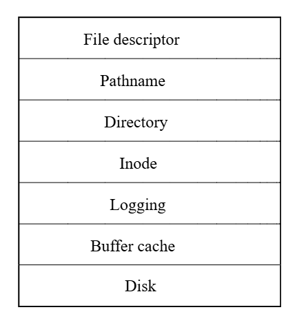
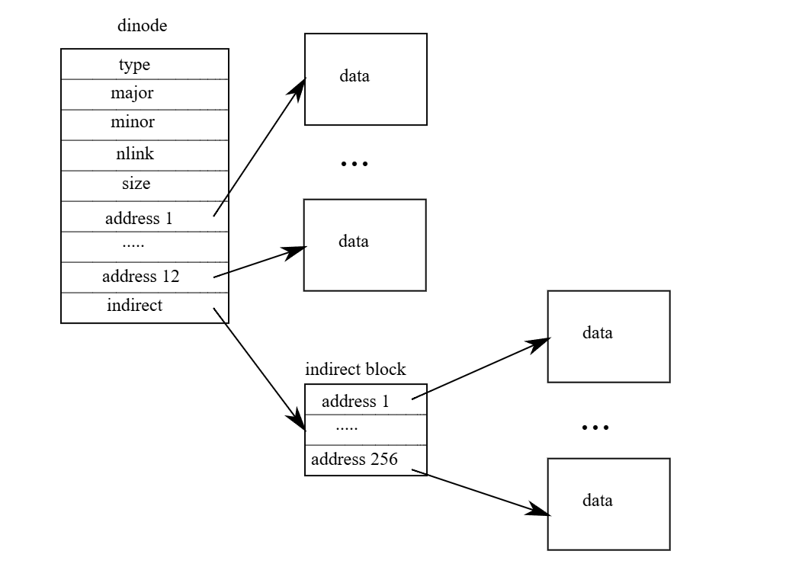

# xv6 riscv book chapter 8：File system

文件系统的目的是为了组织与存储数据。 文件系统通常也会支持用户与应用程序之间的数据共享，并具备数据的持久性，也就是在重新开机后数据仍然可用。 xv6 的文件系统提供类 Unix 的文件、目录与路径名称（详见第一章），并通过 virtio 硬盘来保存其数据以达成持久性。 这个文件系统需要面对数个挑战：

- 文件系统需要在硬盘上创建数据结构，来表示具名目录与文件所组成的树状结构，记录每个文件内容所使用的区块位置，并跟踪硬盘中哪些区域尚未被使用
- 文件系统必须支持当机复原（crash recovery）。 也就是说，如果系统当机（例如电源故障）时中断了操作，重新启动后文件系统仍必须能够正常运行。 当机的风险在于，它可能会中断一连串更新操作，使硬盘上的数据结构处于不一致的状态（例如某个区块既被某个文件使用，又同时被标记为未使用）
- 不同的 process 可能会同时操作文件系统，因此文件系统的代码必须协调彼此之间的动作，以维护数据的一致性与不变性条件
- 访问硬盘的速度远比访问内存慢上好几个数量级，因此文件系统必须在内存中维护一个常用区块的缓存

本章接下来将说明 xv6 是如何解决这些挑战的

## 8.1 Overview

xv6 的文件系统实现被划分为七个层次，如图 8.1 所示。 最底层是 disk layer，负责对 virtio 硬盘进行区块的读写。 buffer cache layer 会对 sector 进行缓存，并协调对其的访问，确保同一时间只有一个 kernel process 可以修改某个特定区块中的数据。 logging layer 允许更高层级的程序将多个区块的更新包装成一个 transaction，并保证在系统当机的情况下，这些更新能够以原子地方式完成（也就是要么全部更新，要么全部不更新）

inode layer 提供单一文件的表示方式，每个文件由一个 inode 表示，具有唯一的 i-number，以及一些存储文件内容的区块。 directory layer 把每个目录实现成一种特殊的 inode，它的内容是一串目录项目（directory entry），每个 entry 包含一个文件名称与对应的 i-number。 pathname leyer 提供阶层式路径名称，例如 `/usr/rtm/xv6/fs.c`，并通过递归查找来解析这些路径。 file descriptor layer 则将许多 Unix 资源（例如 pipe、装置、文件等）抽象成使用文件系统接口的方式，让应用程序开发者的工作变得更简单



硬盘硬件传统上会将硬盘内的数据呈现为一个个 512-byte 的 block（也称为 sector）的编号序列：sector 0 是最前面的 512 bytes，sector 1 是接下来的 512 bytes，以此类推。 操作系统在文件系统中使用的区块大小可以与硬盘的 sector 大小不同，但通常会是 sector 大小的倍数。 xv6 会将读取进内存的 sector 存储在型别为 `struct buf` 的对象中。 这些结构中的数据有时可能与实际硬盘上的数据不同步：例如数据可能还没从硬盘中读取完成（硬盘还在读取中但尚未返回该 sector 的内容），或者数据已被软件修改了但尚未写回硬盘

文件系统必须规划好要将 inode 与数据区块存放在哪些硬盘位置。 为了达成这点，xv6 将整个硬盘划分成几个区段，如图 8.2 所示。 文件系统不使用 sector 0（因为它是 boot sector）。 sector 1 被称为 superblock，其中包含文件系统的中继数据（例如文件系统的 sector 总数、data sector 的数量、inode 的数量，以及用于 log 的 sector 数）

从 sector 2 开始是用来存放 log 的区段。 在 log sector 之后是 inode 区段，每个 sector 内会存放多个 inode。 再往后是 bitmap 区段，用来跟踪哪些 data sector 已被使用。 剩下的区段为数据区段，每一个 sector 要么被 bitmap 标记为 free，要么用来存储文件或目录的内容。 superblock 会由一个名为 `mkfs` 的独立程序填写，它会创建初始的文件系统


本章接下来将依序介绍每个层次，从 buffer cache 开始。 请特别注意那些设计良好的底层抽象是如何让高层的设计变得更简洁的

## 8.2 Buffer cache layer

buffer cache 有两个主要任务：第一是同步对 sector 的访问，确保内存中对每个 sector 都只有一个副本，并且同一时间只有一个 kernel 线程会使用该副本； 第二是对常用的 sector 进行缓存，避免每次都要从缓慢的硬盘中重新读取。 相关代码实现位于 `bio.c`

buffer cache 对外提供的主要接口包括 `bread` 与 `bwrite`； 前者会获取一个「`buf`」，也就是某个 sector 在内存中的副本，这份数据可以被读取或修改，而后者则会将修改过的 buffer 写回对应的 sector。 当 kernel 线程使用完这个 buffer 后，必须调用 `brelse` 来释放该 buffer。 buffer cache 为每个 buffer 使用一个 sleep-lock，以确保同一时间只有一个线程能使用某个 buffer（也就是某个 sector）； `bread` 会返回一个已上锁的 buffer，而 `brelse` 则会释放该锁

buffer cache 中只有固定数量的 buffer 可用来存储 sector，这表示如果文件系统要求某个目前不在 cache 中的 sector，buffer cache 就必须回收一个目前用来存储其他 sector 的 buffer。 它会选择最近最少使用（Least Recently Used, LRU）的那个 buffer 来回收并用于新的 sector。 这基于一个假设：最近最少使用的 buffer 很可能短期内也不会再被使用

::: tip  
本翻译使用 sector 来代表硬盘上的 block（sector），并使用 buffer 来表示内存上对应的 block，以避免将硬盘上的 block 与内存上的 block 生成歧意

较不重要的段落会以中文的「区块」来表示，但由于 buffer 与 sector 是一对一对应的，所以对 sector 的操作其实也就是对 buffer 的操作，反之亦然。 因此除非是专门在讲述硬件相关的段落，否则 buffer、sector、block 这三个用词其实大多时候都可以互通。 但为了避免歧意，加上大部分的操作最终目的还是要更改硬盘上的区块，因此本翻译大多时候都会使用 sector 一词  
:::

## 8.3 Code: Buffer cache

buffer cache 是由多个 buffer 组成的 doubly-linked list。 `main` 函数会调用 `binit`（[kernel/main.c:27](https://github.com/mit-pdos/xv6-riscv/blob/riscv//kernel/main.c#L27)），并用静态数组 `buf` 中的 `NBUF` 个 buffer 初始化整个 doubly-linked list（[kernel/bio.c:43-52](https://github.com/mit-pdos/xv6-riscv/blob/riscv//kernel/bio.c#L43-L52)）。 初始化之后，所有对 buffer cache 的访问都会通过 `bcache.head` 指向的 linked list 来进行，而不再直接使用 `buf` 数组

```c
struct {
  struct spinlock lock;
  struct buf buf[NBUF];

  // Linked list of all buffers, through prev/next.
  // Sorted by how recently the buffer was used.
  // head.next is most recent, head.prev is least.
  struct buf head;
} bcache;

void
binit(void)
{
  struct buf *b;

  initlock(&bcache.lock, "bcache");

  // Create linked list of buffers
  bcache.head.prev = &bcache.head;
  bcache.head.next = &bcache.head;
  for(b = bcache.buf; b < bcache.buf + NBUF; b++){
    b->next = bcache.head.next;
    b->prev = &bcache.head;
    initsleeplock(&b->lock, "buffer");
    bcache.head.next->prev = b;
    bcache.head.next = b;
  }
}
```

每个 buffer 都有两个与其状态有关的栏位。 `valid` 栏位表示这个 buffer 中目前包含了某个 sector 的副本。 `disk` 栏位则表示该 buffer 的内容已经交由硬盘处理，也就是其可能已经被硬盘写入修改了（例如从硬盘读数据到 `data` 数组中）

```c
struct buf {
  int valid;   // has data been read from disk?
  int disk;    // does disk "own" buf?
  uint dev;
  uint blockno;
  struct sleeplock lock;
  uint refcnt;
  struct buf *prev; // LRU cache list
  struct buf *next;
  uchar data[BSIZE];
};
```

`bread`（[kernel/bio.c:93](https://github.com/mit-pdos/xv6-riscv/blob/riscv//kernel/bio.c#L93)）会调用 `bget` 来获取与某个 sector 对应的 buffer（[kernel/bio.c:97](https://github.com/mit-pdos/xv6-riscv/blob/riscv//kernel/bio.c#L97)）。 若这个 buffer 需要从硬盘读取数据，`bread` 会调用 `virtio_disk_rw` 来执行读取，然后才返回这个 buffer

```c
// Return a locked buf with the contents of the indicated block.
struct buf*
bread(uint dev, uint blockno)
{
  struct buf *b;

  b = bget(dev, blockno);
  if(!b->valid) {
    virtio_disk_rw(b, 0);
    b->valid = 1;
  }
  return b;
}
```

`bget`（[kernel/bio.c:59](https://github.com/mit-pdos/xv6-riscv/blob/riscv//kernel/bio.c#L59)）会扫描整个 buffer list，寻找一个拥有指定装置号与 sector 编号的 buffer（[kernel/bio.c:65-73](https://github.com/mit-pdos/xv6-riscv/blob/riscv//kernel/bio.c#L65-L73)）。 若有找到，`bget` 会为该 buffer 获取 sleep-lock，然后返回这个已上锁的 buffer

如果该 sector 没有对应的 buffer，`bget` 就必须建一个新的，这可能会重复使用目前存储其他 sector 的 buffer。 接著它会再扫描一次 buffer list，寻找一个未被使用的 buffer（`b->refcnt = 0`）； 只要符合这个条件就可以使用。 `bget` 接著会更新这个 buffer 的中继数据（metadata），将其装置编号与 sector 编号改成新的，并且为它上锁。 要注意，`b->valid = 0` 这行会强制让 `bread` 之后重新从硬盘读取数据，避免错误地使用这个 buffer 之前的内容

每个 sector 最多只能有一个对应的 buffer，这点非常重要，因为这样才能保证读取端能看到写入端的更新结果，同时文件系统也仰赖对 buffer 上锁来实现同步机制。 `bget` 为了确保这个不变性，会在执行第一次检查（判断某个 sector 是否已存在对应的 buffer）到第二次回收并设为新的 buffer 的整个过程中，持续持有 `bcache.lock`。 这个过程中会设置该 buffer 的 `dev`、`blockno` 与 `refcnt` 栏位。 这种设计可以让「检查缓存是否存在」与「指定一个 buffer 来存放该区块」这两个步骤形成一个原子操作

```c
// Look through buffer cache for block on device dev.
// If not found, allocate a buffer.
// In either case, return locked buffer.
static struct buf*
bget(uint dev, uint blockno)
{
  struct buf *b;

  acquire(&bcache.lock);

  // Is the block already cached?
  for(b = bcache.head.next; b != &bcache.head; b = b->next){
    if(b->dev == dev && b->blockno == blockno){
      b->refcnt++;
      release(&bcache.lock);
      acquiresleep(&b->lock);
      return b;
    }
  }

  // Not cached.
  // Recycle the least recently used (LRU) unused buffer.
  for(b = bcache.head.prev; b != &bcache.head; b = b->prev){
    if(b->refcnt == 0) {
      b->dev = dev;
      b->blockno = blockno;
      b->valid = 0;
      b->refcnt = 1;
      release(&bcache.lock);
      acquiresleep(&b->lock);
      return b;
    }
  }
  panic("bget: no buffers");
}
```

`bget` 在离开 `bcache.lock` 的 critical section 之后再去获取 buffer 的 sleep-lock 是安全的，因为只要 `b->refcnt` 不为 0，就可以防止该 buffer 被重复用于其他 sector。 sleep-lock 用来保护对这个区块内容的读写操作，而 `bcache.lock` 则用来保护「哪些 sector 已被缓存」的相关信息

如果所有的 buffer 都在忙碌中，表示有太多 process 同时在执行文件系统调用了； 这时 `bget` 会直接 panic。 比较温和的处理方式是让该 process 睡眠直到有 buffer 变得可用，但这样会有 deadlock 的可能性

一旦 `bread` 从硬盘读取数据并返回 buffer 给调用者，调用者就能独占这个 buffer，可以任意读取或写入里面的数据。 如果调用者修改了 buffer，就必须调用 `bwrite` 将变更写回硬盘，然后才能释放 buffer。 `bwrite`（[kernel/bio.c:107](https://github.com/mit-pdos/xv6-riscv/blob/riscv//kernel/bio.c#L107)）会调用 `virtio_disk_rw` 与硬盘硬件沟通

```c
// Write b's contents to disk.  Must be locked.
void
bwrite(struct buf *b)
{
  if(!holdingsleep(&b->lock))
    panic("bwrite");
  virtio_disk_rw(b, 1);
}
```

当调用者使用完一个 buffer 时，必须调用 `brelse` 来释放它（`brelse` 这个名称是 b-release 的缩写，虽然不好懂，但很值得学，因为它来自 Unix，并在 BSD、Linux、Solaris 等系统中沿用至今）。 `brelse`（[kernel/bio.c:117](https://github.com/mit-pdos/xv6-riscv/blob/riscv//kernel/bio.c#L117)）会释放这个 buffer 的 sleep-lock，并将它移动到 linked list 的最前面（[kernel/bio.c:128-133](https://github.com/mit-pdos/xv6-riscv/blob/riscv//kernel/bio.c#L128-L133)）。 这让整个 list 会根据 buffer 最近被使用的时间进行排序：最近被释放的 buffer 会在 list 的最前面，而最久未使用的 buffer 会放在最尾端

```c
// Release a locked buffer.
// Move to the head of the most-recently-used list.
void
brelse(struct buf *b)
{
  if(!holdingsleep(&b->lock))
    panic("brelse");

  releasesleep(&b->lock);

  acquire(&bcache.lock);
  b->refcnt--;
  if (b->refcnt == 0) {
    // no one is waiting for it.
    b->next->prev = b->prev;
    b->prev->next = b->next;
    b->next = bcache.head.next;
    b->prev = &bcache.head;
    bcache.head.next->prev = b;
    bcache.head.next = b;
  }
  
  release(&bcache.lock);
}
```

`bget` 中的两段循环就是利用了这种排序方式：在寻找既有 buffer 的那一段，最糟情况下会扫过整个 list，但若有良好的区域性（locality），从 `bcache.head` 开始沿著 next 指针往后找，就能缩短搜索时间。 而在找出可回收 buffer 的那段，则是从 list 的尾端开始，沿著 `prev` 指针反向找，选出最久未使用的 buffer

## 8.4 Logging layer

在文件系统设计中，当机复原（crash recovery）是一个非常有趣的问题。 这个问题的来自于许多文件系统的操作会包含多次对硬盘的写入，如果在这些写入只完成一部分时系统发生当机，那么硬盘上的文件系统可能会变成不一致的状态。 例如，假设当机发生在执行 file truncation（将文件长度设为 0 并释放其内容区块）的过程中。 根据硬盘写入的顺序不同，当机后可能会出现以下两种情况之一：第一种是 inode 仍然指向某个实际上已被标记为「空闲」的区块，第二种是某个区块已被分配但却没有任何 inode 引用它

第二种情况相对比较无害； 但对于第一种，若某个 inode 仍然指向一个已被释放的区块，在重新开机后很可能会引发严重的问题。 因为在重新开机之后，kernel 可能会把该区块分配给另一个文件，结果就变成两个不同的文件意外地指向同一个区块。 如果 xv6 有支持多个用户，这样的状况甚至可能变成一个安全漏洞，因为原本的文件拥有者此时可以读写新的、属于其他用户的文件数据

xv6 使用一种简化的 logging 机制来解决文件系统操作期间可能发生当机的问题。 xv6 的系统调用并不会直接修改硬盘上的文件系统数据结构，而是先将所有预计要写入的内容的描述记录到硬盘上的 log 区段。 等到所有写入动作都被记录到 log 之后，系统调用会在硬盘上写入一个特殊的 commit 记录，表示 log 内包含了一笔完整的操作。 到了这个阶段，系统调用才会把这些写入实际套用到文件系统的数据结构上。 当这些写入完成之后，系统调用会删除硬盘上的 log

如果系统发生当机并重新启动，文件系统的程序会在执行任何 process 之前先进行以下的复原程序。 若 log 的标记仍存在，代表还存在一笔完整的未完成操作，那么复原程序就会将这笔操作所对应的写入内容复制到对应的文件系统数据结构中。 反之，如果 log 的标记已被清除，复原程序就会忽略这份 log。 最后，复原程序会将 log 从硬盘上清除

xv6 的 log 能解决文件系统操作期间发生当机的问题的原因是，如果当机发生在操作完成 commit 之前，那么硬盘上的 log 不会被标记为完成，复原程序就会忽略它，此时硬盘的状态就像这笔写入操作根本还没开始一样。 如果当机发生在操作 commit 之后，那么复原程序会重播这笔操作的所有写入，尽管在当机之前这些写入可能已经部分套用到其数据结构中了。 无论是哪种情况，这个 log 都让文件系统的操作在面对当机时具有原子性：在复原之后，要么这笔操作的所有写入都存在硬盘上，要么一个写入都没有

## 8.5 Log design

log 被存储在一个硬盘上已知的固定位置，这个位置由 superblock 指定。 log 的内容包含一个 header 区块，后面接著一连串更新后的区块副本（称为「logged sector」）。 header 区块中会有一个 sector 编号的数组，对应到每个 logged sector 各自的 sector 编号，还会有一个 log sector 数量的计数值

```c
// Contents of the header block, used for both the on-disk header block
// and to keep track in memory of logged block# before commit.
struct logheader {
  int n;
  int block[LOGSIZE];
};

struct log {
  struct spinlock lock;
  int start;
  int size;
  int outstanding; // how many FS sys calls are executing.
  int committing;  // in commit(), please wait.
  int dev;
  struct logheader lh;
};
struct log log;
```

::: tip  
这边先把整个流程简单纪录一下，因为当初在看的时候真的看很久，这边原文写得不太好，对整个流程先有个认识，看后面的原文才比较看得懂，你也可以先跳过往后看，发现有问题再回来看一下这段

在 xv6 的 log 实现里，`struct logheader` 会被写入 logging 区段的第一个 sector（header sector），并会在内存中维持一份相同内容，随著 transaction 中的 `log_write()` 调用而更新。 换句话说，包含等等会看到的 `strcut log` 在内，两者都只有一个全域的实例（`log` 与 `log.lh`）

一个 transaction 是一组「要么全部成功，要么全部不做」的硬盘操作组合。 这些操作会在 logging system 中被一次性地记录、提交（commit），保证就算在中途当机也不会只执行了一半、造成文件系统损毁

一个 transaction 通常包含以下操作：

- 写入 inode（例如文件长度更新）
- 修改 bitmap（标记区块是否被使用）
- 写入实际的数据 sector（文件内容）

举例来说：

```c
begin_op();
ilock(f->ip);
writei(f->ip, ...);  // 可能寫好幾個區塊
iunlock(f->ip);
end_op(); // 若這是最後一個使用者，就觸發 commit()
```

整个 `begin_op()` 到 `end_op()` 就是一个 transaction。 在全域范围内<span class = "yellow">一次只会有一笔</span> transaction，它会使一个全域的锁 `log.lock` 来管理。 当不同的 system call 同时调用 `begin_op` 时，如果符合其内部条件（后面会提），他就会将 `log.outstanding` 这个计数器加一，以表示它也参予了此次 `transaction`

而 `logheader.n` 是个计数器，用来记录目前这笔 transaction 最后要写多少个「硬盘上的 data sector」； `logheader.block` 则是一个 sector 编号的清单，用来记录「这笔 transaction 修改了哪些 data sector」，注意是 data sector 的编号，而不是 log sector 的编号，其本身并不包含数据（你也可以看到它是 `int` 的数组）。 真正的数据都放在 log buffer 中（于 bio.c 中的 `bcache.buf`），而 log buffer 的数据也是存在 buffer cache 里的，而且只有在 commit 时才会被创建

一般的系统调用要写入 sector 的时候，如上方的 `writei` 函数，其内都会调用 `log_write` 来将硬盘编号 `blockno` 填入 `logheader.block`，最后再等到调用 `end_op` 时再实际的去做这个写操作，每当有 system call 调用对应的 `end_op`（和 `begin_op` 是一组的），`log.outstanding` 就会被减一

而当 `end_op` 内发现所有系统调用的写入操作都被记录下来后（`log.outstanding == 0`），换句话说就是最后一个调用 `end_op` 的人，会去调用 `commit` 这个函数。 也因此，当有多个系统调用的写入操作正等著被执行时，`logheader.block` 内就会存著不同组系统调用的写入操作所写的 buffer

`commit` 这个函数是整个过程里面最重要的函数，只会在这里被调用，其主要做四件事

1. `write_log`：把 `logheader.block` 内纪录的硬盘编号对应的「内存上的 buffer cache」里面的内容，复制到「硬盘上的 log sector」中：
     ```c
     struct buf *to = bread(log.dev, log.start+tail+1); // log block
     struct buf *from = bread(log.dev, log.lh.block[tail]); // cache block
     memmove(to->data, from->data, BSIZE);
     bwrite(to);  // write the log
     brelse(from);
     brelse(to);
     ```
2. `write_head`：把内存中的 `log.lh` 结构覆写到硬盘上的 logging 区（block 2，见图 8.2）的第 0 个 sector
   - 此时硬盘上的 logging 区就有了完整的「要写的数据」与 `logheader` 的内容了
   - `logheader` 里面记录了硬盘上这些 log sector 的内容等等要搬去哪里
   - 到这里 `commit` 的重点（防止当机）就完成了，此时如果当机了，由于 log sector 都还存著这些数据要去哪，所以开机时就有办法复原
3. `install_trans`：把 log sector 搬到正确的位置上
4. `log.lh.n = 0; write_head();`：将内存与硬盘上的 `logheader` 的信息都清 0

整体流程大概就是这样，从上面你也可以看到，log sector 的内容其实就是其对应的 data sector 的副本

从这里你也可以发现，所谓的「一笔」transaction 其实是在「第一个 `begin_op()` 成功」那一刻开始，直到 `log.outstanding` 由 1 变 0 而触发 `commit()` 后结束的。 如果同时有多个系统调用交错执行，它们各自的 `begin_op … end_op` 区段都被包在同一笔 transaction 内，而不是「每个系统调用就是一笔 transaction」  
:::

若 header sector 中的计数器栏位为 0，表示目前 log 中不存在任何的 transaction； 若为非零值，则表示 log 中已包含一笔完整且已 commit 的 transaction，且其中有指定数量的 log sector。 xv6 会在 commit 时写入这个 header sector（而不是事前），并会在把 log sector 写入文件系统后，将计数器清 0。 因此如果 transaction 执行到一半当机，log header 区块中的计数器就会是 0； 如果在 commit 之后才当机，那么计数器会是非零值

每个系统调用的代码都会标示出写入序列的起点与终点，在这之间的写入对 crash 来说必须是原子的。 在让多个 process 同时执行文件系统操作的情况下，log 系统允许将多个系统调用的写入操作累积在同一个 transaction 中。 因此，单个 commit 可能包含了多个完整系统调用的写入。 为了避免某个系统调用的写入被拆分到不同的 transaction 中，log 系统只有在没有任何文件系统相关的系统调用在执行时才会进行 commit

将多笔 transaction 一起进行 commit 的概念被称为「group commit」。 group commit 能减少硬盘操作的次数，因为它可以将 commit 的固定成本分摊到多笔操作上。 此外，group commit 也会让硬盘系统一次接收到较多笔写入操作，有机会让硬盘在一次旋转期间就完成所有写入。 虽然 xv6 所用的 virtio driver 并不支持这种 batching，但 xv6 的文件系统设计仍然允许这种做法的存在

xv6 在硬盘上预留了一块固定大小的空间用来存放 log。 每次 transaction 中由系统调用写入的所有 sector 数量必须能够塞进这块 log 空间。 这会生成两个后果：

1. 不能让任何一个系统调用写入超过 log 空间大小的 sector 数  
   - 这对大多数系统调用来说不是问题，但有两个系统调用可能会写入大量区块：`write` 与 `unlink`
     - 对于一个大型文件的 `write` 操作，可能需要写入很多个 data sector、bitmap sector，甚至还包含一个 inode sector
     - `unlink` 一个大型文件也可能会涉及多个 bitmap sector 与 inode 的写入
   - xv6 的 `write` 系统调用会将大型写入拆分成多个较小的操作，每次都能够塞进 log； 而 `unlink` 则没造成实务上的问题，因为 xv6 的 file system 通常只会用到一个 bitmap sector
2. 由于 log 空间有限，在 logging system 确认一个系统调用的所有写入能够完全塞入剩余的 log 空间之前，不能允许该系统调用开始执行

## 8.6 Code: logging

一个系统调用中使用 logging system 的典型方式如下所示：

```c
begin_op();
...
bp = bread(...);
bp->data[...] = ...;
log_write(bp);
...
end_op();
```

`begin_op`（[kernel/log.c:127](https://github.com/mit-pdos/xv6-riscv/blob/riscv//kernel/log.c#L127)）会等到 logging system 没有在处理 commit，并且 log 中有足够尚未被预留的空间，可以容纳这次系统调用要写入的数据后，才会继续执行。 `log.outstanding` 会记录目前有多少个系统调用预留了 log 空间，整体预留的空间大小为 `log.outstanding` 乘上 `MAXOPBLOCKS`。 将 `log.outstanding` 加一具有预留空间的功能，并能避免在这个系统调用的期间内触发 commit。 代码保守地假设每次系统调用最多可能会写入 `MAXOPBLOCKS` 个不同的 sector

::: tip  
`begin_op()` 要做两件事：

1. 确定可以塞得下
   - 写入空间（`log.lh.n`）：这笔全域唯一的 transaction 要写入的「data sector」的数量
   - log 空间：这笔写入是否塞的进 log sector，`log.outstanding` 代表有几个 log sector
2. 确定现在没有 commit 在跑  
    因为 commit 会读写同一批 log 区块，若程序 A 在 commit、程序 B 又想 append 新的区块，硬盘内容可能冲突

只有两条件都成立，`begin_op()` 才会做 `log.outstanding++`，正式「卡位」成功，并持有这把额度直到 `end_op()`

至于对 commit 有「互斥」效果，是因为 commit 只会在 `log.outstanding` 变为 0 时触发（见底下的 `end_op()`）。 任何其他的系统调用只要先 `begin_op()` 成功，`log.outstanding` 就大于 0，这期间 commit 一定不会开始。 也因此同一个系统调用内的多个 `log_write()` 肯定属于同一笔 transaction，不怕被拆开  
:::

```c
// called at the start of each FS system call.
void
begin_op(void)
{
  acquire(&log.lock);
  while(1){
    if(log.committing){
      sleep(&log, &log.lock);
    } else if(log.lh.n + (log.outstanding+1)*MAXOPBLOCKS > LOGSIZE){
      // this op might exhaust log space; wait for commit.
      sleep(&log, &log.lock);
    } else {
      log.outstanding += 1;
      release(&log.lock);
      break;
    }
  }
}
```

xv6 中的 `log_write`（[kernel/log.c:215](https://github.com/mit-pdos/xv6-riscv/blob/riscv//kernel/log.c#L215)）会用来作为 `bwrite` 的代理（proxy）。 它会在内存中记录该 buffer 对应的 sector 编号，并为其在 log sector 中预留一个位置，同时会将这个 buffer 钉在 buffer cache 中，避免被 cache 排除。 这个 buffer 必须一直预留在 cache 中直到 commit 为止：在此之前，cache 中的数据是唯一的修改纪录，在 commit 前不能把它写回硬盘原本的位置，而且同一 transaction 中的其他读取也必须能看到这些修改

`log_write` 会侦测在同一 transaction 中是否多次写入了同一个 buffer，并让该 buffer 重复使用同一个 log sector，这项最佳化被称为吸收（absorption）。 这种情况很常见，例如：存储多个文件的 inode 的 sector 在同一个 transaction 里可能会被写入好几次。 通过将多次的硬盘写入合并成一次，文件系统可以节省 log 空间，并提升效能，因为最后只会有一个 sector 的副本需要被写入硬盘

```c
// Caller has modified b->data and is done with the buffer.
// Record the block number and pin in the cache by increasing refcnt.
// commit()/write_log() will do the disk write.
//
// log_write() replaces bwrite(); a typical use is:
//   bp = bread(...)
//   modify bp->data[]
//   log_write(bp)
//   brelse(bp)
void
log_write(struct buf *b)
{
  int i;

  acquire(&log.lock);
  if (log.lh.n >= LOGSIZE || log.lh.n >= log.size - 1)
    panic("too big a transaction");
  if (log.outstanding < 1)
    panic("log_write outside of trans");

  for (i = 0; i < log.lh.n; i++) {
    if (log.lh.block[i] == b->blockno)   // log absorption
      break;
  }
  log.lh.block[i] = b->blockno;
  if (i == log.lh.n) {  // Add new block to log?
    bpin(b);
    log.lh.n++;
  }
  release(&log.lock);
}
```

`end_op`（[kernel/log.c:147](https://github.com/mit-pdos/xv6-riscv/blob/riscv//kernel/log.c#L147)） 会先将 `log.outstanding` 减一。 如果计数器变成零，代表这是目前 transaction 中的最后一个系统调用，因此其会调用 `commit()` 来提交这笔 transaction：

```c
// called at the end of each FS system call.
// commits if this was the last outstanding operation.
void
end_op(void)
{
  int do_commit = 0;

  acquire(&log.lock);
  log.outstanding -= 1;
  if(log.committing)
    panic("log.committing");
  if(log.outstanding == 0){
    do_commit = 1;
    log.committing = 1;
  } else {
    // begin_op() may be waiting for log space,
    // and decrementing log.outstanding has decreased
    // the amount of reserved space.
    wakeup(&log);
  }
  release(&log.lock);

  if(do_commit){
    // call commit w/o holding locks, since not allowed
    // to sleep with locks.
    commit();
    acquire(&log.lock);
    log.committing = 0;
    wakeup(&log);
    release(&log.lock);
  }
}
```

整个 commit 的过程包含分为阶段：

1. `write_log()`（[kernel/log.c:179](https://github.com/mit-pdos/xv6-riscv/blob/riscv//kernel/log.c#L179)）会把该 transaction 中被修改过的 buffer，从 buffer cache 复制到硬盘上与其对应的 sector
2. `write_head()`（[kernel/log.c:103](https://github.com/mit-pdos/xv6-riscv/blob/riscv//kernel/log.c#L103)）会把 log 的 header buffer 写入硬盘：这就是 commit 点，如果系统在这步之后当机，恢复程序会根据 log 重播这次 transaction 的所有写入
3. `install_trans`（[kernel/log.c:69](https://github.com/mit-pdos/xv6-riscv/blob/riscv//kernel/log.c#L69)）会从 log 区段中读出每个 log sector，并将其写入文件系统中正确的位置
4. `end_op` 会将 log header 中的计数器清 0，这动作必须在下一笔 transaction 开始写入 log sector 之前完成，否则若系统当机，会导致恢复时错误地将「前一笔 transaction 的 header」与「后一笔 transaction 的 log sector」搭配使用

```c
static void
commit()
{
  if (log.lh.n > 0) {
    write_log();     // Write modified blocks from cache to log
    write_head();    // Write header to disk -- the real commit
    install_trans(0); // Now install writes to home locations
    log.lh.n = 0;
    write_head();    // Erase the transaction from the log
  }
}
```

`initlog`（[kernel/log.c:55](https://github.com/mit-pdos/xv6-riscv/blob/riscv//kernel/log.c#L55)）会调用 `recover_from_log`（[kernel/log.c:117](https://github.com/mit-pdos/xv6-riscv/blob/riscv//kernel/log.c#L117)），而 `initlog` 则是在开机阶段由 `fsinit` 调用的（[kernel/fs.c:42](https://github.com/mit-pdos/xv6-riscv/blob/riscv//kernel/fs.c#L42)），这会发生在第一个用户进程启动前（[kernel/proc.c:535](https://github.com/mit-pdos/xv6-riscv/blob/riscv//kernel/proc.c#L535)）。 它会读取 log header，若 header 显示 log 中包含一笔已提交的 transaction，`recover_from_log` 就会模拟 `end_op` 的动作来进行还原

```c
static void
recover_from_log(void)
{
  read_head();
  install_trans(1); // if committed, copy from log to disk
  log.lh.n = 0;
  write_head(); // clear the log
}
```

在 `filewrite`（[kernel/file.c:135](https://github.com/mit-pdos/xv6-riscv/blob/riscv//kernel/file.c#L135)）中可以看到一个使用 log 的例子，其 transaction 如下：

```c
begin_op();
ilock(f->ip);
r = writei(f->ip, ...);
iunlock(f->ip);
end_op();
```

这段代码被包在一个循环中，会将大型的写入操作分成多个仅写入少数磁区的小型写入，以避免 log 空间爆满。 `writei` 调用的过程中会写入许多不同的区块，包括该文件的 inode、一个或多个 bitmap 区块，以及一些 data 区块

## 8.7 Code: Block allocator

文件与目录的内容都放在硬盘的 sector 里，而这些 sector 必须从可用的空闲池中分配。 xv6 的区块分配器在硬盘上维护一张「free bitmap」，每个 sector 会对应到其中的一个位元。 位元为 0 表示该 sector 为空闲状态； 为 1 表示已被使用。 创建文件系统的程序 `mkfs` 会先把开机区、superblock、log sector、inode sector 以及 bitmap sector 对应的位元设为 1

区块分配器提供两个函数：`balloc` 用来索要新的 sector，`bfree` 用来释放 sector。 `balloc` 里的循环（[kernel/fs.c:72](https://github.com/mit-pdos/xv6-riscv/blob/riscv//kernel/fs.c#L72)）会一路从 sector 0 检查到 `sb.size`（文件系统的总 sector 数），以寻找 bitmap 为 0 的 sector。 一旦找到，就把对应的 bitmap 设成 1，并返回该 sector

为了效率，整个扫描拆成两层：外层一次读取一个「bitmap sector」，内层检查这个 bitmap sector 里的 `BPB` 个位元。 若两个进程同时尝试分配 sector，理论上会生成竞争，但实际上 buffer cache 会保证同一个 bitmap sector 在同一时间只会被一个进程持有，因此避免了这种竞争

::: tip  
`sb.size` 来自 superblock，代表文件系统容量。 因为 bitmap 本身也存放在硬盘上，扫描时必须先把 bitmap 的内容读进 buffer cache。 而 `BPB = (block size in bytes) × 8`，意思是一个 bitmap sector 可以表示多少 data sector，在 xv6 的实现中 `BPB = 1024 * 8`。 把扫描拆两层可以减少 I/O 次数：一次读进来就检查整个 bitmap sector，而不是每找一个位元就读一次硬盘  
:::

```c
// Allocate a zeroed disk block.
// returns 0 if out of disk space.
static uint
balloc(uint dev)
{
  int b, bi, m;
  struct buf *bp;

  bp = 0;
  for(b = 0; b < sb.size; b += BPB){
    bp = bread(dev, BBLOCK(b, sb));
    for(bi = 0; bi < BPB && b + bi < sb.size; bi++){
      m = 1 << (bi % 8);
      if((bp->data[bi/8] & m) == 0){  // Is block free?
        bp->data[bi/8] |= m;  // Mark block in use.
        log_write(bp);
        brelse(bp);
        bzero(dev, b + bi);
        return b + bi;
      }
    }
    brelse(bp);
  }
  printf("balloc: out of blocks\n");
  return 0;
}
```

`bfree`（[kernel/fs.c:92](https://github.com/mit-pdos/xv6-riscv/blob/riscv//kernel/fs.c#L92)）会定位到正确的 bitmap sector，然后把相应的位元清 0。 同样地，`bread` 与 `brelse` 的互斥效果让程序无需再显式地加锁

和本章稍后介绍的大部分代码一样，`balloc` 与 `bfree` 必须包在同一笔 transaction 里调用

## 8.8 Inode layer

「inode」一词有两种相关含义：其一指硬盘上的数据结构，内含文件大小与 data sector 的位置清单； 其二指内存中的 inode，其除了持有该 on-disk inode 的副本，还带有内核执行时所需的额外信息

硬盘上的所有 inode 连续存放在一段称作 inode blocks 的区域中； 由于每个 inode 大小固定，只要给定编号 `n`，就能直接定位到第 `n` 个 inode。 实现上，这个 `n` 就是 inode number（亦称 i-number），用来唯一标识一个 inode

on-disk inode 以 `struct dinode`（[kernel/fs.h:32](https://github.com/mit-pdos/xv6-riscv/blob/riscv//kernel/fs.h#L32)）定义：`type` 栏位区分一般文件、目录与特殊文件（装置），若为 0 代表此 inode 为 free inode； `nlink` 记录有多少 directory entry 指向此 inode，用来判断何时可释放该 inode 及其 data sector； `size` 保存文件内容的位元组数； `addrs` 数组存放内含文件内容之硬盘 sector 的号码

```c
// On-disk inode structure
struct dinode {
  short type;           // File type
  short major;          // Major device number (T_DEVICE only)
  short minor;          // Minor device number (T_DEVICE only)
  short nlink;          // Number of links to inode in file system
  uint size;            // Size of file (bytes)
  uint addrs[NDIRECT+1];   // Data block addresses
};
```

内核将活跃中的 inode 保存在一张 itable 中； `struct inode`（[kernel/file.h:17](https://github.com/mit-pdos/xv6-riscv/blob/riscv//kernel/file.h#L17)）就是内存版本的 `struct dinode`。 只有当代码持指向该 inode 的 C 指针时，内核才会把它留在内存； `ref` 栏位用来计数这些指针，若变为零就会把 inode 从 itable 中移除。 `iget` 与 `iput` 分别负责获取及归还 inode 指针，并调整 `ref`。 这些指针可能来自文件描述符、目前的工作目录或暂时性地内核流程（例如 `exec`）

```c
// in-memory copy of an inode
struct inode {
  uint dev;           // Device number
  uint inum;          // Inode number
  int ref;            // Reference count
  struct sleeplock lock; // protects everything below here
  int valid;          // inode has been read from disk?

  short type;         // copy of disk inode
  short major;
  short minor;
  short nlink;
  uint size;
  uint addrs[NDIRECT+1];
};

// fs.c:
struct {
  struct spinlock lock;
  struct inode inode[NINODE];
} itable;
```

xv6 的 inode 代码用了四种锁／类似锁的机制：`itable.lock` 保证「同一个 inode 最多只在 inode table 中出现一次」以及「`ref` 计数正确」这两项不变式； 每个内存 inode 内的 `lock`（sleep-lock）负责确保对 inode 栏位与其文件／目录内容区块的互斥访问； `ref` 只要大于零，系统就会将 inode 维持在表中，且不会把这个槽位给别的 inode 用； 最后，`nlink` 栏位会记录引用到该文件的 directory entry 数量，只要大于零，xv6 就不会释放该 inode

在对应的 `iput()` 调用之前，通过 `iget()` 函数获取的 `struct inode` 的指针保证是有效的：该 inode 不会被删除，且这段内存不会被指派给别的 inode。 `iget()` 提供非独占（non-exclusive）访问，因此同一 inode 可被多个指针共用。 文件系统中有大量代码仰赖此语义，这使其既能长期持有 inode（如打开文件、目前目录），又能在处理多个 inode（如路径解析）时避免竞争与死锁

```c
// Find the inode with number inum on device dev
// and return the in-memory copy. Does not lock
// the inode and does not read it from disk.
static struct inode*
iget(uint dev, uint inum)
{
  struct inode *ip, *empty;

  acquire(&itable.lock);

  // Is the inode already in the table?
  empty = 0;
  for(ip = &itable.inode[0]; ip < &itable.inode[NINODE]; ip++){
    if(ip->ref > 0 && ip->dev == dev && ip->inum == inum){
      ip->ref++;
      release(&itable.lock);
      return ip;
    }
    if(empty == 0 && ip->ref == 0)    // Remember empty slot.
      empty = ip;
  }

  // Recycle an inode entry.
  if(empty == 0)
    panic("iget: no inodes");

  ip = empty;
  ip->dev = dev;
  ip->inum = inum;
  ip->ref = 1;
  ip->valid = 0;
  release(&itable.lock);

  return ip;
}

...

// Drop a reference to an in-memory inode.
// If that was the last reference, the inode table entry can
// be recycled.
// If that was the last reference and the inode has no links
// to it, free the inode (and its content) on disk.
// All calls to iput() must be inside a transaction in
// case it has to free the inode.
void
iput(struct inode *ip)
{
  acquire(&itable.lock);

  if(ip->ref == 1 && ip->valid && ip->nlink == 0){
    // inode has no links and no other references: truncate and free.

    // ip->ref == 1 means no other process can have ip locked,
    // so this acquiresleep() won't block (or deadlock).
    acquiresleep(&ip->lock);

    release(&itable.lock);

    itrunc(ip);
    ip->type = 0;
    iupdate(ip);
    ip->valid = 0;

    releasesleep(&ip->lock);

    acquire(&itable.lock);
  }

  ip->ref--;
  release(&itable.lock);
}
```

`iget` 返回的 `struct inode*` 所指向的 inode 实例有可能尚未从硬盘中加载任何有效内容； 为确保其中含有对应的 on-disk inode，程序需调用 `ilock`。 `ilock` 会锁住 inode（防止其他进程再对它做一次 `ilock`）并从硬盘加载该 inode（如果还未被加载），之后可用 `iunlock` 释放该锁。 将「获取指针」与「加锁」分离有助于在某些情况下避免死锁，例如查找目录时需同时处理多个 inode。 多个进程可同时持有 `iget` 得到的指针，但同一时间仅允许一个进程锁住该 inode

```c
// Lock the given inode.
// Reads the inode from disk if necessary.
void
ilock(struct inode *ip)
{
  struct buf *bp;
  struct dinode *dip;

  if(ip == 0 || ip->ref < 1)
    panic("ilock");

  acquiresleep(&ip->lock);

  if(ip->valid == 0){
    bp = bread(ip->dev, IBLOCK(ip->inum, sb));
    dip = (struct dinode*)bp->data + ip->inum%IPB;
    ip->type = dip->type;
    ip->major = dip->major;
    ip->minor = dip->minor;
    ip->nlink = dip->nlink;
    ip->size = dip->size;
    memmove(ip->addrs, dip->addrs, sizeof(ip->addrs));
    brelse(bp);
    ip->valid = 1;
    if(ip->type == 0)
      panic("ilock: no type");
  }
}
```

inode table 只保存那些仍被内核程序或数据结构引用的 inode，它的首要任务是去协调多进程的访问。 顺带一提，它也刚好会把常用的 inode 缓存起来，但这是次要的功能，因为如果某个 inode 经常会被使用到，那 buffer cache 大多也会把对应的 sector 留在内存内。 当程序修改内存中的 inode 时，会调用 `iupdate` 将更动写回硬盘

```c
// Copy a modified in-memory inode to disk.
// Must be called after every change to an ip->xxx field
// that lives on disk.
// Caller must hold ip->lock.
void
iupdate(struct inode *ip)
{
  struct buf *bp;
  struct dinode *dip;

  bp = bread(ip->dev, IBLOCK(ip->inum, sb));
  dip = (struct dinode*)bp->data + ip->inum%IPB;
  dip->type = ip->type;
  dip->major = ip->major;
  dip->minor = ip->minor;
  dip->nlink = ip->nlink;
  dip->size = ip->size;
  memmove(dip->addrs, ip->addrs, sizeof(ip->addrs));
  log_write(bp);
  brelse(bp);
}
```

## 8.9 Code: Inodes

当需要分配新 inode（例如创建文件）时，xv6 会调用 `ialloc`（[kernel/fs.c:199](https://github.com/mit-pdos/xv6-riscv/blob/riscv//kernel/fs.c#L199)）。 `ialloc` 与 `balloc` 类似：它逐个扫描硬盘上的 inode sector，寻找标记为空闲的 inode； 一旦找到，就把新的 `type` 写回硬盘以宣告占用，并调用 `iget`（[kernel/fs.c:213](https://github.com/mit-pdos/xv6-riscv/blob/riscv//kernel/fs.c#L213)）返回 inode table 中的项目。 `ialloc` 能正常运行的关键是同时间只有一个进程持有 `bp` 指针，确保不会有另一进程同时看到该 inode 可用并试图抢占它

```c
// Allocate an inode on device dev.
// Mark it as allocated by  giving it type type.
// Returns an unlocked but allocated and referenced inode,
// or NULL if there is no free inode.
struct inode*
ialloc(uint dev, short type)
{
  int inum;
  struct buf *bp;
  struct dinode *dip;

  for(inum = 1; inum < sb.ninodes; inum++){
    bp = bread(dev, IBLOCK(inum, sb));
    dip = (struct dinode*)bp->data + inum%IPB;
    if(dip->type == 0){  // a free inode
      memset(dip, 0, sizeof(*dip));
      dip->type = type;
      log_write(bp);   // mark it allocated on the disk
      brelse(bp);
      return iget(dev, inum);
    }
    brelse(bp);
  }
  printf("ialloc: no inodes\n");
  return 0;
}
```

`iget`（[kernel/fs.c:247](https://github.com/mit-pdos/xv6-riscv/blob/riscv//kernel/fs.c#L247)）会在 inode table 中搜索符合指定装置与 inode number 条件的活跃项目（`ip->ref > 0`）； 若找到，就返回该 inode 的新引用（[kernel/fs.c:256-260](https://github.com/mit-pdos/xv6-riscv/blob/riscv//kernel/fs.c#L256-L260)）。 搜索过程中它会将遇到的第一个空槽暂存起来（[kernel/fs.c:261-262](https://github.com/mit-pdos/xv6-riscv/blob/riscv//kernel/fs.c#L261-L262)），以便在没找到的时候用来放入新的 table 项目

```c
// Find the inode with number inum on device dev
// and return the in-memory copy. Does not lock
// the inode and does not read it from disk.
static struct inode*
iget(uint dev, uint inum)
{
  struct inode *ip, *empty;

  acquire(&itable.lock);

  // Is the inode already in the table?
  empty = 0;
  for(ip = &itable.inode[0]; ip < &itable.inode[NINODE]; ip++){
    if(ip->ref > 0 && ip->dev == dev && ip->inum == inum){
      ip->ref++;
      release(&itable.lock);
      return ip;
    }
    if(empty == 0 && ip->ref == 0)    // Remember empty slot.
      empty = ip;
  }

  // Recycle an inode entry.
  if(empty == 0)
    panic("iget: no inodes");

  ip = empty;
  ip->dev = dev;
  ip->inum = inum;
  ip->ref = 1;
  ip->valid = 0;
  release(&itable.lock);

  return ip;
}
```

在读写 inode 的中继数据或内容前，程序必须先以 `ilock`（[kernel/fs.c:293](https://github.com/mit-pdos/xv6-riscv/blob/riscv//kernel/fs.c#L293)）函数将该 inode 上锁，该函数内使用的是 sleep-lock。 在 `ilock` 独占了该 inode 的访问权后，它就会在需要时从硬盘（实际上多半是 buffer cache）中读取 inode。 `iunlock`（[kernel/fs.c:321](https://github.com/mit-pdos/xv6-riscv/blob/riscv//kernel/fs.c#L321)）则会释放该 sleep-lock，唤醒等待此锁的其他进程

```c
// Lock the given inode.
// Reads the inode from disk if necessary.
void
ilock(struct inode *ip)
{
  struct buf *bp;
  struct dinode *dip;

  if(ip == 0 || ip->ref < 1)
    panic("ilock");

  acquiresleep(&ip->lock);

  if(ip->valid == 0){
    bp = bread(ip->dev, IBLOCK(ip->inum, sb));
    dip = (struct dinode*)bp->data + ip->inum%IPB;
    ip->type = dip->type;
    ip->major = dip->major;
    ip->minor = dip->minor;
    ip->nlink = dip->nlink;
    ip->size = dip->size;
    memmove(ip->addrs, dip->addrs, sizeof(ip->addrs));
    brelse(bp);
    ip->valid = 1;
    if(ip->type == 0)
      panic("ilock: no type");
  }
}

// Unlock the given inode.
void
iunlock(struct inode *ip)
{
  if(ip == 0 || !holdingsleep(&ip->lock) || ip->ref < 1)
    panic("iunlock");

  releasesleep(&ip->lock);
}
```

`iput`（[kernel/fs.c:337](https://github.com/mit-pdos/xv6-riscv/blob/riscv//kernel/fs.c#L337)）会通过将引用计数（reference count）减一（[kernel/fs.c:360](https://github.com/mit-pdos/xv6-riscv/blob/riscv//kernel/fs.c#L360)）来释放指向某 inode 的 C 语言指针； 如果它是最后一个引用，则它在 inode table 中的槽位就会转为空闲槽位，供其他 inode 使用

如果 `iput` 发现某个 inode 已不再被任何 C 指针所引用，且也没有任何硬链接指向它（也就是没有出现在任何目录中），那么它会释放该 inode 和其使用的 data sector。 `iput` 会调用 `itrunc`，将文件截短为 0 位元组来释放数据区块，接著将该 inode 的类型栏位设为 0（代表未分配），最后把 inode 写回硬盘（[kernel/fs.c:342](https://github.com/mit-pdos/xv6-riscv/blob/riscv//kernel/fs.c#L342)）

`iput` 释放 inode 时的 locking 机制也值得深入探讨。 一种潜在风险是：其他线程可能正在 `ilock` 中等待这个 inode，例如想要读取某个文件或列出某个目录，此时若 inode 已被释放则会出现错误。 不过这种情况不会发生，因为如果某个 inode 没有 link，且 `ip->ref` 是 1，那么除了目前调用 `iput` 的线程外，系统中没有其他地方会持有指向这个 inode 的指针

另一种潜在风险是：释放的同时有另一个线程调用了 `ialloc`，并且选中了 `iput` 正在释放的那个 inode。 不过这种情况只有在 `iupdate` 将 inode 的 `type` 写成 0（代表未分配）后才会发生，因此这样的竞争条件是良性的：因为分配 inode 的那个线程会在读写 inode 前先获取该 inode 的 sleep-lock，此时 `iput` 已经完成它的动作了

`iput()` 可能会对硬盘进行写入。 这代表，只要是会使用到文件系统的系统调用，就有可能对硬盘写入，因为该系统调用有可能是系统中最后一个持有该文件引用的地方。 即使像 `read()` 这种看起来是唯读的调用，最终也可能调用到 `iput()`。 因此，只要是涉及文件系统的系统调用，即使表面上是唯读的，也必须包在 transaction 里

`iput()` 和系统崩溃之间存在一个棘手的交互情况。 当某个文件的 link count 降到 0 时，`iput()` 不会马上把文件截断，因为可能还有某个 process 持有对该 inode 的内存引用：有某个 process 曾成功打开该文件并可能会再进行读写。 不过，如果在最后一个 process 关闭文件描述符之前系统崩溃，那么该文件在硬盘上会仍被标记为 allocated，但已经没有任何 directory entry 指向它了

文件系统处理这种情况的方法有两种。 最简单的方式是在重开机后进行 recovery 时，扫描整个文件系统，找出那些被标记为 allocated 却没有任何 directory entry 指向它们的文件。 只要找到这种文件，就可以将其释放

第二种解法则不需扫描整个文件系统。 在这个解法中，文件系统会在硬盘上（例如记录在 superblock 中）纪录那些 link count 为 0、但引用计数尚未为 0 的 inode inumber。 当引用计数最终也降到 0、文件真正被删除时，系统就从该列表中移除该 inode。 若发生崩溃，系统在 recovery 阶段就可以释放这个列表中遗留下来的文件

xv6 没有实现上述任何一种解法，这代表即使某些 inode 已经不再被使用了，它们在硬盘上仍可能被标记为 allocated。 随著时间推移，这可能导致 xv6 耗尽所有硬盘空间

## 8.10 Code: Inode content

硬盘上的 inode 结构为 `struct dinode`，其中包含了一个大小栏位与一个 sector 编号的数组（见图 8.3）。 inode 的数据存储在 `dinode` 内 `addrs` 数组所列出的那些 data sector 中。 这个数组的前 `NDIRECT` 个项目对应的 sector 被称为 direct sector； 而接下来的 `NINDIRECT` 个 sector 则不直接列在 inode 中，而是存储在一个称为 indirect sector 的 data sector 里



indirect sector 的地址被放在 `addrs` 数组的最后一个项目中。 也就是说，一个文件的前 12 KB（`NDIRECT × BSIZE`）可以直接从 inode 里所列出的 sector 获取，而后续的 256 KB（`NINDIRECT × BSIZE`）则必须通过查找 indirect sector 才能获取。 这样的设计对硬盘比较友善，但对于用户程序来说处理起来就较为复杂

`bmap` 函数负责处理这种表示法的细节，使得像 `readi` 和 `writei` 这类较高阶的函数无须处理这些复杂性。 `bmap` 会返回 inode `ip` 的第 `bn` 个 data sector 对应的硬盘 sector 编号。 如果该 sector 尚未被分配，`bmap` 就会分配一个新的 sector

`bmap` 函数（[kernel/fs.c:383](https://github.com/mit-pdos/xv6-riscv/blob/riscv//kernel/fs.c#L383)）首先会处理前 `NDIRECT` 个 data sector，因为它直接列在 inode 里（[kernel/fs.c:388-396](https://github.com/mit-pdos/xv6-riscv/blob/riscv//kernel/fs.c#L388-L396)）所以处理起来比较简单。 接下来的 `NINDIRECT` 个 data sector 则列在 indirect sector 中，其地址存放于 `ip->addrs[NDIRECT]`。 `bmap` 会先从硬盘读取这个 indirect sector（[kernel/fs.c:407](https://github.com/mit-pdos/xv6-riscv/blob/riscv//kernel/fs.c#L407)），然后从这个 sector 内的适当位置读出正确的 sector 编号（[kernel/fs.c:408](https://github.com/mit-pdos/xv6-riscv/blob/riscv//kernel/fs.c#L408)）。 如果传入的区块编号超过 `NDIRECT + NINDIRECT`，`bmap` 会触发 panic； `writei` 里会有逻辑先进行检查，以避免这种情况发生（[kernel/fs.c:513](https://github.com/mit-pdos/xv6-riscv/blob/riscv//kernel/fs.c#L513)）

```c
// Inode content
//
// The content (data) associated with each inode is stored
// in blocks on the disk. The first NDIRECT block numbers
// are listed in ip->addrs[].  The next NINDIRECT blocks are
// listed in block ip->addrs[NDIRECT].


// Return the disk block address of the nth block in inode ip.
// If there is no such block, bmap allocates one.
// returns 0 if out of disk space.
static uint
bmap(struct inode *ip, uint bn)
{
  uint addr, *a;
  struct buf *bp;

  if(bn < NDIRECT){
    if((addr = ip->addrs[bn]) == 0){
      addr = balloc(ip->dev);
      if(addr == 0)
        return 0;
      ip->addrs[bn] = addr;
    }
    return addr;
  }
  bn -= NDIRECT;

  if(bn < NINDIRECT){
    // Load indirect block, allocating if necessary.
    if((addr = ip->addrs[NDIRECT]) == 0){
      addr = balloc(ip->dev);
      if(addr == 0)
        return 0;
      ip->addrs[NDIRECT] = addr;
    }
    bp = bread(ip->dev, addr);
    a = (uint*)bp->data;
    if((addr = a[bn]) == 0){
      addr = balloc(ip->dev);
      if(addr){
        a[bn] = addr;
        log_write(bp);
      }
    }
    brelse(bp);
    return addr;
  }

  panic("bmap: out of range");
}
```

`bmap` 会在需要时动态分配区块。 当 `ip->addrs[]` 或 indirect sector 中的某一个项目为 0 时，表示对应的 data sector 尚未被分配。 一旦 `bmap` 遇到这样的情况，就会即时分配一个新的 data sector，并将其 sector 编号填入原本为 0 的位置（[kernel/fs.c:389-390](https://github.com/mit-pdos/xv6-riscv/blob/riscv//kernel/fs.c#L513) & [kernel/fs.c:401-402](https://github.com/mit-pdos/xv6-riscv/blob/riscv//kernel/fs.c#L401-L402)）

`itrunc` 会释放一个文件使用的所有 data sector，并将 inode 的大小栏位设为 0。 `itrunc`（[kernel/fs.c:426](https://github.com/mit-pdos/xv6-riscv/blob/riscv//kernel/fs.c#L426)）会先释放所有 direct sector（[kernel/fs.c:432-437](https://github.com/mit-pdos/xv6-riscv/blob/riscv//kernel/fs.c#L432-L437)），接著释放 indirect sector 中列出的所有 data sector（[kernel/fs.c:442-445](https://github.com/mit-pdos/xv6-riscv/blob/riscv//kernel/fs.c#L442-L445)），最后再释放那个用来记录间接地址的 indirect sector 本身（[kernel/fs.c:447-448](https://github.com/mit-pdos/xv6-riscv/blob/riscv//kernel/fs.c#L447-L448)）

```c
// Truncate inode (discard contents).
// Caller must hold ip->lock.
void
itrunc(struct inode *ip)
{
  int i, j;
  struct buf *bp;
  uint *a;

  for(i = 0; i < NDIRECT; i++){
    if(ip->addrs[i]){
      bfree(ip->dev, ip->addrs[i]);
      ip->addrs[i] = 0;
    }
  }

  if(ip->addrs[NDIRECT]){
    bp = bread(ip->dev, ip->addrs[NDIRECT]);
    a = (uint*)bp->data;
    for(j = 0; j < NINDIRECT; j++){
      if(a[j])
        bfree(ip->dev, a[j]);
    }
    brelse(bp);
    bfree(ip->dev, ip->addrs[NDIRECT]);
    ip->addrs[NDIRECT] = 0;
  }

  ip->size = 0;
  iupdate(ip);
}
```

`bmap` 让 `readi` 和 `writei` 能够轻松地访问 inode 的数据。 `readi`（[kernel/fs.c:472](https://github.com/mit-pdos/xv6-riscv/blob/riscv//kernel/fs.c#L472)）一开始会先确认传入的 offset 和数据长度是否有超过文件结尾。 若从文件末尾之后开始读取，会直接返回错误（[kernel/fs.c:477-478](https://github.com/mit-pdos/xv6-riscv/blob/riscv//kernel/fs.c#L477-L478)）； 若读取范围涵盖到文件尾端，则会只返回有效数据长度内的部分（[kernel/fs.c:479-480](https://github.com/mit-pdos/xv6-riscv/blob/riscv//kernel/fs.c#L479-L480)）。 接著进入主循环，每次处理一个 data sector，并从 buffer 复制数据到 `dst`（[kernel/fs.c:482-494](https://github.com/mit-pdos/xv6-riscv/blob/riscv//kernel/fs.c#L482-L494)）

```c
// Read data from inode.
// Caller must hold ip->lock.
// If user_dst==1, then dst is a user virtual address;
// otherwise, dst is a kernel address.
int
readi(struct inode *ip, int user_dst, uint64 dst, uint off, uint n)
{
  uint tot, m;
  struct buf *bp;

  if(off > ip->size || off + n < off)
    return 0;
  if(off + n > ip->size)
    n = ip->size - off;

  for(tot=0; tot<n; tot+=m, off+=m, dst+=m){
    uint addr = bmap(ip, off/BSIZE);
    if(addr == 0)
      break;
    bp = bread(ip->dev, addr);
    m = min(n - tot, BSIZE - off%BSIZE);
    if(either_copyout(user_dst, dst, bp->data + (off % BSIZE), m) == -1) {
      brelse(bp);
      tot = -1;
      break;
    }
    brelse(bp);
  }
  return tot;
}
```

`writei`（[kernel/fs.c:506](https://github.com/mit-pdos/xv6-riscv/blob/riscv//kernel/fs.c#L506)）在逻辑上与 `readi` 几乎相同，但有三个差异：若写入动作发生在文件尾端或越过尾端，则会使文件大小成长，最多可达最大文件限制（[kernel/fs.c:513-514](https://github.com/mit-pdos/xv6-riscv/blob/riscv//kernel/fs.c#L513-L514)）； 写入时是将数据从用户空间复制到 buffer（[kernel/fs.c:522](https://github.com/mit-pdos/xv6-riscv/blob/riscv//kernel/fs.c#L522)）； 若写入后文件大小变大，则 `writei` 也会更新 inode 的文件大小栏位（[kernel/fs.c:530-531](https://github.com/mit-pdos/xv6-riscv/blob/riscv//kernel/fs.c#L530-L531)）

```c
// Write data to inode.
// Caller must hold ip->lock.
// If user_src==1, then src is a user virtual address;
// otherwise, src is a kernel address.
// Returns the number of bytes successfully written.
// If the return value is less than the requested n,
// there was an error of some kind.
int
writei(struct inode *ip, int user_src, uint64 src, uint off, uint n)
{
  uint tot, m;
  struct buf *bp;

  if(off > ip->size || off + n < off)
    return -1;
  if(off + n > MAXFILE*BSIZE)
    return -1;

  for(tot=0; tot<n; tot+=m, off+=m, src+=m){
    uint addr = bmap(ip, off/BSIZE);
    if(addr == 0)
      break;
    bp = bread(ip->dev, addr);
    m = min(n - tot, BSIZE - off%BSIZE);
    if(either_copyin(bp->data + (off % BSIZE), user_src, src, m) == -1) {
      brelse(bp);
      break;
    }
    log_write(bp);
    brelse(bp);
  }

  if(off > ip->size)
    ip->size = off;

  // write the i-node back to disk even if the size didn't change
  // because the loop above might have called bmap() and added a new
  // block to ip->addrs[].
  iupdate(ip);

  return tot;
}
```

`stati` 函数（[kernel/fs.c:458](https://github.com/mit-pdos/xv6-riscv/blob/riscv//kernel/fs.c#L458)）会将 inode 的中继数据复制到 `stat` 结构中，该结构会通过 `stat` 系统调用暴露给用户程序

```c
struct stat {
  int dev;     // File system's disk device
  uint ino;    // Inode number
  short type;  // Type of file
  short nlink; // Number of links to file
  uint64 size; // Size of file in bytes
};
```

::: tip  
这边应该是要说 `fstat` 系统调用，而不是 `stat`，后者不是系统调用，而是 user lib 内的函数：

```c
int
stat(const char *n, struct stat *st)
{
  int fd;
  int r;

  fd = open(n, O_RDONLY);
  if(fd < 0)
    return -1;
  r = fstat(fd, st);
  close(fd);
  return r;
}
```

而前者是系统调用：

```c
uint64
sys_fstat(void)
{
  struct file *f;
  uint64 st; // user pointer to struct stat

  argaddr(1, &st);
  if(argfd(0, 0, &f) < 0)
    return -1;
  return filestat(f, st);
}
```

但我也不确定他是想说哪个，所以就保留原文了  
:::

## 8.11 Code: directory layer

目录的实现方式和一般文件非常类似。 它的 inode 类型为 `T_DIR`，其数据部分则是一连串的 directory entry。 每个 entry 是一个 `struct dirent`（[kernel/fs.h:56](https://github.com/mit-pdos/xv6-riscv/blob/riscv//kernel/fs.h#L56)），其中包含了一个名称以及一个 inode number。 名称最多为 `DIRSIZ`（14）个字元； 若长度不足，则以 NULL（0）位元组作为结尾。 inode number 为零的 directory entry 被视为未使用的空白 entry

```c
// Directory is a file containing a sequence of dirent structures.
#define DIRSIZ 14

struct dirent {
  ushort inum;
  char name[DIRSIZ];
};
```

`dirlookup` 函数（[kernel/fs.c:552](https://github.com/mit-pdos/xv6-riscv/blob/riscv//kernel/fs.c#L552)）会在某个目录（`dp`）中搜索名称符合指定字串的 entry。 若找到了，就会返回对应的 inode（未加锁），并将 `*poff` 设为该 entry 在该目录中所对应的位元组偏移量，这是为了让调用者可以对该 entry 进行修改。 如果 `dirlookup` 成功找到对应名称的 entry，它会更新 `*poff`，并通过 `iget` 获取该 inode 并返回（仍是未加锁状态）

::: tip  
`poff` 是用来纪录偏移量的参数，见底下 `dirlookup` 的 prototype  
:::

`dirlookup` 是 `iget` 会返回「未加锁」inode 的主因，因为调用 `dirlookup` 的 caller 已经先对 `dp` 上锁了，因此如果搜索的是 `.`（代表目前目录的别名），如果在返回前试图再次对该 inode 上锁，会导致对 `dp` 的重复上锁并造成 deadlock。 实际上还有更复杂的 deadlock 情境，涉及多个 process 与 `..`（父目录的别名），所以 `.` 并不是唯一的问题。 因此正确做法是让 caller 在收到 inode 后先解锁 `dp`，再去对 `ip` 上锁，以确保任一时刻只持有一个锁

```c
// Look for a directory entry in a directory.
// If found, set *poff to byte offset of entry.
struct inode*
dirlookup(struct inode *dp, char *name, uint *poff)
{
  uint off, inum;
  struct dirent de;

  if(dp->type != T_DIR)
    panic("dirlookup not DIR");

  for(off = 0; off < dp->size; off += sizeof(de)){
    if(readi(dp, 0, (uint64)&de, off, sizeof(de)) != sizeof(de))
      panic("dirlookup read");
    if(de.inum == 0)
      continue;
    if(namecmp(name, de.name) == 0){
      // entry matches path element
      if(poff)
        *poff = off;
      inum = de.inum;
      return iget(dp->dev, inum);
    }
  }

  return 0;
}
```

`dirlink` 函数（[kernel/fs.c:580](https://github.com/mit-pdos/xv6-riscv/blob/riscv//kernel/fs.c#L580)）会将一个新的 directory entry 写入指定的目录 `dp`，这个 entry 具有指定的名称与 inode number。 如果目录中已存在该名称了，则 `dirlink` 会返回一个错误（[kernel/fs.c:586-590](https://github.com/mit-pdos/xv6-riscv/blob/riscv//kernel/fs.c#L586-L590)）

主循环会扫描所有 directory entry 以寻找尚未被分配（未使用）的 entry。 一旦找到，就会提早结束循环（[kernel/fs.c:592-597](https://github.com/mit-pdos/xv6-riscv/blob/riscv//kernel/fs.c#L592-L597)），并将 `off` 设为该可用 entry 的偏移量。 若找不到空的 entry，循环就会结束，这时 `off` 会被设成 `dp->size`。 无论是哪种情况，`dirlink` 都会在 `off` 所指定的位置写入新的 entry（[kernel/fs.c:602-603](https://github.com/mit-pdos/xv6-riscv/blob/riscv//kernel/fs.c#L602-L603)）

```c
// Write a new directory entry (name, inum) into the directory dp.
// Returns 0 on success, -1 on failure (e.g. out of disk blocks).
int
dirlink(struct inode *dp, char *name, uint inum)
{
  int off;
  struct dirent de;
  struct inode *ip;

  // Check that name is not present.
  if((ip = dirlookup(dp, name, 0)) != 0){
    iput(ip);
    return -1;
  }

  // Look for an empty dirent.
  for(off = 0; off < dp->size; off += sizeof(de)){
    if(readi(dp, 0, (uint64)&de, off, sizeof(de)) != sizeof(de))
      panic("dirlink read");
    if(de.inum == 0)
      break;
  }

  strncpy(de.name, name, DIRSIZ);
  de.inum = inum;
  if(writei(dp, 0, (uint64)&de, off, sizeof(de)) != sizeof(de))
    return -1;

  return 0;
}
```

## 8.12 Code: Path names

路径名称查找的过程会依序针对路径中的每个组件调用一次 `dirlookup`。 `namei` 函数（[kernel/fs.c:687](https://github.com/mit-pdos/xv6-riscv/blob/riscv//kernel/fs.c#L687)）会解析 `path` 并返回对应的 `inode`。 而 `nameiparent` 则是另一种变形版本：它会在处理到最后一个路径组件之前停止，返回该路径的父目录所对应的 inode，并将最后一个组件复制到变量 `name` 中。 这两个函数都会调用一个通用的底层函数 `namex` 来进行实际的查找工作

```c
struct inode*
namei(char *path)
{
  char name[DIRSIZ];
  return namex(path, 0, name);
}

struct inode*
nameiparent(char *path, char *name)
{
  return namex(path, 1, name);
}
```

`namex` 函数（[kernel/fs.c:652](https://github.com/mit-pdos/xv6-riscv/blob/riscv//kernel/fs.c#L652)）一开始会判断该从哪里开始进行路径的解析。 如果 `path` 是以 `/` 开头，代表从根目录开始解析； 否则就从目前所在的目录开始（[kernel/fs.c:656-659](https://github.com/mit-pdos/xv6-riscv/blob/riscv//kernel/fs.c#L656-L659)）。 接著，它会使用 `skipelem` 依序获取路径中的每个元素（[kernel/fs.c:661](https://github.com/mit-pdos/xv6-riscv/blob/riscv//kernel/fs.c#L661)）。 每次循环都会在目前的 inode `ip` 中查找这个名称。 每一轮开始时，其会先对 `ip` 上锁，并确认它的类型是否为目录。 若不是，就会导致查找失败（[kernel/fs.c:662-666](https://github.com/mit-pdos/xv6-riscv/blob/riscv//kernel/fs.c#L662-L666)）。 对 `ip` 上锁的目的并不是害怕 `ip->type` 可能会在背景中被改变（这其实不会发生），而是因为在执行 `ilock` 前，我们无法保证 `ip->type` 已经从硬盘加载进来了

如果调用的是 `nameiparent`，且这已经是路径上的最后一个元素了，则依据其设计，会提早结束查找； 最后一个元素已经复制到 `name` 中，因此 `namex` 只需返回未加锁的 `ip`（[kernel/fs.c:667-671](https://github.com/mit-pdos/xv6-riscv/blob/riscv//kernel/fs.c#L667-L671)）即可。 最后，这个循环会通过 `dirlookup` 查找当前元素，并通过设置 `ip = next` 来进入下一轮查找（[kernel/fs.c:672-677](https://github.com/mit-pdos/xv6-riscv/blob/riscv//kernel/fs.c#L672-L677)）。 当所有 path element 都处理完后，会返回 `ip`

```c
// Look up and return the inode for a path name.
// If parent != 0, return the inode for the parent and copy the final
// path element into name, which must have room for DIRSIZ bytes.
// Must be called inside a transaction since it calls iput().
static struct inode*
namex(char *path, int nameiparent, char *name)
{
  struct inode *ip, *next;

  if(*path == '/')
    ip = iget(ROOTDEV, ROOTINO);
  else
    ip = idup(myproc()->cwd);

  while((path = skipelem(path, name)) != 0){
    ilock(ip);
    if(ip->type != T_DIR){
      iunlockput(ip);
      return 0;
    }
    if(nameiparent && *path == '\0'){
      // Stop one level early.
      iunlock(ip);
      return ip;
    }
    if((next = dirlookup(ip, name, 0)) == 0){
      iunlockput(ip);
      return 0;
    }
    iunlockput(ip);
    ip = next;
  }
  if(nameiparent){
    iput(ip);
    return 0;
  }
  return ip;
}
```

`namex` 的整体流程可能需要相当长的时间，因为它可能要进行多次硬盘操作，来读取路径中经过的那些目录的 inode 和 directory sector（如果这些数据尚未被缓存在 buffer cache 中）。 xv6 的设计十分谨慎：即使某个 kernel thread 调用 `namex` 时被卡在硬盘 I/O 上，其他 kernel thread 若要查找不同的路径名称时仍然可以继续执行。 这是因为 `namex` 会针对路径中的每个目录分别上锁，让不同目录的查找可以平行进行

这样的并行设计也带来了一些挑战。 举例来说，当某个 kernel thread 正在查找某个路径时，另一个 kernel thread 可能正在通过 unlink 操作来修改整个目录树。 这样就会出现一种风险：查找的 thread 可能会处理到某个已经被删除、其 sector 又被重新分配给其他目录或文件的目录

xv6 采取了一些机制来避免这种竞争状况。 举例来说，在 `namex` 执行 `dirlookup` 时，查找的 thread 会先持有该目录的锁，并且 `dirlookup` 返回的 inode 是通过 `iget` 获取的，而 `iget` 会增加该 inode 的引用计数。 只有在 `namex` 收到 inode 之后，才会释放对该目录的锁。 这样一来，即使之后有另一个 thread 把这个 inode 从目录中 unlink 掉，由于 inode 的引用计数尚未归零，xv6 仍然不会删除该 inode

另一种风险是死结（deadlock）。 例如，在查找 `"."`（代表目前目录）时，`next` 会指向与 `ip` 相同的 inode。 若在还没释放 `ip` 的锁之前就尝试去锁住 `next`，就会造成死结。 为了避免这种情况，`namex` 会先解锁该目录，再去对 `next` 上锁。 这也再次说明了将 `iget` 与 `ilock` 拆开设计的重要性

## 8.13 File descriptor layer

Unix 接口有一个很酷的设计是，它将系统中的大多数资源都表示为文件，包括像是主控台（console）、pipe，以及一般的实体文件等。 而实现这种一致性设计的就是「file descriptor layer」

如同在第一章所介绍的，xv6 为每个 process 提供了自己的「已打开文件表（open file table）」，或称 file descriptor 表。 每个被打开的文件都会对应到一个 `struct file`（[kernel/file.h:1](https://github.com/mit-pdos/xv6-riscv/blob/riscv//kernel/file.h#L1)），这个结构会包装住一个 inode 或一个 pipe，加上一个 I/O offset。 每次调用 `open` 都会创建一个新的 open file（也就是一个新的 `struct file` 结构）； 即便多个 process 打开同一个文件，它们各自的 `struct file` 也会拥有不同的 I/O offset

相对地，如果同一个 `struct file` 被多次引用，它可能会多次出现在同一个 process 的 file table 中，也可能出现在不同 process 的 file table 中。 这种情况可能发生在 process 使用 `open` 打开文件后，通过 `dup` 创建别名，或通过 `fork` 和子 process 共享文件的情况。 系统会通过引用计数来跟踪某个 open file 被引用的次数。 文件可以被打开为可读、可写，或两者皆可，这些权限状态由 `readable` 与 `writable` 栏位纪录

```c
struct file {
  enum { FD_NONE, FD_PIPE, FD_INODE, FD_DEVICE } type;
  int ref; // reference count
  char readable;
  char writable;
  struct pipe *pipe; // FD_PIPE
  struct inode *ip;  // FD_INODE and FD_DEVICE
  uint off;          // FD_INODE
  short major;       // FD_DEVICE
};
```

系统中所有打开中的文件都会集中管理在一个全域的文件表 `ftable` 中。 这个 file table 提供几个操作函数，包括分配一个新的文件结构（`filealloc`）、创建重复引用（`filedup`）、释放引用（`fileclose`），以及进行数据读写的函数（`fileread` 与 `filewrite`）

```c
struct {
  struct spinlock lock;
  struct file file[NFILE];
} ftable;
```

前三个函数采用了我们已经熟悉的形式。 `filealloc`（[kernel/file.c:30](https://github.com/mit-pdos/xv6-riscv/blob/riscv//kernel/file.c#L30)）会扫描整个 file table，寻找一个尚未被引用的文件（即 `f->ref == 0`），引用它并返回该新引用； `filedup`（[kernel/file.c:48](https://github.com/mit-pdos/xv6-riscv/blob/riscv//kernel/file.c#L48)）会增加引用计数； 而 `fileclose`（[kernel/file.c:60](https://github.com/mit-pdos/xv6-riscv/blob/riscv//kernel/file.c#L60)）则会减少引用计数。 当某个文件的引用计数变成 0 时，`fileclose` 会依据其类型（pipe 或 inode）释放底层资源

`filestat`、`fileread` 与 `filewrite` 这些函数实现了对文件的 `stat`、`read` 与 `write` 操作。 `filestat`（[kernel/file.c:88](https://github.com/mit-pdos/xv6-riscv/blob/riscv//kernel/file.c#L88)）只能作用于 inode，并会调用 `stati`。 `fileread` 与 `filewrite` 则会先检查该操作是否符合文件的打开模式，然后将调用转发给对应的 pipe 或 inode 操作实现。 如果该 file 是 inode，`fileread` 与 `filewrite` 就会使用 I/O offset 作为此次操作的位移，并在操作完成后自动更新 offset（[kernel/file.c:122-123](https://github.com/mit-pdos/xv6-riscv/blob/riscv//kernel/file.c#L122-L123), [kernel/file.c:153-154](https://github.com/mit-pdos/xv6-riscv/blob/riscv//kernel/file.c#L153-L154)）。 而 pipe 则没有 offset 的概念

请注意，inode 函数要求调用者自己负责加锁（[kernel/file.c:94-96](https://github.com/mit-pdos/xv6-riscv/blob/riscv//kernel/file.c#L94-L96), [kernel/file.c:121-124](https://github.com/mit-pdos/xv6-riscv/blob/riscv//kernel/file.c#L121-L123), [kernel/file.c:163-166](https://github.com/mit-pdos/xv6-riscv/blob/riscv//kernel/file.c#L163-L166)）。 这个 inode 加锁的设计还带来一个额外好处：它能确保读写时的 offset 更新具有原子性，也就是说同时多个 process 写入同一文件时，不会互相覆盖对方的数据； 不过写入的内容可能会交错

## 8.14 Code: System calls

借助底层提供的那些函数，大多数系统调用的实现都非常简单（[kernel/sysfile.c](https://github.com/mit-pdos/xv6-riscv/blob/riscv//kernel/sysfile.c)）。 不过有几个系统调用值得我们深入探讨

`sys_link` 和 `sys_unlink` 这两个函数会修改目录，也就是创建或移除 inode 的引用，这两个函数是「使用 transaction 的好例子」。 `sys_link`（[kernel/sysfile.c:124](https://github.com/mit-pdos/xv6-riscv/blob/riscv//kernel/sysfile.c#L124)）首先会抓取两个字串参数 `old` 和 `new`（[kernel/sysfile.c:129](https://github.com/mit-pdos/xv6-riscv/blob/riscv//kernel/sysfile.c#L129)）。 假设 `old` 存在且不是目录（[kernel/sysfile.c:133-136](https://github.com/mit-pdos/xv6-riscv/blob/riscv//kernel/sysfile.c#L133-L136)），`sys_link` 就会把它的 `ip->nlink` 引用计数加一

接著 `sys_link` 会调用 `nameiparent` 找出 `new` 的父目录与最后一段名称（[kernel/sysfile.c:149](https://github.com/mit-pdos/xv6-riscv/blob/riscv//kernel/sysfile.c#L149)），然后在该目录中创建一个新的 directory entry 指向 `old` 的 `inode`（[kernel/sysfile.c:152](https://github.com/mit-pdos/xv6-riscv/blob/riscv//kernel/sysfile.c#L152)）。 这个新创建的父目录必须存在，且必须和 `old` 的 inode 在同一个装置上，因为 inode number 只有在单一硬盘上才具有唯一性。如果出现这类错误，`sys_link` 必须回头把 `ip->nlink` 减回来

使用 transaction 会让实现变得更简单，因为它牵涉到更新多个 sector，但我们不需要担心这些操作的执行顺序。 其要么所有操作都成功，要么全都不执行。 例如，如果没有使用 transaction，就先更新了 `ip->nlink` 却还没创建新的 link，这会让文件系统短暂进入不一致状态，若此时系统当机，可能会造成更严重的错误。 而有了 transaction，就不需要担心这些问题

`sys_link` 是为已存在的 inode 创建一个新名称，而 `create`（[kernel/sysfile.c:246](https://github.com/mit-pdos/xv6-riscv/blob/riscv//kernel/sysfile.c#L246)）则会为一个新的 inode 创建新名称。 `create` 是三个与创建文件相关的系统调用的泛化版本：`open` 搭配 `O_CREATE` 旗标会创建一个新的普通文件、`mkdir` 创建新目录、`mkdev` 则创建设备文件

`create` 的起始步骤与 `sys_link` 相同，会先调用 `nameiparent` 找到父目录 inode。 接著调用 `dirlookup` 确认该名称是否已存在（[kernel/sysfile.c:256](https://github.com/mit-pdos/xv6-riscv/blob/riscv//kernel/sysfile.c#L256)）。 若名称已存在，`create` 的行为会根据所使用的系统调用而异：`open` 的语意和 `mkdir`、`mkdev` 不同。 如果 `create` 是代表 `open` 调用（`type == T_FILE`），而该名称对应的是普通文件，则 `open` 视此为成功，`create` 也会视为成功（[kernel/sysfile.c:260](https://github.com/mit-pdos/xv6-riscv/blob/riscv//kernel/sysfile.c#L260)）； 否则会视为错误（[kernel/sysfile.c:261-262](https://github.com/mit-pdos/xv6-riscv/blob/riscv//kernel/sysfile.c#L261-L262)）

若名称尚未存在，`create` 就会使用 `ialloc`（[kernel/sysfile.c:265](https://github.com/mit-pdos/xv6-riscv/blob/riscv//kernel/sysfile.c#L265)）分配一个新的 inode。 若这个新的 inode 是一个目录，`create` 会初始化它的 `.` 与 `..` 项目。 当这些数据都妥善初始化后，`create` 才会将该 inode link 到父目录中（[kernel/sysfile.c:278](https://github.com/mit-pdos/xv6-riscv/blob/riscv//kernel/sysfile.c#L278)）。 `create` 与 `sys_link` 一样，在过程中会同时持有两个 inode 的锁：`ip` 与 `dp`。 但不会有 deadlock 的风险，因为 `ip` 是刚分配出来的新 inode，系统中不会有其他 process 已经先锁住它并再去锁 `dp`

通过 `create`，可以很容易地实现 `sys_open`、`sys_mkdir` 和 `sys_mknod`。 其中 `sys_open`（[kernel/sysfile.c:305](https://github.com/mit-pdos/xv6-riscv/blob/riscv//kernel/sysfile.c#L305)）最为复杂，因为「创建新文件」只是它众多功能中的一部分。 当 `open` 搭配 `O_CREATE` 旗标时，它会调用 `create`（[kernel/sysfile.c:320](https://github.com/mit-pdos/xv6-riscv/blob/riscv//kernel/sysfile.c#L320)）； 否则就会调用 `namei`（[kernel/sysfile.c:326](https://github.com/mit-pdos/xv6-riscv/blob/riscv//kernel/sysfile.c#L326)）

`create` 会返回一个已加锁的 inode，但 `namei` 不会，因此 `sys_open` 必须自行将该 inode 上锁。 这里也刚好提供了一个机会来检查是否对目录做了不合法的打开方式（例如以写入模式打开目录）。 在成功获取 inode 之后，`sys_open` 会分配一个 file 与一个 file descriptor（[kernel/sysfile.c:344](https://github.com/mit-pdos/xv6-riscv/blob/riscv//kernel/sysfile.c#L344)），并填入 file 的内容（[kernel/sysfile.c:356-361](https://github.com/mit-pdos/xv6-riscv/blob/riscv//kernel/sysfile.c#L356-L361)）。 需要注意的是，此时该 file 尚未出现在其他 process 的 table 中，因此其他 process 无法访问这个尚未完全初始化的文件

在第七章，我们在尚未介绍文件系统前就已经看过 pipe 的实现。 而 `sys_pipe` 则将那套 pipe 实现与文件系统结合，提供一种创建 pipe 配对（pipe pair）的方法。 它的参数是一个指向两个整数的内存空间的指针，该函数会在那里写入两个新的 file descriptor。 接著，它会分配一个新的 pipe，并将两个 file descriptor 安装进 process 的 file descriptor table 中

## 8.15 Real world

真实世界中的操作系统所使用的 buffer cache 比 xv6 复杂得多，但其目的仍然有两个：缓存数据，以及同步访问硬盘。 xv6 的 buffer cache 和早期 UNIX V6 一样，采用简单的 LRU（Least Recently Used，最近最少使用）驱逐策略； 实际上可以实现许多更复杂的策略，各自适用于不同的工作负载，但也各有优缺点。 若要更有效率的 LRU 实现，可以不使用 linked list，而改用 hash table 做查询、heap 来处理 LRU 驱逐。 现代的 buffer cache 通常还会整合进虚拟内存系统，以支持 memory-mapped file

xv6 的 logging system 效率不高。 它在执行 commit 时无法与其他文件系统的系统调用并行进行。 此外，即便只修改了某个 sector 中的几个位元组，它仍然会将整个 sector 写入 log。 log 的写入是同步进行的，而且每次只能写一个 sector，这通常需要等整个硬盘旋转一圈的时间。 实际的 logging 系统会处理以上所有这些效能问题

提供 crash recovery 的方法不只有 logging。 早期的文件系统会在重开机时执行 scavenger（例如 UNIX 的 `fsck` 程序），逐一检查所有的文件与目录，并检查 sector 与 inode 的 free list，来找出并修复不一致之处。 对于大型文件系统，这种 scavenging 可能会花上好几小时，而且某些不一致的情况无法以保证系统调用是原子性的方式来修复。 而通过 log 进行复原不仅更快，也能让系统调用在发生 crash 时仍维持原子性

xv6 采用与早期 UNIX 相同的 inode 和目录的 on-disk 分配； 这种结构在这些年来一直非常稳定地被沿用，像 BSD 的 UFS/FFS 和 Linux 的 ext2/ext3 都采用了本质上相同的数据结构。 在这个分配中最没有效率的是目录：每次查找都需要线性扫描该目录的所有 data sector。 当目录仅占几个 sector 时这是合理的，但若目录中有大量文件，代价就会很高。 而如 Microsoft Windows 的 NTFS、macOS 的 HFS，以及 Solaris 的 ZFS 等系统，则会将目录实现为硬盘上的平衡树结构。 虽然这样的实现较复杂，但能保证查找操作在时间上为对数等级

xv6 对于硬盘错误的处理方式非常简单：只要某次硬盘操作失败，整个系统就会 panic。 这样的设计是否合理，取决于底层硬件：若操作系统运行在具有错误容忍（如冗余）机制的特殊硬件上，那么硬盘错误非常少见，panic 或许可以接受。 但若操作系统直接面对的是一般的硬盘，那么就应预期错误会发生，并以更温和的方式处理，像是确保单一文件中的某个 sector 损毁不会影响整个文件系统的正常使用

xv6 的限制是文件系统必须完全放在单一硬盘装置上，且大小不可变动。 随著大型数据库与多媒体文件推升存储需求，现代操作系统开始寻求突破「一个文件系统只能对应一颗硬盘」的瓶颈。 最基本的作法是将多颗硬盘合并为一个逻辑硬盘。 RAID 这种硬件解决方案至今仍最常见，但近年趋势是尽可能地将这些逻辑实现搬到软件层面

这些软件方案通常支持更弹性的功能，例如能即时新增或移除硬盘，动态扩展或缩减逻辑装置大小。 当然，这种可动态调整大小的存储层也需要文件系统本身具备相同能力； 而 xv6 中使用固定大小 inode sector 数组的设计，在这样的环境下将难以应用。 虽然将硬盘管理与文件系统分离是比较干净的设计方式，但两者之间复杂的接口反而使得有些系统（如 Sun 的 ZFS）选择将它们合并设计

现代 Unix 系统允许许多不同种类的资源都能通过与硬盘文件相同的系统调用来访问，例如：具名 pipe、网络连线、远端文件系统，以及像 `/proc` 这种监控与控制接口。 与其像 xv6 的 `fileread` 与 `filewrite` 中使用 `if` 判断处理类型，这些系统通常会为每个 open file 配一张函数指针表，每个操作（如 read、write）对应一个函数，调用时就直接由该函数指针触发该 inode 所属类型的实现。 对于网络文件系统或 user-level 文件系统而言，这些函数会将调用转换成网络 RPC，等待响应后再传回结果

## 8.16 Exercises

1. 为什么在 `balloc` 中要调用 panic？ xv6 有办法从这种情况中复原吗？
2. 为什么在 `ialloc` 中要调用 panic？ xv6 有办法从这种情况中复原吗？
3. 为什么 `filealloc` 在没有可用文件结构时不会调用 panic？ 为什么这种情况比较常见，因此值得特别处理？
4. 假设在 `sys_link` 中，`ip` 对应的文件在调用 `iunlock(ip)` 与 `dirlink` 之间，被其他 process unlink 掉了。 这个链接还会正确被创建吗？ 为什么会或为什么不会？
5. `create` 在过程中会调用四个必须要成功的函数（一次 `ialloc` 和三次 `dirlink`）。 若其中任一失败，它就会调用 panic。 为什么这样的做法是可以接受的？ 为什么这四个调用不能失败？
6. `sys_chdir` 在调用 `iput(cp->cwd)` 之前先调用了 `iunlock(ip)`，而 `iput(cp->cwd)` 可能会去锁住 `cp->cwd`，不过就算把 `iunlock(ip)` 延后到 `iput` 之后才执行，也不会造成 deadlock。 为什么？
7. 实现 `lseek` 这个系统调用。 要支持 `lseek`，还需要修改 `filewrite`：当 `lseek` 将 `off` 设置到超过 `f->ip->size` 时，要在文件中用 0 来填补中间的空洞
8. 为 `open` 加上 `O_TRUNC` 与 `O_APPEND` 支持，这样 shell 里的 `>` 与 `>>` 运算子才会正常运行
9. 修改文件系统，使其支持 symbolic link（符号链接）
10. 修改文件系统，使其支持 named pipe（具名管道）
11. 修改文件系统与虚拟内存系统，使其支持 memory-mapped file（内存对映文件）
