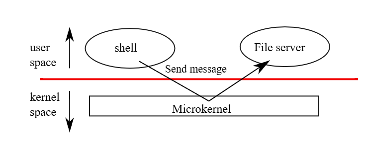
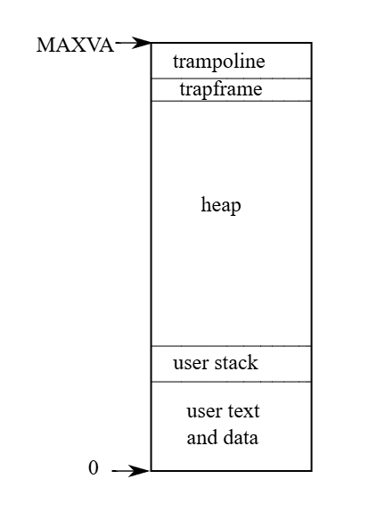

# xv6 riscv book chapter 2：Operating system organization

操作系统的一项关键需求是要能够同时支持多个活动，例如通过第一章所描述的系统调用接口，一个进程可以使用 `fork` 创建新的进程。 操作系统还必须在这些进程之间分时共享电脑的资源，例如即使进程数量超过了硬件 CPU 的数量，操作系统仍必须确保所有进程都能获得执行的机会。 操作系统也必须在进程之间安排隔离机制，换句话说如果某个进程出现错误并发生故障，它不应该影响到那些不依赖它的进程。 然而，完全的隔离又过于强硬，因为进程之间应要可以有意地交互，例如 pipeline 就是一个例子。 因此，操作系统必须满足三个需求：多任务（multiplexing）、隔离（isolation）与交互（interaction）

本章将概述操作系统是如何组织架构，以实现这三项需求。 事实上，有许多不同的方式可以达成，但本书聚焦于以「monolithic kernel」为中心的主流设计，这种设计被许多 Unix 操作系统所采用。 本章也会简要说明 xv6 中的进程，它是 xv6 中实现隔离的基本单位，以及 xv6 启动时创建第一个进程的过程

xv6 执行于一颗「multi-core」的 RISC-V 微处理器上，其许多底层功能（例如进程的实现）都依赖于 RISC-V 架构。 RISC-V 是一种 64 位元的 CPU，而 xv6 是使用 "LP64" 模式的 C 语言撰写的，这表示在 C 语言中，`long`（L）与指针（P）是 64 位元，而 `int` 则是 32 位元。 本书假设读者已具备某些架构上机器层级（machine-level）的程序设计经验，并会在需要时介绍与 RISC-V 有关的概念。 完整的 RISC-V 规格可以参考用户层级 ISA 文件与特权层级架构文件。 你也可以参考《The RISC-V Reader: An Open Architecture Atlas》一书

### 在一台完整的电脑中，CPU 周围会有许多辅助硬件，其中大部分以 I/O 接口的形式存在。 xv6 是针对 qemu 的 `-machine virt` 选项模拟的辅助硬件所撰写的。 这些硬件包括：RAM、一个包含开机程序的 ROM、一条与用户键盘与萤幕相连的序列埠，以及一个用于存储的硬盘

## 2.1 Abstracting physical resources

当人们第一次接触操作系统时，可能会问的第一个问题是：为什么需要操作系统？ 也就是说，可以将上一章的图 1.2 中的系统调用全部实现成一个函数库，应用程序只要链接该函数库即可。 在这样的设计下，每个应用程序甚至可以拥有一套量身打造的函数库。 应用程序可以直接与硬件资源交互，并以最适合该应用的方式使用这些资源（例如，达成高效或可预期的效能）。 有些为嵌入式装置或即时系统所设计的操作系统就是采用这种方式来组织的

这种函数库式作法的缺点是，如果有多个应用程序同时执行，那么这些应用程序必须都要是「行为良好（well-behaved）」的。 例如，每个应用程序都必须定期主动让出 CPU，让其他应用程序能够执行。 这种「协作式（cooperative）」的分时机制，在所有应用程序彼此信任、而且没有错误的情况下也许可以接受。 但在现实中，应用程序通常不会彼此信任，而且经常会有错误，因此我们常常需要比协作式更强的隔离机制

为了达成强隔离，禁止应用程序直接访问敏感的硬件资源，取而代之的将这些资源抽象成服务是有帮助的。 例如，Unix 应用程序与存储装置的交互只能通过文件系统提供的 `open`、`read`、`write` 和 `close` 等系统调用，而不是直接对硬盘进行读写。 这不仅提供了路径名称的便利性，也让操作系统作为该接口的实现者能够管理硬盘。 即使隔离不是主要考量，有意交互的程序（或是只是想避免彼此干扰）也会发现文件系统比直接使用硬盘来得更加方便

同样地，Unix 能够在不同的进程之间透明地切换硬件 CPU，并在需要时存储与还原寄存器状态，使得应用程序无需关心分时的细节。 这种透明性让操作系统即使在有些应用程序陷入无穷循环的情况下，仍能实现 CPU 的共享

另一个例子是，Unix 的进程使用 `exec` 来创建它们的内存映像，而不是直接操作物理内存。 这样一来，操作系统可以决定将进程放置在哪个内存位置； 如果内存不足，操作系统甚至可以把进程的一部分数据存放到硬盘上。 `exec` 也让用户能够利用文件系统来方便地存储可执行的程序映像档

Unix 进程之间的许多交互形式都是通过文件描述符进行的。 文件描述符不仅将许多细节（例如 pipe 或文件中的数据存储位置）抽象化，且其设计方式也简化了进程间的交互。 例如，如果 pipeline 中的某个应用程序失败，kernel 会为下一个进程生成一个 end-of-file 信号

图 1.2 所示的系统调用接口经过了精心设计，以同时提供程序开发者的便利性与实现强隔离的可能性。 Unix 所采用的这种资源抽象方式并不是唯一的做法，但实践证明它是一种有效的方法

## 2.2 User mode, supervisor mode, and system calls

强隔离（strong isolation）需要在应用程序与操作系统之间设置一个严格的边界。 如果某个应用程序出错，我们不希望其会导致整个操作系统或其他应用程序也发生错误。 相反地，操作系统应该能够清除这个失败的应用程序，并继续执行其他应用程序。 为了实现强隔离，操作系统使应用程序无法修改（甚至是读取）操作系统的数据结构与指令，并且也无法访问其他进程的内存

CPU 提供了实现强隔离的硬件支持。 例如，RISC-V 拥有三种 CPU 执行指令的模式：machine mode（机器模式）、supervisor mode（监督者模式）、以及 user mode（用户模式）。 在 machine mode 下执行的指令拥有完全的权限，CPU 启动时会从 machine mode 开始。 machine mode 主要用于开机时对电脑进行初始化设置，xv6 只会在 machine mode 执行几行代码，接著就会切换至 supervisor mode

在 supervisor mode 中，CPU 可以执行特权指令，例如启用或关闭中断、读取与写入 page table 地址所存储的寄存器等等。 如果某个处于 user mode 的应用程序试图执行特权指令，CPU 不会执行该指令，而是会切换至 supervisor mode，让 supervisor-mode 的代码能够终止该应用程序，因为它做了不该做的事情

第一章中的图 1.1 说明了这种架构，应用程序只能执行 user-mode 的指令（例如加法等），称为在 user space（user space）中执行； 而 supervisor mode 的软件则还能执行特权指令，称为在 kernel space 中执行。 执行于 kernel space（或 supervisor mode）的软件被称为 kernel 

应用程序无法直接调用 kernel 函数，若其想要调用某个 kernel 功能（例如 xv6 中的 `read` 系统调用），则必须转移至 kernel。 CPU 提供了一条特殊的指令，用来将 CPU 从 user mode 切换到 supervisor mode，并从由 kernel 指定的进入点进入 kernel（RISC-V 提供的 `ecall` 指令就是为此目的而设计的）

一旦 CPU 切换到 supervisor mode，kernel 便能验证该系统调用的引数（例如检查传入的内存地址是否属于应用程序的范围），决定应用程序是否有权执行该操作（例如检查应用程序是否有权写入指定文件），然后决定是要拒绝还是执行该请求。 由 kernel 控制切换到 supervisor mode 的进入点是非常重要的，如果应用程序能够自行决定 kernel 的进入点，恶意应用就可能从绕过引数验证的位置进入 kernel 

## 2.3 Kernel organization

一个关键的设计问题是：操作系统的哪些部分应该在 supervisor mode 下执行。 其中一种可能的做法是让整个操作系统都驻留在 kernel 中，这样所有系统调用的实现都会在 supervisor mode 下执行，这种架构被称为 monolithic kernel

在这种架构中，整个操作系统是由一个在拥有完整硬件特权下执行的单一程序所构成。 这样的设计相对方便，因为操作系统设计者不需要判断操作系统中哪些部分不需要完整的硬件权限。 此外，操作系统的不同组件之间也会更容易合作，例如操作系统可能有一个缓冲区缓存（buffer cache），可供文件系统与虚拟内存系统共用

单体架构的缺点是：操作系统中不同部分的交互通常很复杂（如本书后续会提到），因此操作系统开发者很容易犯错。 在单体 kernel 中，错误通常是致命的，因为在 supervisor mode 发生错误往往会导致整个 kernel 崩溃。 若 kernel 失效，整台电脑就会停止运行，所有应用程序也都会失效，此时就必须重新启动电脑

为了降低 kernel 错误所带来的风险，操作系统设计者可以尽量减少在 supervisor mode 下执行的操作系统代码，并将大部分操作系统的功能放在 user mode 执行，这种 kernel 架构被称为 microkernel

图 2.1 说明了微 kernel 的设计，在该图中，文件系统是一个以 user-level 执行的进程。 以进程形式执行的操作系统服务被称为服务器（servers）。 为了让应用程序能够与文件服务器交互，kernel 提供了一种「进程间通信（inter-process communication）」机制，使得一个 user-mode 进程可以向另一个进程发送消息。 例如，若像 shell 这样的应用程序想读写一个文件，它会发送一个消息给文件服务器并等待回复

在微 kernel 架构中，kernel 接口只包含一些低层次的功能，例如启动应用程序、发送消息、访问装置硬件等。 这使得 kernel 本身的设计相对简单，因为大部分的操作系统功能都由 user-level 的服务器来负责

在现实世界中，单体 kernel 与微 kernel 这两种架构都很流行。 许多 Unix kernel 采用单体架构，例如 Linux 就是一个单体 kernel，但其中也有些操作系统功能是以 user-level 服务器执行的（例如视窗系统）。 Linux 能为操作系统密集型的应用提供高效能环境，有部分就是因为 kernel 子系统之间可以高度整合

像 Minix、L4 以及 QNX 等操作系统采用了微 kernel 加服务器的架构，并且在嵌入式环境中被广泛使用。 L4 的一个变种「seL4」甚至小到足以被形式化验证其内存安全性与其他安全特性[[1]](#1)。 操作系统开发者之间对于哪种架构较佳有许多争论，目前也没有哪一种架构优于另一种的明确证据。 此外，这也很取决于「较佳」的定义是什么：更高的效能、更小的代码体积、更可靠的 kernel、更可靠的整体操作系统（包含用户层服务）等等

实务上还有一些考量可能比架构选择更重要。 有些操作系统采用微 kernel，但会将部分原本属于 user-level 的服务放到 kernel space 中执行，以提高效能。 有些操作系统之所以维持单体 kernel，是因为它们最初就是这样设计的，而将现有系统重写成纯微 kernel 设计所需的代价太高，相较之下新增功能可能更值得投入

从本书的观点来看，微 kernel 与单体 kernel 操作系统共享许多 kernel 概念：它们实现系统调用、使用 page table、处理中断、支持进程、使用锁来控制并发、实现文件系统等等。 本书将聚焦于这些 kernel 概念

xv6 是以单体 kernel 的方式实现的，与大多数 Unix 操作系统相同。 因此，xv6 的 kernel 接口即对应操作系统的接口，且该 kernel 实现了完整的操作系统。 虽然 xv6 并未提供太多服务，其 kernel 的规模甚至比某些微 kernel 还小，但在概念上，xv6 属於单体 kernel 

## 2.4 Code: xv6 organization

xv6 的 kernel 源代码位于 `kernel/` 子目录中。 这些源代码按照一种粗略的模组化概念分为多个文件，下方的表格列出了这些文件。 各模组间的接口定义在 `defs.h`（[kernel/defs.h](https://github.com/mit-pdos/xv6-riscv/blob/riscv//kernel/defs.h)）中

<center-panel natural title="（Figure 2.2: xv6 kernel source files.）">

| File             | Description                                              |
|------------------|----------------------------------------------------------|
| bio.c            | Disk block cache for the file system.                   |
| console.c        | Connect to the user keyboard and screen.                |
| entry.S          | Very first boot instructions.                           |
| exec.c           | exec() system call.                                     |
| file.c           | File descriptor support.                                |
| fs.c             | File system.                                            |
| kalloc.c         | Physical page allocator.                                |
| kernelvec.S      | Handle traps from kernel.                               |
| log.c            | File system logging and crash recovery.                 |
| main.c           | Control initialization of other modules during boot.    |
| pipe.c           | Pipes.                                                  |
| plic.c           | RISC-V interrupt controller.                            |
| printf.c         | Formatted output to the console.                        |
| proc.c           | Processes and scheduling.                               |
| sleeplock.c      | Locks that yield the CPU.                               |
| spinlock.c       | Locks that don't yield the CPU.                         |
| start.c          | Early machine-mode boot code.                           |
| string.c         | C string and byte-array library.                        |
| swtch.S          | Thread switching.                                       |
| syscall.c        | Dispatch system calls to handling function.             |
| sysfile.c        | File-related system calls.                              |
| sysproc.c        | Process-related system calls.                           |
| trampoline.S     | Assembly code to switch between user and kernel.        |
| trap.c           | C code to handle and return from traps and interrupts.  |
| uart.c           | Serial-port console device driver.                      |
| virtio_disk.c    | Disk device driver.                                     |
| vm.c             | Manage page tables and address spaces.                  |

</center-panel>

## 2.5 Process overview

在 xv6（以及其他 Unix 操作系统）中以「进程」作为隔离的单位。 进程这种抽象化可以防止一个进程破坏或窥探其他进程的内存、CPU、文件描述符等资源。 它也防止进程破坏 kernel 本身，因此进程无法破坏 kernel 提供的隔离机制。 kernel 在实现进程的抽象化时必须格外谨慎，因为一个有漏洞或恶意的应用程序可能会诱使 kernel 或硬件执行某些不应发生的行为（例如绕过隔离机制）。 kernel 用来实现进程的机制包括：user mode／supervisor mode 的旗标、地址空间（address space），以及线程的时间分配（time-slicing）

为了加强隔离效果，进程的抽象会给程序一种错觉，好像它拥有一台属于自己的私有机器。 进程为程序提供一个看起来是私有的内存系统，也就是地址空间（address space），其他进程无法读写这个空间。 进程也让程序感觉它拥有自己的 CPU 来执行其指令

xv6 使用 page table（由硬件实现）来为每个进程提供自己的地址空间。 RISC-V 的 page table 会将虚拟地址（即 RISC-V 指令操作的地址）转换（或称「映射」）为实体地址（也就是 CPU 寄给主内存的地址）

xv6 为每个进程维护一份独立的 page table，来定义该进程的地址空间。 如图 2.3 所示，一个地址空间包含该进程的用户内存（user memory），其从虚拟地址 0 开始。 最前面是程序的指令，接著是全域变量，再来是 stack，最后是用于 `malloc` 的「heap」，其可视需要扩展。 进程地址空间的最大大小受到几个因素限制，首先 RISC-V 的指针宽度为 64 位元，但硬件在查询 page table 时只使用其中的低 39 位，而 xv6 又只使用了这 39 位中的前 38 位，因此最大可用地址为 238 - 1，即 `0x3fffffffff`，也就是 `MAXVA`（定义于 [kernel/riscv.h:382](https://github.com/mit-pdos/xv6-riscv/blob/riscv//kernel/riscv.h#L382)）

在地址空间的顶端，xv6 分配了一个 page（4096 bytes）的 trampoline 和一个 page 的 trapframe。 xv6 利用这两个 page 来实现从 user space 转入 kernel space 再返回的机制，trampoline page 中含有切换模式所需的代码，而 trapframe page 则用来存储进程的用户寄存器，这在第四章中会进一步解释

xv6 的 kernel 为每个进程维护许多状态，这些状态集中存放在 `struct proc` 结构中（[kernel/proc.h:85](https://github.com/mit-pdos/xv6-riscv/blob/riscv//kernel/proc.h#L85)）。 对一个进程来说，最重要的 kernel 状态包含其 page table、kernel stack，以及执行状态（run state）。 本文中将使用 `p->xxx` 的方式来表示 `proc` 结构中的成员，例如 `p->pagetable` 表示该进程的 page table 指针

每个进程都有一个控制执行的线程（thread），它保存著执行该进程所需的状态。 在任一时间点，一个线程可能会在某个 CPU 上执行，或者处于暂停状态（暂时未执行，但未来可以恢复执行）。 为了让 CPU 能在不同进程之间切换，kernel 会将当前在该 CPU 上执行的线程暂停，并存储它的状态，然后恢复另一个进程中先前已暂停的线程状态。 线程的大部分执行状态（例如区域变量、函数调用的返回地址）会存储在该线程的 stack 中

每个进程有两个 stack：一个 user stack 和一个 kernel stack（`p->kstack`）。 进程执行用户指令时仅会使用它的 user stack，kernel stack 是空的。 当进程进入 kernel（例如发出系统调用或中断）时，kernel 会在该进程的 kernel stack 上执行； 而当进程处于 kernel 中时，其 user stack 仍保留著数据，但不会被积极使用。 进程的线程会在 user stack 与 kernel stack 之间交替使用。 kernel stack 是独立且受保护的，因此即使某进程损坏了自己的 user stack，kernel 仍然能正常执行

一个进程可以通过执行 RISC-V 的 `ecall` 指令来发出系统调用。 这个指令会提高硬件的权限等级，并将程序计数器设为 kernel 定义的进入点。 该进入点的代码会切换至该进程的 kernel stack，并执行该系统调用的 kernel 代码。 当系统调用结束后，kernel 会切换回 user stack，并通过执行 `sret` 指令返回 user space，此指令会降低硬件权限等级，并从之前的系统调用指令之后继续执行用户指令。 一个进程的线程可能会在 kernel 中「阻塞」，以等待 I/O 操作完成，而当 I/O 结束后，该线程可以从原先中断的地方继续执行

`p->state` 表示该进程的状态，包括是否已分配、是否准备执行、是否正在 CPU 上执行、是否正在等待 I/O，或是否正在结束阶段。 `p->pagetable` 存储该进程的 page table，其格式符合 RISC-V 硬件的要求。 当 xv6 在 user space 中执行某个进程时，会让 paging hardware 使用该进程的 `p->pagetable`。 此外，进程的 page table 也记录了分配给该进程内存所对应的 page frame（实体 page）地址

总结来说，进程结合了两个设计概念：地址空间，让进程生成拥有独立内存的错觉； 以及线程，让进程感觉拥有自己的 CPU。 在 xv6 中，一个进程包含一个地址空间与一个线程。 而在实际的操作系统中，一个进程可能会包含多个线程，以善用多 kernel  CPU 的计算资源

## 2.6 Code: starting xv6, the first process and system call

为了让 xv6 更具体易懂，我们将简要地说明 kernel 如何启动并执行第一个进程。 后续的章节将会更详细地介绍本概要中提到的机制。 当 RISC-V 电脑开机时，它会先进行初始化，接著执行存储在唯读内存中的 boot loader。 boot loader 会将 xv6 kernel 加载到内存中。 然后，在 machine mode 下，CPU 会从 `_entry` 开始执行 xv6。 此时 RISC-V 的 paging hardware 尚未启用，因此虚拟地址会直接对应到实体地址

boot loader 会将 xv6 kernel 加载至内存中的实体地址 `0x80000000`。 之所以不是放在 `0x0`，是因为从 `0x0` 到 `0x80000000` 的地址范围被保留给了 I/O 装置使用

`_entry` 内的指令会创建一个 stack，让 xv6 能够执行 C 代码。 xv6 在 start.c（[kernel/start.c:11](https://github.com/mit-pdos/xv6-riscv/blob/riscv//kernel/start.c#L11)）中宣告了一个初始 stack 区域 `stack0`。 `_entry` 的代码会将 stack 指针（`sp`）设为 `stack0 + 4096`，即 stack 顶端，因为在 RISC-V 中 stack 是向下成长的。 现在 kernel 已经有 stack 了，`_entry` 会接著调用位于 `start`（[kernel/start.c:15](https://github.com/mit-pdos/xv6-riscv/blob/riscv//kernel/start.c#L15)）的 C 函数

`start` 函数会进行一些只能在 machine mode 下执行的设置，然后切换到 supervisor mode。 为了进入 supervisor mode，RISC-V 提供了 `mret` 指令，这个指令通常用来从一个 supervisor mode 对 machine mode 的调用中返回。 然而 `start` 并非是从这类调用返回的，不过它会模拟那种情境：它会在 `mstatus` 寄存器中设置前一个权限模式为 supervisor，将 `main` 的地址写入 `mepc` 寄存器中作为返回地址，将 `satp` 设为 0 以停用 supervisor mode 下的虚拟地址转译，并将所有中断与例外的处理委托给 supervisor mode

:::tip
`mret` 通常用来从 machine mode「回去」到 supervisor mode，也就是说前面会有个 supervisor mode 进到 machine mode 的调用／过程。 但 xv6 中开机过渡到 supervisor mode 的前面并没有「S 进到 M 的过程」，只是利用它来进到 supervisor mode 而已  
:::

在进入 supervisor mode 之前，`start` 还要做一件事：设置时钟晶片，使其生成定时中断。 这些前置作业完成后，`start` 便会通过调用 `mret`「返回」到 supervisor mode。 这会让程序计数器跳跃到 `main`，也就是先前写入 `mepc` 的地址

当 `main` 初始化完若干装置与子系统后，会通过调用 `userinit` 创建第一个进程。 这个第一个进程会执行一段以 RISC-V 汇编语言撰写的小程序，并发出 xv6 中的第一个系统调用。 `initcode.S` 会将 `exec` 系统调用的编号 `SYS_EXEC` 加载寄存器 `a7`，然后执行 `ecall` 指令以重新进入 kernel 

kernel 会在 `syscall` 中使用寄存器 `a7` 内的数值来调用对应的系统调用。 系统调用表会将 `SYS_EXEC` 映射到函数 `sys_exec`，接著 kernel 会调用该函数。 正如我们在 UNIX 章节中所看到的，`exec` 会用新的程序（这里是 `/init`）取代目前进程的内存与寄存器内容

一旦 kernel 执行完 `exec`，它会返回到 `/init` 进程的 user space。 `init` 会在需要时创建一个新的主控台装置文件，然后将其分别以文件描述符 0、1 和 2 打开。 接著，它会在主控台上启动一个 shell，此时，系统便已启动完成

## 2.7 Security Model

你可能会好奇操作系统会如何处理有漏洞或恶意的代码。 由于应对恶意行为比起处理意外的程序错误要困难得多，因此操作系统主要会著重于防范恶意行为。 接下来我们会对操作系统设计中典型安全假设与目标的做个高层次概述

操作系统必须假设某个进程的用户层代码会尽可能地破坏 kernel 或其他进程。 用户程序码可能会试图对超出其被允许访问的地址空间的指针解参考（dereference）； 可能会尝试执行任何 RISC-V 指令，甚至是那些原本不给用户程序使用的指令； 可能会试图读写任何 RISC-V 控制寄存器； 可能会直接访问硬件装置； 还可能会传递巧妙设计过的值给系统调用，企图诱使 kernel 当机或做出愚蠢的行为

kernel 的目标是限制每个用户进程，使其只能读取、写入、执行它自己的用户内存，只能使用 RISC-V 的 32 个通用寄存器，并且只能通过系统调用所允许的方式来影响 kernel 与其他进程。 kernel 必须防止任何其他行为的发生。 这通常是 kernel 设计中绝对必要的要求

对于 kernel 自身的代码，所抱持的期望则完全不同，kernel 代码被假设为由善意且谨慎的程序设计师所撰写。 因此我们预期 kernel 代码是没有错误的，当然也不会包含任何恶意行为。 这个假设会影响我们分析 kernel 代码的方式，例如，有许多内部 kernel 函数（例如 spin lock）如果被错误使用会造成严重问题

在检查任何特定的 kernel 代码时，我们会希望能够确信它的行为是正确的。 不过，我们仍假设整体来说 kernel 代码是被正确撰写的，并且遵循所有使用 kernel 内部函数与数据结构的规则。 在硬件层面上，RISC-V 的 CPU、RAM、硬盘等也被假设会如同其说明文件所述那样正常运行，并且不存在硬件错误

当然，现实中的情况并不那么单纯，你很难防止聪明的用户程序码通过消耗 kernel 保护的资源（如硬盘空间、CPU 时间、进程表中的槽位等）使系统变得不可用（或导致系统 panic）。 通常要撰写完全无错误的 kernel 代码或设计毫无缺陷的硬件是几乎不可能的； 如果恶意程序的作者发现了 kernel 或硬件的漏洞，他们就会加以利用

即使是在像 Linux 这样成熟且被广泛使用的 kernel 中，人们仍不断发现新的安全漏洞。 为了应对 kernel 自身可能有错的情况，在 kernel 中设计保护措施是值得的：如 assert、型别检查、stack guard page 等

最后，用户与 kernel 代码之间的界线有时并不那么清楚：某些具有特权的用户层进程可能会提供重要服务，因此其实际上也会成为操作系统的一部分； 而在某些操作系统中，特权用户程序甚至可以将新的代码插入 kernel（例如 Linux 的可加载 kernel 模组机制）

## 2.8 Real world

大多数操作系统都采用了进程的概念，而大多数进程的样貌也与 xv6 的类似。 然而，现代操作系统会支持一个进程内有多个线程，以便让单一进程能利用多颗 CPU。 在一个进程内支持多线程需要相当多的机制，而 xv6 并不具备这些，这通常也包括一些接口的变动（例如 Linux 的 `clone`，它是 `fork` 的一种变体），用以控制线程之间共享进程的哪些部分

## 2.9 Exercises

1. 为 xv6 新增一个系统调用，返回目前可用的内存总量

## Bibliography

- <a id="1">[1]</a>：Gerwin Klein, Kevin Elphinstone, Gernot Heiser, June Andronick, David Cock, Philip Derrin, Dhammika Elkaduwe, Kai Engelhardt, Rafal Kolanski, Michael Norrish, Thomas Sewell, Harvey Tuch, and Simon Winwood. Sel4: Formal verification of an OS kernel. In Proceedings of the ACM SIGOPS 22nd Symposium on Operating Systems Principles, page 207–220, 2009.
