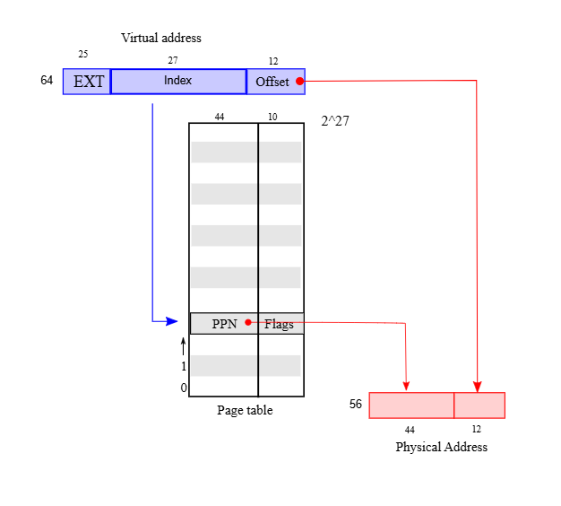
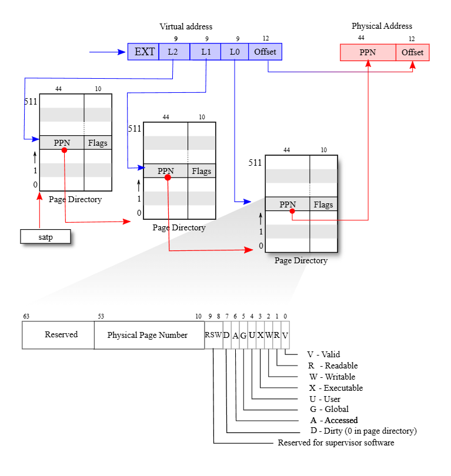
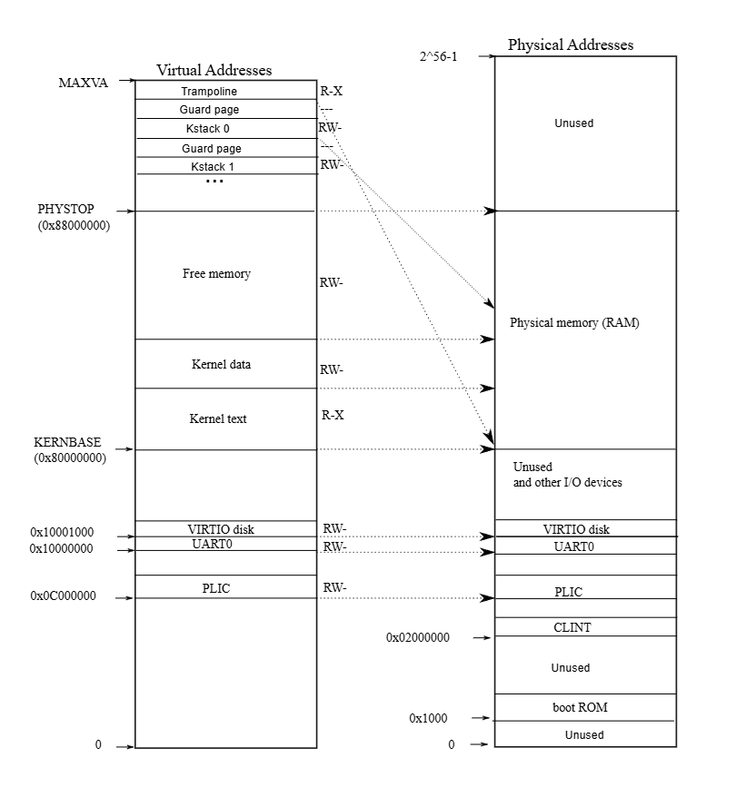
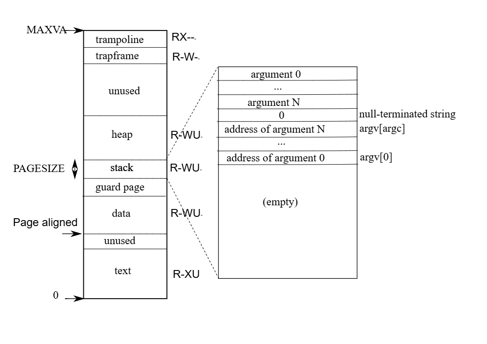

# xv6 riscv book chapter 3：Page tables

Page table 是操作系统用来为每个进程提供私有地址空间与内存的最常见的机制。 page table 决定了内存地址的含义，以及哪些物理内存区段可以被访问。 它们让 xv6 能够隔离不同进程的地址空间，并将它们多任务使用在单一的物理内存上

page table 之所以被广泛使用，是因为它们提供了一层间接性，使操作系统能够应用许多「技巧」。 xv6 就使用了一些技巧：像是将相同的内存（例如 trampoline page）映射到多个地址空间中，并且用未映射的 page 来保护 kernel 与 user 的 stack。 接下来的章节会说明 RISC-V 硬件所提供的 page table 功能，以及 xv6 是如何使用这些功能的

## 3.1 Paging hardware

回顾一下，RISC-V 的指令（无论是用户或 kernel ）所操作的是虚拟地址。 机器的 RAM，也就是物理内存，则是以实体地址来索引。 RISC-V 的 page table 硬件会将这两种地址连接起来，将每个虚拟地址对应到一个实体地址来完成映射

xv6 运行在 Sv39 的 RISC-V 架构上，这代表 64 位元虚拟地址中，只有最低的 39 个位元会被使用，最上面的 25 个位元则不会被使用。 在 Sv39 的设置下，一个 RISC-V page table 在逻辑上是一个包含 2<sup>27</sup>（134,217,728）个 PTE 的数组。 每个 PTE 包含一个 44 位元的 page frame 编号（PPN）以及一些旗标

:::tip
page frame 指的是物理内存的 page，原文为 physical page，因此 page frame 的编号才会缩写为 PPN（physical page number）  
:::

paging hardware 会使用 39 位元中最高的 27 位元作为索引查找 page table，找到对应的 PTE，然后组合成一个 56 位元的实体地址：地址的高 44 位元来自 PTE 里的 PPN，低 12 位元则直接复制自原本虚拟地址中的低 12 位。 图 3.1 显示了这个流程，其使用一个简化为 PTE 数组的逻辑 page table 来呈现（更完整的结构请见图 3.2）。 page table 让操作系统可以用 4096（2<sup>12</sup>）位元组对齐的区块为单位，控制虚拟地址到实体地址的对应关系。 这种区块就被称作「page」



在 Sv39 的 RISC-V 架构中，虚拟地址的高 25 位并不会参与转换。 而在实体地址方面也预留了成长的空间：在 PTE 的格式中，PPN 还可以再增加 10 个位元。 RISC-V 的设计者是根据技术的发展预测来选定这些数值的，2<sup>39</sup> 位元组等于 512GB，对于在 RISC-V 电脑上运行的应用程序来说应该已经足够。 2<sup>56</sup> 则提供了足够的实体内存空间，在可见的未来能容纳许多 I/O 装置与 RAM 模组。 如果未来还需要更多，RISC-V 的设计者也已定义了拥有 48 位元的虚拟地址空间的 Sv48<sup>[[1]](#1)</sup>

如图 3.2 所示，RISC-V 的 CPU 会通过三个步骤将虚拟地址转换为实体地址。 page table 在物理内存中会以三层的树的形式存储，这棵树的根是一个 4096 位元组的 page table，里面包含 512 个 PTE，这些 PTE 内也各都存储著下一层 page table 的实体地址。 而该 page table 中的每个 PTE 所指向的 page table，其内会包含 512 个最底层的 PTE。 每个 page table 都使用了一个 page 的大小（4096 位元组）来存储

paging hardware 会使用 27 位元中最高的 9 位来在 root page table 中选择一个 PTE，中间的 9 位元用来在下一层的 page table 中选择一个 PTE，而最底下的 9 位元则用来选择最终的 PTE（在 Sv48 的 RISC-V 中，page table 有四层，虚拟地址中的第 39 到 47 位会用来索引最顶层的 page table）



如果在地址转换过程中所需的三个 PTE 中有任何一个不存在，paging hardware 就会生成一个「page-fault 例外」，并交由 kernel 来处理这个例外（详见第四章）

相较于图 3.1 的单层设计，图 3.2 所示的三层结构提供了一种更节省内存的方式来记录 PTE。 在许多虚拟地址范围根本没有被映射的情况下，三层结构有机会能直接省略多个 page table。 例如，如果一个应用程序只使用从地址 0 开始的几个 page，那么第一层 page table 内的第 1 到 511 的 PTE 都会是无效的，kernel 不必耗费 page 来存这 511 个第二层 page table，也不需要分配这 511 个第二层 page table 所对应到的底层 page table。 因此，在这个例子中，三层结构可以节省 511 个 page 的第二层 page table，以及 511×512 个 page 的底层 page table 

虽然 CPU 会在执行 `load` 或 `store` 指令时，由硬件自动走访三层结构，但三层结构有个潜在缺点是：CPU 必须从内存中加载三个 PTE 才能完成虚拟地址到实体地址的转换。 为了减去从物理内存加载 PTE 的开销，RISC-V 的 CPU 会将 PTE 缓存在一个称为 Translation Look-aside Buffer（TLB）的结构中

每个 PTE 都包含一些旗标位元，用来告诉 paging hardware 这个对应的虚拟地址允许被如何使用。 `PTE_V` 表示这个 PTE 是否存在：如果其没被设置，则对该 page 的访问会引发例外。 `PTE_R` 决定指令能否读取该 page。 `PTE_W` 决定能否写入该 page。 `PTE_X` 决定 CPU 是否可以将该 page 的内容作为指令来执行。 `PTE_U` 决定 user mode 下的指令是否可以访问该 page； 如果没设置 `PTE_U`，则仅能在 supervisor mode 中使用该 PTE。 图 3.2 展示了这整个是如何运行的。 这些旗标以及其他与 page 硬件有关的结构都定义在 [kernel/riscv.h](https://github.com/mit-pdos/xv6-riscv/blob/riscv//kernel/riscv.h) 中

若要让 CPU 使用某个 page table，kernel 必须将 root page table 的 page 的实体地址写入 `satp` 寄存器中，这样接下来 CPU 执行的所有指令所生成的地址，都会使用 `satp` 指向的 page table 来进行转换。 每颗 CPU 都有自己的 `satp` 寄存器，因此不同的 CPU 可以同时执行不同的进程，各自使用其私有的地址空间与 page table。 从 kernel 的角度来看，page table 就是存储在内存中的数据结构，kernel 会使用类似操作其他树状数据结构的方式来创建与修改 page table 

这里对书中所使用的一些术语做个简要说明。 「物理内存」是指 RAM 中的存储单元。 一个物理内存位元组会有一个称为「实体地址」的地址。 那些会解参考地址的指令（例如 `load`、`store`、`jump`、function call）只会使用虚拟地址，这些虚拟地址会先由 paging hardware 转换为实体地址，再送到 RAM 进行读写

「地址空间」是指在某个 page table 中有效的虚拟地址集合； xv6 中的每个进程都有自己的用户地址空间，xv6 kernel 本身也有自己的地址空间。 「用户内存」是进程的用户地址空间加上 page table 允许该进程访问的物理内存。 「虚拟内存」是一组与 page table 管理有关的概念与技术，并通过它们来实现如隔离等目标

## 3.2 Kernel address space

xv6 为每个进程维护一个 page table，用来描述该进程的用户地址空间，此外还有一份单独、全域的 page table 描述 kernel 的地址空间。 kernel 会分配自己地址空间的布局（layout），使其能够在预期的虚拟地址上访问物理内存与各种硬件资源。 图 3.3 显示这个布局如何将 kernel 虚拟地址对应到实体地址。 [kernel/memlayout.h](https://github.com/mit-pdos/xv6-riscv/blob/riscv//kernel/memlayout.h) 中宣告了 xv6 kernel 内存布局的各种常数



QEMU 模拟了一台电脑，其中的 RAM（物理内存）从实体地址 `0x80000000` 开始，持续到 `0x88000000` 以上，这段范围在 xv6 中称为 `PHYSTOP`。 QEMU 的模拟也包含像是硬盘接口这样的 I/O 装置，QEMU 以内存映射控制寄存器（memory-mapped control registers）的方式，将这些装置的接口暴露给软件，这些寄存器位于实体地址空间中小于 `0x80000000` 的位置。 kernel 可以通过读写这些特殊的实体地址与装置交互，换句话说这些读写会与装置硬件沟通，而非与 RAM 交互。 第四章会解释 xv6 是如何与装置交互的

kernel 通过「直接映射（direct mapping）」的方式来访问 RAM 与 memory-mapped 的装置寄存器，其会将资源映射到与其实体地址相同的虚拟地址上（VA == PA），例如 kernel 本身在虚拟地址空间与物理内存中都位于 `KERNBASE=0x80000000`。 直接映射能简化 kernel 对物理内存的读写代码，例如在 `fork` 分配子进程的用户内存时，分配器会返回那块内存的实体地址； `fork` 在复制父进程的用户内存到子进程时，会直接把这个实体地址当作虚拟地址使用

有一些 kernel 的虚拟地址并不是直接映射的：

- Trampoline page：  
  它被映射到虚拟地址空间的最顶部，而用户的 page table 也会有这个相同的映射。 第四章会讨论 trampoline page 的用途，但在这里我们可以看到一个有趣的 page table 用法：一个 page frame（存放 trampoline 代码）在 kernel 的虚拟地址空间中被映射了两次，一次在虚拟空间顶部，另一次则为直接映射
- kernel stack page：  
  每个进程都有自己的 kernel stack，它会被映射到较高的虚拟地址位置，而 xv6 会在其下方留下一个没有被映射的「guard page」。 这个 guard page 的 PTE 是无效的（也就是 `PTE_V` 没有设置），这样当 kernel stack 溢出时，通常就会触发例外并使 kernel 发生 panic。 若没有 guard page，stack 溢出就可能会覆盖其他 kernel 内存，导致错误行为，而比起默默地发生错误执行，有出错、崩溃是比较可以接受的

虽然 kernel 通过高地址的映射使用它的 stack，但 kernel 其实也可以通过直接映射的地址访问这些 stack。 另一种设计可能会只使用直接映射的方式，直接在那个地址操作 stack。 不过在这种设计中，如果要提供 guard page，就得取消某些本来会对应到物理内存的虚拟地址，这会让内存变得难以使用

kernel 将 trampoline page 与 kernel 代码的 page 设置为具有 `PTE_R` 与 `PTE_X` 的权限，这表示 kernel 可以在这些 page 上读取并执行指令。 其他 page 则被设置为具有 `PTE_R` 与 `PTE_W` 的权限，以便 kernel 能够对这些 page 进行读写。 至于 guard page，则被设为无效映射

:::tip
kernel 一开始使用的是 Bare Mode（`satp.MODE == 0`）：

```c
// entry.S jumps here in machine mode on stack0.
void
start()
{
  ...
  // disable paging for now.
  w_satp(0);
  ...
}
```

但「kernel 通过 direct mapping 的方式来访问 RAM 与 memory-mapped 的装置寄存器」这句话，并不是在指 Bare mode。 它说的是在初始化 kernel page table 的时候，他会「手动」依照 Sv39 的格式，将 VA 映射到与其相同地址的 PA。 因此在后面已启用 Sv39 的环境下，你把拿到的 VA 以 Sv39 的规则去查 kernel page table 时，最后得出的 PA 还是会刚好等于 VA（除了之前提到的 trampoline page 之类的）

以 uart register 为例，他在 kernel page table 中被这么初始化：

```c
// Make a direct-map page table for the kernel.
pagetable_t
kvmmake(void)
{

  pagetable_t kpgtbl;

  kpgtbl = (pagetable_t) kalloc();
  memset(kpgtbl, 0, PGSIZE);

  // uart registers
  kvmmap(kpgtbl, UART0, UART0, PGSIZE, PTE_R | PTE_W);
  ...
}
```

其中 `UART0 = 0x10000000L`，`PGSIZE = 4096`。 而如前面所述 `kvmmap` 会调用 `mappages`：

```c
// add a mapping to the kernel page table.
// only used when booting.
// does not flush TLB or enable paging.
void
kvmmap(pagetable_t kpgtbl, uint64 va, uint64 pa, uint64 sz, int perm)
{
  if(mappages(kpgtbl, va, sz, pa, perm) != 0)
    panic("kvmmap");
}
```

因此你可以看见，在其传入 `kvmmap` 的参数中，`va` 与 `pa` 是直接写了相同的值 `UART0`，这就是 direct mapping 的意思。 上方是 mmap 装置的初始化，而对于 RAM 也是：

```c
// map kernel text executable and read-only.
kvmmap(kpgtbl, KERNBASE, KERNBASE, (uint64)etext-KERNBASE, PTE_R | PTE_X);

// map kernel data and the physical RAM we'll make use of.
kvmmap(kpgtbl, (uint64)etext, (uint64)etext, PHYSTOP-(uint64)etext, PTE_R | PTE_W);
```

这两行就把整个 Physical memory 都包含进来了（`KERNBASE` 至 `PHYSTOP`，见图 3.3）。 而 `kvmmap` 内的 `mappages` 会利用 `walk` 来判断你给的参数 `va` 在 kernel page table 中是否已经被映射了：

```c
// Create PTEs for virtual addresses starting at va that refer to
// physical addresses starting at pa.
// va and size MUST be page-aligned.
// Returns 0 on success, -1 if walk() couldn't
// allocate a needed page-table page.
int
mappages(pagetable_t pagetable, uint64 va, uint64 size, uint64 pa, int perm)
{
  uint64 a, last;
  pte_t *pte;

  if((va % PGSIZE) != 0)
    panic("mappages: va not aligned");

  if((size % PGSIZE) != 0)
    panic("mappages: size not aligned");

  if(size == 0)
    panic("mappages: size");
  
  a = va;
  last = va + size - PGSIZE;
  for(;;){
    if((pte = walk(pagetable, a, 1)) == 0)
      return -1;
    if(*pte & PTE_V)
      panic("mappages: remap");
    *pte = PA2PTE(pa) | perm | PTE_V;
    if(a == last)
      break;
    a += PGSIZE;
    pa += PGSIZE;
  }
  return 0;
}
```

`walk` 固定会走访三层 page table，如果途中发现某个 PTE 的值还是 0（未分配），就会用 `kalloc` 要一个 page frame，并把该 PTE 指向它：

```c
// Return the address of the PTE in page table pagetable
// that corresponds to virtual address va.  If alloc!=0,
// create any required page-table pages.
//
// The risc-v Sv39 scheme has three levels of page-table
// pages. A page-table page contains 512 64-bit PTEs.
// A 64-bit virtual address is split into five fields:
//   39..63 -- must be zero.
//   30..38 -- 9 bits of level-2 index.
//   21..29 -- 9 bits of level-1 index.
//   12..20 -- 9 bits of level-0 index.
//    0..11 -- 12 bits of byte offset within the page.
pte_t *
walk(pagetable_t pagetable, uint64 va, int alloc)
{
  if(va >= MAXVA)
    panic("walk");

  for(int level = 2; level > 0; level--) {
    pte_t *pte = &pagetable[PX(level, va)];
    if(*pte & PTE_V) {
      pagetable = (pagetable_t)PTE2PA(*pte);
    } else {
      if(!alloc || (pagetable = (pde_t*)kalloc()) == 0)
        return 0;
      memset(pagetable, 0, PGSIZE);
      *pte = PA2PTE(pagetable) | PTE_V;
    }
  }
  return &pagetable[PX(0, va)];
}
```

也因此 kernel page table 一样有三层，才可以依照 Sv39 的格式去查表。  再来对于 trampoline page 和 per-process 的 kernel stack，他又另外做了一次映射，但却不是以 direct mapping 的方式：

```c
// map the trampoline for trap entry/exit to
// the highest virtual address in the kernel.
kvmmap(kpgtbl, TRAMPOLINE, (uint64)trampoline, PGSIZE, PTE_R | PTE_X);

// allocate and map a kernel stack for each process.
proc_mapstacks(kpgtbl);
```

因此上面才说这两个东西可以用高位的虚拟地址来访问，也可以走 direct mapping 的路线  
:::

## 3.3 Code: creating an address space

xv6 中大多数负责操作地址空间与 page table 的代码都写在 vm.c（[kernel/vm.c:1](https://github.com/mit-pdos/xv6-riscv/blob/riscv//kernel/vm.c#L1)）中。 主要的数据结构是 `pagetable_t`，它实际上是一个指向 RISC-V root page table 的 page 的指针。 `pagetable_t` 的实例可能是 kernel 的 page table，也可能是某个进程的 page table。 相关的主要函数有 `walk` 与 `mappages`，前者用来找出某个虚拟地址对应的 PTE，后者会为新的映射关系创建对应的 PTE

以 `kvm` 开头的函数会操作 kernel 的 page table； 以 `uvm` 开头的函数会操作 user 的 page table； 其他函数则可能同时用于两者。 `copyout` 与 `copyin` 用来从系统调用的引数提供的用户虚拟地址中复制数据进出，这两个函数之所以写在 vm.c 里，是因为它们必须显式地将虚拟地址转换成对应的物理地址

在开机流程的早期，`main` 会调用 `kvminit`，通过 `kvmmake` 创建 kernel 的 page table。 这个调用发生在 xv6 尚未启用 RISC-V 的 paging 功能之前，因此当时的地址仍直接对应到物理内存。 `kvmmake` 会先分配一个 page 的物理内存作为 root page table，接著调用 `kvmmap` 来设置 kernel 所需的映射关系。 这些映射包含了 kernel 的程序与数据、本机到 `PHYSTOP` 为止的物理内存，以及实际上是装置的某些内存区段。 `proc_mapstacks` 为每个进程分配一个 kernel stack，它会调用 `kvmmap`，把每个 stack 映射到由 `KSTACK` 生成的虚拟地址，同时为无效的 guard page 预留空间

`kvmmap`（[kernel/vm.c:132](https://github.com/mit-pdos/xv6-riscv/blob/riscv//kernel/vm.c#L132)）会调用 `mappages`（[kernel/vm.c:144](https://github.com/mit-pdos/xv6-riscv/blob/riscv//kernel/vm.c#L144)），针对目标范围内的每个虚拟地址，以 page 大小为间格，将其映射关系加入到 page table 中。 对于每个要映射的虚拟地址，`mappages` 会调用 `walk` 找到该地址对应的 PTE，然后初始化这个 PTE，填入对应的 PPN、所需的访问权限（例如 `PTE_W`、`PTE_X` 或 `PTE_R`），并设置 `PTE_V` 将该 PTE 标记为有效 page 

`walk`（[kernel/vm.c:86](https://github.com/mit-pdos/xv6-riscv/blob/riscv//kernel/vm.c#L86)）模拟 RISC-V paging hardware 的行为，用来查找某个虚拟地址对应的 PTE。 `walk` 一次会往下走访一层 page table，并使用该层虚拟地址的 9 个位元来索引对应的 page table。 在每一层 page table 当中，它可能会找到下一层 page table 的 PTE，或者是最终 page 的 PTE（[kernel/vm.c:92](https://github.com/mit-pdos/xv6-riscv/blob/riscv//kernel/vm.c#L92)）。 如果第一层或第二层的 page table 中的 PTE 无效，表示该层的 page 尚未分配； 如果设置了 `alloc` 引数，`walk` 就会为新 page table 分配一个新的 page，并把它的实体地址写入该 PTE。 最终 `walk` 会返回树中最底层那个 PTE 的地址（[kernel/vm.c:102](https://github.com/mit-pdos/xv6-riscv/blob/riscv//kernel/vm.c#L102)）

上述的代码只能在物理内存已被直接映射到 kernel 的虚拟地址空间内的情况下执行。 例如，当 `walk` 向下走访 page table 时，它会从某个 PTE 中获取下一层 page table 的实体地址（[kernel/vm.c:94](https://github.com/mit-pdos/xv6-riscv/blob/riscv//kernel/vm.c#L94)），然后把这个地址当作虚拟地址使用，来访问下一层的 PTE（[kernel/vm.c:92](https://github.com/mit-pdos/xv6-riscv/blob/riscv//kernel/vm.c#L92)）

`main` 会调用 `kvminithart`（[kernel/vm.c:62](https://github.com/mit-pdos/xv6-riscv/blob/riscv//kernel/vm.c#L62)）来加载 kernel 的 page table，这个函数会将 root page table 的 page 的实体地址写入寄存器 `satp`，之后 CPU 就会开始使用这份 kernel 的 page table 来进行地址转译。 由于 kernel 使用的是直接映射，接下来的指令所使用的虚拟地址将会正确地映射到对应的实体内存地址上

每颗 RISC-V CPU 都会将 PTE 缓存在 TLB（Translation Look-aside Buffer）中，而当 xv6 修改 page table 时，它必须通知 CPU 将对应的 TLB 缓存项目作废。 否则之后 TLB 可能会使用到过时的缓存映射，进而指向一个已经被分配给其他进程的 page frame，导致某个进程不小心写入其他进程的内存

RISC-V 提供一条名为 `sfence.vma` 的指令，用于清空当前 CPU 的 TLB。 xv6 会在 `kvminithart` 中重新加载 `satp` 后执行 `sfence.vma`，或在切换至用户 page table 的 trampoline 代码中，于返回 user space 之前执行 `sfence.vma`。 在更改 `satp` 之前也必须执行一次 `sfence.vma`，以等待所有的 load 与 store 操作完成，这能确保先前对 page table 的更新已完成，并且也能保证先前的 load 与 store 操作会使用旧的 page table，而不是新的 page table 

:::tip
`sfence.vma` 不只是用来清除 TLB，也可以作为一种内存屏障（memory barrier），确保旧 page table 的操作完成后，才开始使用新 page table，以避免顺序错乱造成的错误  
:::

为了避免整个 TLB 被清空，RISC-V CPU 可能会支持 ASID<sup>[[1]](#1)</sup>。 这样 kernel 就可以只清除属于特定地址空间的 TLB 项目。 但 xv6 并未使用这项功能

## 3.4 Physical memory allocation

kernel 在执行期间必须为 page table、用户内存、kernel stack，以及 pipe 缓冲区分配与释放物理内存。 xv6 使用从 kernel 结束地址到 `PHYSTOP` 之间的物理内存区域作为执行期间的分配来源，每次以 4096 位元组为单位分配与释放整个 page。 它通过将这些 page 本身串成一个 linked list 来跟踪 free page，分配时会从 list 中取出一个 page，而释放时则是将该 page 加入 list 中

## 3.5 Code: Physical memory allocator

内存分配器实现于 kalloc.c（[kernel/kalloc.c:1](https://github.com/mit-pdos/xv6-riscv/blob/riscv//kernel/kalloc.c#L1)）中。 这个分配器是一个可分配的物理内存 page 所组成的「free list」，其的元素为 `struct run`，对应到一个 free page 

因为这些 free page 内并没存其他东西，因此分配器会把每个 free page 对应的 `run` 结构体直接存在该 page 里面，使分配器之后能够获取这个 free list 的内存。 这个 free list 还受到一个自旋锁的保护（[kernel/kalloc.c:21-24](https://github.com/mit-pdos/xv6-riscv/blob/riscv//kernel/kalloc.c#L21-L24)），它们会一起被包在一个结构体里，以明确表示该锁保护的是此结构体内的栏位。 目前可以先忽略锁以及 `acquire` 和 `release` 的调用，第六章会详细讨论 locking

`main` 函数会调用 `kinit` 来初始化分配器（[kernel/kalloc.c:27](https://github.com/mit-pdos/xv6-riscv/blob/riscv//kernel/kalloc.c#L27)），其会将 free list 初始化为包含「从 kernel 结尾到 `PHYSTOP` 之间」的所有 page。 理论上 xv6 应该要通过解析硬件所提供的设置信息来判断可用的物理内存大小，但 xv6 采取了简化的做法：直接假设机器拥有 128MB 的内存。 `kinit` 会调用 `freerange`，并对每一个 page 都调用 `kfree`，以将内存加入 free list

由于 PTE 只能对齐到 4096 位元组（即 4096 的倍数）的实体地址，因此 `freerange` 使用 `PGROUNDUP` 来确保只会释放有对齐的实体地址。 分配器一开始没有任何可用的内存，这些 `kfree` 的调用则为它提供了可以管理的内存

分配器有时会将地址当作整数使用，以便对它们进行数学运算（例如在 `freerange` 中走访所有 page），有时又会将地址当作指针使用，用来读写内存（例如操作存储在各 page 中的 `run` 结构）； 这种「地址的双重用途」是分配器的实现中充满 C type cast 的主要原因

`kfree`（[kernel/kalloc.c:47](https://github.com/mit-pdos/xv6-riscv/blob/riscv//kernel/kalloc.c#L47)）会先将要释放的内存中的每个位元组都设为数值 1。 这样一来，若有程序在释放后仍使用该内存（也就是所谓的「悬空参考（dangling reference）」），它读取到的也会是杂讯数据而不是原本的正确内容，理论上可以更快地暴露错误。 接下来，`kfree` 会将该 page 加入 free list 的前端：它将实体地址（`pa`）转型为指向 `struct run` 的指针，将原本 free list 的开头记录在 `r->next`，然后再将 free list 的开头设为 `r`。 而 `kalloc` 则会从 free list 中取出（removes）并返回第一个元素

## 3.6 Process address space

每个进程都有自己的 page table，而当 xv6 在进程间切换时，也会随之切换 page table。 图 3.4 比图 2.3 更详细地展示了一个进程的地址空间。 进程的用户内存从虚拟地址 0 开始，可以一直成长到 `MAXVA`（[kernel/riscv.h:379](https://github.com/mit-pdos/xv6-riscv/blob/riscv//kernel/riscv.h#L379)），这使得一个进程理论上能够访问高达 256 GB 的内存



一个进程的地址空间由多个 page 组成，这些 page 包括：存储代码的 page（xv6 为其设置的权限为 `PTE_R`、`PTE_X` 和 `PTE_U`）、包含预先初始化数据的 page、一个用作 stack 的 page，以及数个用作 heap 的 page。 xv6 为数据、stack 与 heap 对应的 page 所设置的权限为 `PTE_R`、`PTE_W` 和 `PTE_U`

在用户地址空间中设置权限，是强化用户进程安全性的一种常见技巧。 如果 text 段被映射为具有 `PTE_W` 权限的 page，那么进程就可能会不小心修改到自己的代码； 例如，若有程序错误导致对空指针写入，就可能会改写位于地址 0 的指令，接著程序继续执行，造成更严重的后果

为了立即侦测这类错误，xv6 在映射 text 段时不会给予 `PTE_W` 权限，因此如果程序误写入地址 0，硬件将会拒绝这次写入并生成 page 错误，接著 kernel 会终止该进程并输出一条错误消息，帮助开发者跟踪问题。 同样地，通过不为 data 段映射到的 page 设置 `PTE_X` 权限，用户程序便无法意外跳跃到 data 段的地址，并从那里开始执行

在现实世界中，通过精确地设置权限来强化进程的安全性，也有助于防御各种安全攻击。 攻击者可能会为某些程序（例如一个网页服务器）设计一些精巧的输入，借此触发程序中的某个错误，并进一步将其变成可被利用的漏洞。 谨慎地设置权限，加上其他技术（例如随机化用户地址空间的分配），能有效增加此类攻击的难度

stack 段仅占用一个 page，图 3.4 中显示的是由 `exec` 创建的初始内容。 命令列引数的字串，以及指向这些字串的指针数组，会被放在 stack 的最顶部。 紧接著在它们之下，是一些让程序可以从 `main` 开始执行的数据，就像是调用了 `main(argc, argv)` 一样

为了侦测 user stack 溢出分配范围的情况，通过清除 page 的 `PTE_U` 标志，xv6 在 stack 下方放置了一个无法访问的「guard page」。 若 user stack 溢出并试图使用 stack 下方的地址，因为该 guard page 对 user mode 的程序是不可访问的，硬件将生成 page 错误例外。 现实中的操作系统也有可能会选择在 stack 溢出时自动分配更多内存

当某个进程向 xv6 索要更多用户内存时，xv6 会扩展该进程的 heap 段。 首先会使用 `kalloc` 分配 page frame，然后在该进程的 page table 中新增指向这些 page frame 的 PTE，并为这些 PTE 中设置 `PTE_W`、`PTE_R`、`PTE_U` 和 `PTE_V` 标志。 大多数进程并不会使用整个用户地址空间，对于未使用的 `PTE`，xv6 会清除其 `PTE_V` 

这里我们看到了 page table 运用的几个典型范例。 首先，不同进程的 page table 会将用户地址映射到不同的物理内存 page，因此每个进程拥有各自私有的用户内存。 其次，每个进程都会看到自己的内存是个从 0 开始且连续排列的虚拟地址空间，而物理内存则可以是不连续的。 第三，kernel 会在用户地址空间顶端映射一个包含 trampoline 代码的 page（不设置 `PTE_U`），因此这个单一 page frame 会出现在所有进程的地址空间中，但只有 kernel 可以使用它

## 3.7 Code: sbrk

`sbrk` 是一个系统调用，用来让一个进程可以扩增或缩减它的内存空间，这个系统调用是由 `growproc`（[kernel/vm.c:233](https://github.com/mit-pdos/xv6-riscv/blob/riscv//kernel/proc.c#L260)）函数实现的。 `growproc` 会根据其引数 `n` 的正负，来调用 `uvmalloc` 或 `uvmdealloc`。 `uvmalloc` 会使用 `kalloc` 分配物理内存，并将分配到的内存清 0，再通过 `mappages` 将各 PTE 加入用户的 page table。 `uvmdealloc` 则会调用 `uvmunmap`，该函数会使用 `walk` 寻找 PTE，并通过 `kfree` 释放它们所对应的物理内存

xv6 为每个进程都建了 page table，不仅仅是为了告诉硬件如何将用户虚拟地址映射到物理内存，同时也作为唯一的记录，指出哪些物理内存 page 被分配给了该进程。 这就是为什么在释放用户内存时（如在 `uvmunmap` 中），必须检查该进程的 page table 

## 3.8 Code: exec

`exec` 是一个系统调用，会将某个进程的用户地址空间替换为从文件中读取的数据，这个文件被称为二进位档或可执行档。 二进位档通常是编译器与链接器的输出结果，内含机器指令与程序数据。 `exec`（[kernel/exec.c:23](https://github.com/mit-pdos/xv6-riscv/blob/riscv//kernel/exec.c#L23)）会使用 `namei`（[kernel/exec.c:36](https://github.com/mit-pdos/xv6-riscv/blob/riscv//kernel/exec.c#L36)）打开指定路径 `path` 所对应的二进位档，`namei` 的细节会在第八章中说明

接著它会读取 ELF header，xv6 的二进位档使用的是 ELF 格式，该格式定义于 [kernel/elf.h](https://github.com/mit-pdos/xv6-riscv/blob/riscv//kernel/elf.h#L6)。 一个 ELF 格式的文件由一个 ELF header `struct elfhdr`，和一连串的 program section header `struct proghdr` 组成。 每个 `proghdr` 描述了应加载内存中的一个应用程序区段，xv6 的程序通常有两个 program section header：一个用于指令段，一个用于数据段

第一个步骤是快速检查该文件是否可能是一个 ELF 的二进位档。 一个 ELF 文件的开头会包含四个位元组的「魔术号」：`0x7F`、`'E'`、`'L'`、`'F'`，也可写成 `ELF_MAGIC`。 如果 ELF header 的魔术号正确，`exec` 就会假设这个二进位档格式正确无误

`exec` 会通过 `proc_pagetable`（[kernel/exec.c:49](https://github.com/mit-pdos/xv6-riscv/blob/riscv//kernel/exec.c#L49)）创建一个不含任何用户映射的新 page table，并通过 `uvmalloc`（[kernel/exec.c:65](https://github.com/mit-pdos/xv6-riscv/blob/riscv//kernel/exec.c#L65)）为每个 ELF segment 分配内存，再用 `loadseg` 将每个 segment 加载到内存中。 `loadseg`（[kernel/exec.c:10](https://github.com/mit-pdos/xv6-riscv/blob/riscv//kernel/exec.c#L10)）会使用 `walkaddr` 来找到已分配的内存的实体地址，以便写入 ELF segment 内的每一个 page，并使用 `readi` 从文件中读取数据

`/init` 是第一个使用 `exec` 创建的用户程序，其 program section header 如下：

```
# objdump -p user/_init

user/_init:     file format elf64-little

Program Header:
0x70000003 off    0x0000000000006bb0 vaddr 0x0000000000000000
                                       paddr 0x0000000000000000 align 2**0
         filesz 0x000000000000004a memsz 0x0000000000000000 flags r--
    LOAD off    0x0000000000001000 vaddr 0x0000000000000000
                                       paddr 0x0000000000000000 align 2**12
         filesz 0x0000000000001000 memsz 0x0000000000001000 flags r-x
    LOAD off    0x0000000000002000 vaddr 0x0000000000001000
                                       paddr 0x0000000000001000 align 2**12
         filesz 0x0000000000000010 memsz 0x0000000000000030 flags rw-
   STACK off    0x0000000000000000 vaddr 0x0000000000000000
                                       paddr 0x0000000000000000 align 2**4
         filesz 0x0000000000000000 memsz 0x0000000000000000 flags rw-
```

我们可以看到，text 段应该从文件中偏移量为 `0x1000` 的位置加载到内存中虚拟地址为 `0x0` 的位置，且不具有写入权限。 我们也可以看到，data 段应该加载到 page 对齐的地址 `0x1000`，并且不具有执行权限

一个程序区段的 `filesz` 可能会小于 `memsz`，表示两者之间的差距应该用零填满（例如 C 的全域变量），而不是从文件中读取数据。 以 `/init` 为例，其数据段的 `filesz` 为 `0x10` bytes，而 `memsz` 为 `0x30` bytes，因此 `uvmalloc` 会分配足够的物理内存以容纳 `0x30` bytes，但仅会从 `/init` 文件中读取 `0x10` bytes 的数据

现在 `exec` 会分配并初始化 user stack，它只会分配一个 page 用作 stack。 `exec` 将每个字串引数依序复制到 stack 顶部，并将它们的指针记录在 `ustack` 中。 它会在即将传给 `main` 的 `argv` 清单末端放上一个 `null` 指针。 `argc` 与 `argv` 的值会通过系统调用的返回路径传给 `main`：`argc` 会经由系统调用的返回值传递，放在寄存器 `a0` 中； 而 `argv` 则通过该进程的 trapframe 中的 `a1` 栏位传递

`exec` 会在 stack page 的下方放置一个不可访问的 page，这样若有程序试图使用超过一个 page 的 stack 时就会生成错误。 这个不可访问的 page 也让 `exec` 能够处理引数过大的情况； 若发生这种情形，`exec` 所使用的 `copyout`（[kernel/vm.c:359](https://github.com/mit-pdos/xv6-riscv/blob/riscv//kernel/vm.c#L359)）函数会在把引数复制到 stack 时发现目标 page 无法访问，然后返回 -1

在准备新的内存映像的过程中，若 `exec` 侦测到错误，例如无效的程序区段，它会跳转到标签 `bad`，释放新创建的映像，并返回 -1。 `exec` 必须等到确定这次系统调用会成功时，才会释放旧有的映像：因为若旧映像已经被释放，系统调用就无法再返回 -1 给它。 `exec` 中所有的错误情况都只会发生在创建新映像的过程中，一旦映像建构完成（[kernel/exec.c:125](https://github.com/mit-pdos/xv6-riscv/blob/riscv//kernel/exec.c#L125)），`exec` 就可以正式切换到新的 page table 并释放旧的 page table 了（[kernel/exec.c:129](https://github.com/mit-pdos/xv6-riscv/blob/riscv//kernel/exec.c#L129)）

`exec` 会依照 ELF 文件所指定的地址，将其位元组数据加载到内存中。 由于用户或进程可以在 ELF 档中放入任意地址，因此 `exec` 存在风险，ELF 档中的地址可能会指向 kernel 区域，无论是意外还是恶意行为。 对于不设防的 kernel 来说，其后果从系统崩溃到恶意破坏 kernel 隔离机制（即安全漏洞）都有可能发生

xv6 采取了一些检查措施以避免这些风险。 例如，用户可以制作一个 ELF 档，让 `ph.vaddr` 指向一个任意地址，并给 `ph.memsz` 一个足够大的值，让相加结果发生溢位并变成像 `0x1000` 这样看似合理的值。 xv6 使用 `if(ph.vaddr + ph.memsz < ph.vaddr)` 来检查这两者相加时是否发生 64 位元整数溢位，以达到防御的效果

在旧版的 xv6 中，用户地址空间也包含了 kernel（虽然在 user mode 中无法读写），用户可以选择一个对应到 kernel 内存的地址，这样 ELF 档的数据就会被复制进 kernel。 这在 RISC-V 版本的 xv6 中不会发生，因为 kernel 拥有独立的 page table； `loadseg` 会将数据加载进程的 page table，而非 kernel 的 page table 

对于 kernel 开发者来说，很容易会遗漏关键地检查。 实际上在 kernel 发展历史中，常常会因为检查不足而让用户程序得以利用漏洞获得 kernel 权限。 xv6 很可能也没有完全验证由用户层传入 kernel 的数据，这可能会被恶意的用户程序加以利用，来绕过 xv6 的隔离机制

## 3.9 Real world

如同大多数的操作系统，xv6 使用 paging hardware 来进行内存保护与映射。 大多数操作系统会比 xv6 更复杂地使用 paging 技术，通过 paging 与 page 错误例外的结合来达成，这部分我们会在第四章内讨论

xv6 简化了实现，因为 kernel 直接使用虚拟地址与实体地址的一对一映射，并假设物理 RAM 位于 `0x80000000` 这个地址，同时也是 kernel 预期加载的位置。 这在使用 QEMU 时可以正常运行，但在真实硬件上却是个坏主意，因为真实硬件的 RAM 与装置会被分配在不可预测的物理地址上，例如在某些系统中，`0x80000000` 处可能根本没有 RAM，而这正是 xv6 预期存放 kernel 的位置。 更严谨的 kernel 设计会利用 page table 将任意的物理内存分配映射成可预测的 kernel 虚拟地址布局

RISC-V 支持针对实体地址层级的保护功能，但 xv6 并未使用这项功能

在拥有大量内存的机器上，使用 RISC-V 所支持的「super pages」是合理的。 但当物理内存很小时，使用小 page 比较合理，这样可以以更细致的粒度进行分配与 page-out 到硬盘。 例如，如果一个程序只用到 8 KB 内存，却给它一整个 4 MB 的超大 page，那就很浪费。 在具备大量 RAM 的机器上，使用大 page 比较合理，并且可以减少管理 page table 的负担

xv6 kernel 缺乏类似 `malloc` 的分配器来提供小型对象的内存空间，这使得 kernel 无法使用需要动态分配的复杂数据结构。 更精致的 kernel 会分配多种大小的小型区块，而不只是像 xv6 一样仅使用 4096 位元组的区块； 一个真正的 kernel 分配器需要同时处理大与小的内存分配需求

内存分配一直是个经久不衰的热门议题，其基本问题是如何有效利用有限的内存，并为未来不可预期的请求做准备。 而如今人们更在意分配速度，而非空间效率

## 3.10 Exercises

1. 解析 RISC-V 的 device tree，以找出该电脑的物理内存容量
2. 撰写一个用户程序，通过调用 `sbrk(1)` 以增加一个位元组的地址空间。 执进程序，并观察调用 `sbrk` 前后该程序的 page table。 kernel 实际上分配了多少空间？ 新分配的内存对应的 PTE 中包含了哪些内容？
3. 修改 xv6，使 kernel 可以使用 super pages
4. 传统的 Unix 系统在 `exec` 实现中会对 shell script 加以特殊处理。 如果目标文件的开头是 `#!`，那么首行会被视为用来解读该文件的程序。 例如，若 `exec` 被调用来执行 `myprog arg1`，而 `myprog` 的第一行是 `#!/interp`，那么 `exec` 实际上会执行 `/interp myprog arg1`。 在 xv6 中实现这个行为
5. 为 kernel 实现地址空间布局随机化（ASLR）

## Bibliography

- <a id="1">[1]</a>：The RISC-V instruction set manual Volume II: privileged specification. https://drive.google.com/file/d/1uviu1nH-tScFfgrovvFCrj7Omv8tFtkp/view?usp=drive_link, 2024
